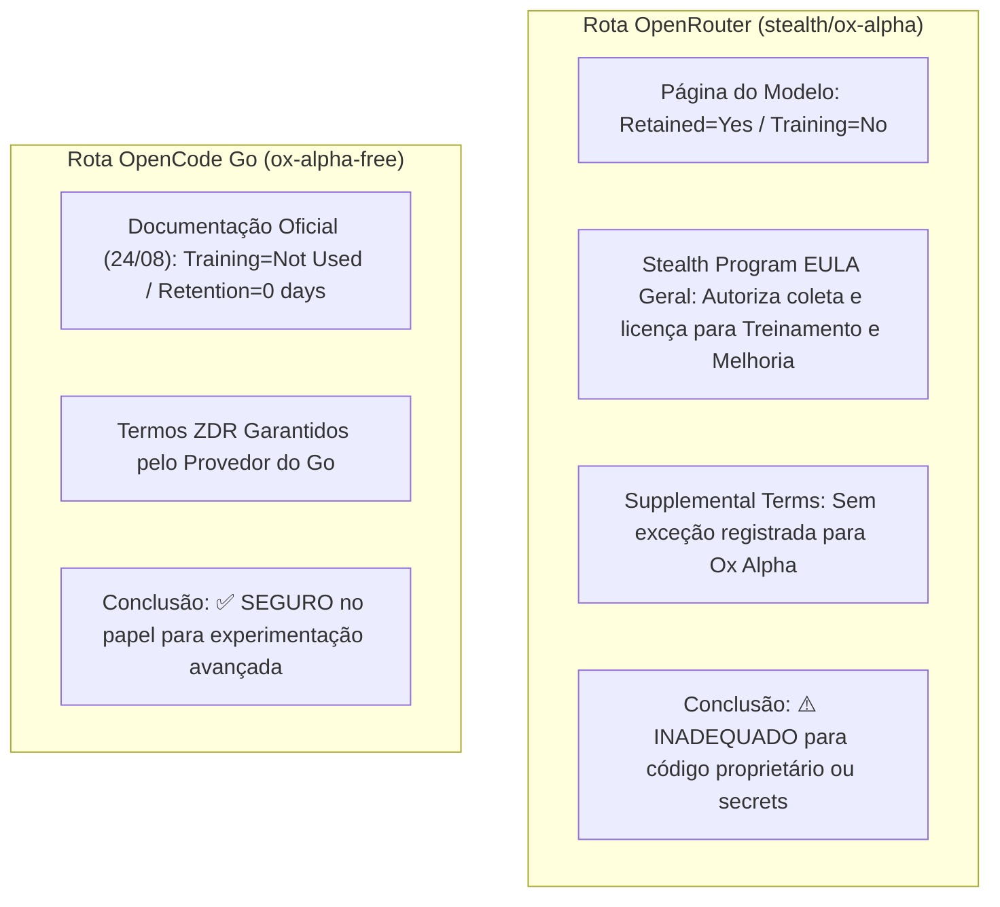

# Base de Conhecimento e Comparativo Multidimensional de Modelos de IA

Este documento consolida dados abrangentes sobre precificação de tokens, custos por tarefa, consumo de cotas de assinatura (Cursor Pro $20, SuperGrok $30, OpenCode Go $10, etc.), comportamento por nível de raciocínio (*thinking effort*), desempenho em benchmarks reais de engenharia de software (*CursorBench 3.2*, *DeepSWE*, etc.) e configurações avançadas de ferramentas CLI (Grok Build).

---

## 1. Estrutura de Pools de Cota no Cursor Pro ($20/mês)

No ecossistema do Cursor Pro, a franquia mensal é segregada em dois **pools independentes**:

```
Assinatura Cursor Pro ($20/mês)
│
├── [Pool 1] Other Models (US$ 20,00 fixos/mês)
│   ├── OpenAI (GPT-5.6 Luna, Terra, Sol)
│   ├── Anthropic (Claude Fable 5.1, Claude Fable 5, Opus 5, Sonnet 5, Haiku 4.5)
│   └── Google (Gemini 3.8 Flash, Gemini 3.7 Flash)
│
└── [Pool 2] Cursor Models ("Generous Included Usage" / Pool Separado)
    ├── Grok 4.6 (xAI)
    └── Composer 2.5 (Cursor)
```

> [!IMPORTANT]
> **Grok 4.6** e **Composer 2.5** rodam em um pool exclusivo que **não desconta** dos US$ 20 de *Other Models*. Isso permite reservar os US$ 20 para modelos pontuais de altíssima especialização (como Fable 5.1, Opus 5, Terra Max ou Gemini 3.8) enquanto Grok 4.6 atua como cavalo de batalha principal.

> [!WARNING]
> O modo **Fast ON** dobra o custo de tokens em quase todos os modelos (e no Composer 2.5 multiplica o input em 6× e output em 6×). Para maximizar qualquer cota, o modo **Standard (Fast OFF)** deve ser mantido como padrão.

---

## 2. Tabela Geral de Tarifas por Token no Cursor (Modo Standard)

Valores por **1 Milhão de tokens** (sem Fast, base set/2026):

| Modelo | Input (/1M) | Cache Write (/1M) | Cache Read (/1M) | Output (/1M) | Pool Cursor Pro | Observações / Contexto |
| :--- | :---: | :---: | :---: | :---: | :---: | :--- |
| **Claude Fable 5.1** | $10,00 | $12,50 (5m) / $20,00 (1h) | **$0,25** | $50,00 | *Other Models* | **Novo #1 CursorBench (73,4%)**; cache read 75% mais barato que Fable 5; adaptive thinking |
| **Claude Fable 5** | $10,00 | $12,50 | $1,00 | $50,00 | *Other Models* | Predecessor; superado por Fable 5.1 em inteligência e economia de cache |
| **Claude Opus 5** | $5,00 | $6,25 | $0,50 | $25,00 | *Other Models* | Alto raciocínio; $3,91/task no High; saída máxima de 128k tokens |
| **Claude Sonnet 5** | $2,00 | $2,50 | $0,20 | $10,00 | *Other Models* | Cavalo de batalha balanceado da Anthropic (1M contexto / 128k output) |
| **Claude Haiku 4.5** | $1,00 | $1,25 | $0,10 | $5,00 | *Other Models* | Modelo subagente da Anthropic; 200k contexto / 32k output |
| **GPT-5.6 Sol** | $5,00 | $6,25 | $0,50 | $30,00 | *Other Models* | Modelo pesado de raciocínio da OpenAI; 88,8% Terminal-Bench |
| **GPT-5.6 Terra** | $2,00 | $2,50 | $0,20 | $12,00 | *Other Models* | Escala excelente no modo Max (64,9% / $2,31) |
| **GPT-5.6 Luna** | $0,20 | $0,25 | $0,02 | $1,20 | *Other Models* | Ultra-baixo custo; anomalia econômica ($0,39/task Max) |
| **Gemini 3.8 Flash** | $0,75 | — | **$0,075** | $3,50 | *Other Models* | **90,8% Terminal-Bench 2.1**; 305 tok/s; 1M multimodal; DeepSWE 74% |
| **Gemini 3.7 Flash** | $0,75 | — | $0,075 | $3,50 | *Other Models* | Multimodal vídeo/áudio; DeepSWE 65,3%; 1M tokens |
| **Grok 4.6** | $2,00 | — | $0,50 | $6,00 | **Cursor Models** | Janela de 256k no Cursor; Sweet Spot Geral no Medium ($1,28 / 67,1%) |
| **Composer 2.5** | $0,50 | — | $0,20 | $2,50 | **Cursor Models** | Modelo nativo do Cursor; Fast ON passa para $3,00/$0,50/$15,00 |

*DeepSeek V4 Flash 0731 & Vision Exp (API Externa Direta): Input $0,22/M off-peak ($0,44 peak), Cache Hit $0,007/M off-peak ($0,014 peak), Output $0,66/M off-peak ($1,32 peak).*

---

## 3. Benchmark Consolidado: CursorBench 3.2 por Nível de Thinking

O **CursorBench 3.2** avalia resolução de problemas reais, ambíguos e com múltiplos arquivos em regime agêntico no Cursor.

### Tabela Completa de Desempenho e Consumo

| Modelo | Nível de Thinking | Score % | Tokens Médios / Tarefa | Custo Médio / Tarefa | % do Pool Pro ($20) | ~Tarefas por $20 | Pool no Cursor |
| :--- | :---: | :---: | :---: | :---: | :---: | :---: | :---: |
| **Claude Fable 5.1** | **Max** *(Líder Geral)* | **73,4%** | 72.060 | **$9,64** | 48,20% | ~2,1 | Other Models |
| **Claude Fable 5.1** | **XHigh** | **72,8%** | 52.340 | **$6,96** | 34,80% | ~2,9 | Other Models |
| **Grok 4.6** | **XHigh** | **70,8%** | 41.136 | $2,81 | *Pool Separado* | — | Cursor Models |
| **Claude Fable 5** | **Max** *(Superado)* | **70,5%** | 103.525 | $17,32 | 86,60% | 1,15 | Other Models |
| **Claude Opus 5** | **Max** | **70,0%** | 61.838 | $8,23 | 41,15% | 2,40 | Other Models |
| **Grok 4.6** | **High** | **69,9%** | 32.449 | $2,34 | *Pool Separado* | — | Cursor Models |
| **Claude Fable 5.1** | **High** | **69,4%** | 36.100 | **$4,80** | 24,00% | ~4,2 | Other Models |
| **Claude Opus 5** | **XHigh** | **69,3%** | 54.239 | $7,35 | 36,75% | 2,70 | Other Models |
| **Gemini 3.8 Flash** | **High** | **69,2%** | 68.200 | **$2,38** | 11,90% | ~8,4 | Other Models |
| **Claude Fable 5** | **XHigh** | **68,4%** | 64.971 | $11,73 | 58,65% | 1,70 | Other Models |
| **Claude Fable 5.1** | **Medium** | **68,0%** | 26.500 | **$3,53** | 17,65% | ~5,7 | Other Models |
| **GPT-5.6 Sol** | **Max** | **67,2%** | 28.320 | $5,69 | 28,45% | 3,50 | Other Models |
| **Grok 4.6** | **Medium** *(Sweet Spot)* | **67,1%** | 17.942 | **$1,28** | *Pool Separado* | — | Cursor Models |
| **Gemini 3.8 Flash** | **Medium** | **67,0%** | 55.400 | **$1,93** | 9,65% | ~10,4 | Other Models |
| **Claude Opus 5** | **High** | **66,7%** | 27.932 | $3,91 | 19,55% | 5,10 | Other Models |
| **Claude Fable 5** | **High** | **66,5%** | 43.747 | $8,77 | 43,85% | 2,30 | Other Models |
| **Claude Fable 5.1** | **Low** | **66,2%** | 21.800 | **$2,90** | 14,50% | ~6,9 | Other Models |
| **Claude Fable 5** | **Medium** | **65,2%** | 30.366 | $6,80 | 34,00% | 2,90 | Other Models |
| **GPT-5.6 Terra** | **Max** | **64,9%** | 32.969 | $2,31 | 11,55% | 8,70 | Other Models |
| **GPT-5.6 Sol** | **XHigh** | **64,5%** | 19.699 | $3,88 | 19,40% | 5,20 | Other Models |
| **Claude Opus 5** | **Medium** | **64,3%** | 23.612 | $3,29 | 16,45% | 6,10 | Other Models |
| **GPT-5.6 Sol** | **High** | **63,5%** | 13.867 | $2,79 | 13,95% | 7,20 | Other Models |
| **Claude Opus 5** | **Low** | **62,8%** | 18.529 | $2,55 | 12,75% | 7,80 | Other Models |
| **Claude Fable 5** | **Low** | **62,1%** | 18.182 | $4,46 | 22,30% | 4,50 | Other Models |
| **Gemini 3.7 Flash** | **High** | **61,6%** | 38.448 | $1,20 | 6,00% | ~16,7 | Other Models |
| **Claude Sonnet 5** | **Max** | **61,5%** | 92.882 | $4,30 | 21,50% | 4,70 | Other Models |
| **GPT-5.6 Luna** | **Max** | **61,1%** | 87.973 | **$0,39** | 1,95% | ~51,0 | Other Models |
| **Grok 4.6** | **Low** | **61,0%** | 10.658 | $0,70 | *Pool Separado* | — | Cursor Models |
| **GPT-5.6 Sol** | **Medium** | **60,0%** | 9.747 | $1,95 | 9,75% | 10,3 | Other Models |
| **GPT-5.6 Terra** | **XHigh** | **59,2%** | 16.089 | $1,15 | 5,75% | 17,0 | Other Models |
| **Gemini 3.7 Flash** | **Medium** | **59,0%** | 30.953 | $0,95 | 4,75% | ~21,0 | Other Models |
| **Claude Sonnet 5** | **XHigh** | **58,7%** | 52.871 | $2,77 | 13,85% | 7,20 | Other Models |
| **GPT-5.6 Luna** | **XHigh** | **57,7%** | 22.480 | $0,23 | 1,15% | 87,0 | Other Models |
| **Claude Sonnet 5** | **High** | **56,9%** | 39.483 | $2,13 | 10,65% | 9,40 | Other Models |
| **GPT-5.6 Luna** | **High** | **56,8%** | 15.141 | **$0,16** | 0,80% | 125,0 | Other Models |
| **Composer 2.5** | **Padrão** | **56,1%** | 14.286 | $0,44 | *Pool Separado* | — | Cursor Models |
| **GPT-5.6 Terra** | **High** | **54,2%** | 9.468 | $0,71 | 3,55% | 28,0 | Other Models |
| **Gemini 3.7 Flash** | **Low** | **53,8%** | 20.594 | $0,74 | 3,70% | ~27,0 | Other Models |
| **GPT-5.6 Sol** | **Low** | **52,6%** | 5.104 | $1,01 | 5,05% | 20,0 | Other Models |
| **Claude Sonnet 5** | **Medium** | **52,4%** | 26.200 | $1,44 | 7,20% | 13,9 | Other Models |
| **GPT-5.6 Terra** | **Medium** | **50,3%** | 6.222 | $0,49 | 2,45% | 41,0 | Other Models |
| **Claude Sonnet 5** | **Low** | **47,7%** | 16.269 | $0,87 | 4,35% | 23,0 | Other Models |
| **GPT-5.6 Luna** | **Medium** | **47,7%** | 7.095 | $0,08 | 0,40% | 250,0 | Other Models |
| **GPT-5.6 Terra** | **Low** | **46,9%** | 5.312 | $0,42 | 2,10% | 48,0 | Other Models |
| **GPT-5.6 Luna** | **Low** | **37,6%** | 3.209 | $0,03 | 0,15% | ~667,0 | Other Models |

---

## 4. Análises e Anomalias Econômicas por Família

### 4.1 GPT-5.6 Luna: A Anomalia de Custo/Benefício
- **Luna High ($0,16 / 56,8%)** entrega performance equivalente ao **Sonnet 5 High ($2,13 / 56,9%)** custando **13× menos**.
- **Luna Max ($0,39 / 61,1%)** praticamente empata com **Sonnet 5 Max ($4,30 / 61,5%)** consumindo **11× menos recursos**.
- Cada tarefa em Luna Max consome meros **1,95%** da cota de $20 (~51 tarefas/mês só com Luna Max).

### 4.2 GPT-5.6 Terra vs Sol: Inversão de Custo e Performance
- **Terra Max (64,9% / $2,31)** supera **Sol High (63,5% / $2,79)** e **Sol XHigh (64,5% / $3,88)** custando menos.
- Não há justificativa para usar Sol nos tiers High/XHigh quando Terra Max entrega mais por menor custo. Sol só se justifica no nível **Sol Max (67,2% / $5,69)**.

### 4.3 Claude: Opus 5 vs Fable 5 vs Sonnet 5 vs Haiku 4.5
- **Opus 5 High (66,7% / $3,91)** é o melhor ponto de equilíbrio da Anthropic, empatando tecnicamente com Sol Max (67,2% / $5,69) consumindo 31% menos cota.
- **Fable 5 Max (70,5% / $17,32)** drena **86,6%** de todo o pool de $20 em **uma única tarefa**. Deve ser estritamente reservado para emergências críticas.
- **Sonnet 5** perde apelo econômico frente ao Gemini 3.7 Flash High ($1,20) e Luna Max ($0,39).
- **Haiku 4.5 ($1,00 / $5,00)** atua como o modelo de menor custo e máxima velocidade da Anthropic (metade do custo nominal de Sonnet 5). Ideal para subagentes em paralelo (*Sonnet planeja $\rightarrow$ múltiplos Haiku executam*), busca de arquivos, refactors simples e testes de baixa latência, embora esteja uma geração atrás em *long-horizon agentic coding*.

### 4.4 Google Gemini 3.7 Flash: O Grande Salto
- **Corte de Preço de 50% vs 3.6 Flash:** Input caiu de $1,50 para $0,75/M e Output de $7,50 para $3,50/M.
- **Cache Read 10× menor:** $0,075/M torna contextos longos e repositórios estáveis ultra-econômicos.
- **Evolução de Score vs Gemini 3.6 Flash:**
  - `Low`: 47,4% → **53,8%** (+6,4)
  - `Medium`: 51,2% → **59,0%** (+7,8)
  - `High`: 53,5% → **61,6%** (+8,1)
- **Comparativo Direto:** Gemini 3.7 High (61,6% por $1,20) empata com Sonnet 5 Max (61,5% por $4,30) custando 72% menos.

### 4.5 Grok 4.6: Domínio pelo Pool Separado
- **Grok 4.6 Medium (67,1% / $1,28)** empata com Sol Max ($5,69) e Opus High ($3,91), mas utiliza o **pool separado do Cursor**, deixando os US$ 20 intocados.
- **Grok 4.6 High (69,9% / $2,34)** e **XHigh (70,8% / $2,81)** lideram o topo do CursorBench sem penalizar a cota de terceiros.

### 4.6 Claude Fable 5.1: O Novo #1 Absoluto do CursorBench e Artificial Analysis
- **Líder Histórico do CursorBench:** No nível **Max (73,4% / $9,64)** e **XHigh (72,8% / $6,96)**, Claude Fable 5.1 supera todos os modelos avaliados na história do benchmark, superando Grok 4.6 XHigh (70,8%) e o predecessor Fable 5 (70,5%).
- **Eficiência Drástica em Relação ao Fable 5:** Enquanto o Fable 5 drenava **$17,32 por tarefa** no Max consumindo 103k tokens (86,6% do pool de $20), o Fable 5.1 Max resolve tarefas com maior acurácia (73,4%) custando **$9,64** e 72k tokens — uma **redução de custo de 44%** e de tokens de 30%.
- **Cache Read 75% mais Barato:** Redução de $1,00/M (Fable 5) para **$0,25/M** (Fable 5.1). Com sessões longas de código e múltiplos turnos agênticos, o custo real efetivo por tarefa despenca progressivamente.
- **Domínio Multidisciplinar:** 91,4% no Terminal-Bench 2.1, 55,8% no Terminal-Bench 4.0, 52,6% no TB-Science 0.1, e líder geral do Artificial Analysis com **Index 66**.

### 4.7 Google Gemini 3.8 Flash: Velocidade Extrema de 305 tok/s e 90,8% no Terminal-Bench
- **Superação Direta do Gemini 3.7 Flash:** Salto de 85,8% para **90,8%** no Terminal-Bench 2.1 e de 65,3% para **74% ±1%** no DeepSWE 1.1 ($2,36/task, 166 steps, 143k tokens).
- **Desempenho no CursorBench:** Gemini 3.8 Flash atinge **69,2% no High** por meros **$2,38/task** (11,9% do pool de $20) e **67,0% no Medium** por **$1,93/task**, empatando tecnicamente com Grok 4.6 Medium (67,1%) e Sol Max (67,2%) a uma fração do tempo de inferência.
- **Throughput e Latência Líderes:** Velocidade de geração de **305–310 tok/s** e TTFT de ~0,18 s, tornando-o o motor ideal de execução em loops rápidos, agentes de build, auto-testes e geração massiva de código.
- **Multimodalidade e Custo:** Suporte nativo a texto, imagem, vídeo (1 hora contínua) e áudio em janela de 1M de tokens, custando $0,75 input e $3,75 output por milhão de tokens.

---

## 5. Grok CLI / Grok Build (xAI) e Estratégia de Contexto

O ecossistema oficial de linha de comando da xAI é o **Grok Build** (`grok`), ferramenta avançada com suporte a subagentes, workflows, modo de planejamento, MCP, skills, memória persistente e importação de sessões do Claude Code.

### 5.1 Instalação e Janela de Contexto

```bash
# Instalação oficial
curl -fsSL https://x.ai/cli/install.sh | bash

# Atualização do binário e modelos
grok update grok
```

- **Janela de Contexto:** **500.000 tokens** (no backend oficial xAI / Grok Build).
- **Comandos Úteis:**
  - `/model`: Alternar modelo ativo (ex: Grok 4.6).
  - `/context` ou `/session-info`: Exibe tokens usados, tamanho da janela e percentual atual.
  - `grok -p "..."`: Execução em modo headless/scriptável.

### 5.2 O Degrau de Preço aos 200k (API xAI)

Na API da xAI, requisições que ultrapassam 200.000 tokens entram no tier de *long-context* e sofrem **dobro de tarifação**:

| Faixa de Contexto | Input (/1M) | Cached Input (/1M) | Output (/1M) | Multiplicador |
| :--- | :---: | :---: | :---: | :---: |
| **$< 200\text{k}$ tokens** | $2,00 | $0,50 | $6,00 | 1× |
| **$\ge 200\text{k}$ tokens** | $4,00 | $1,00 | $12,00 | **2× (Dobro)** |

### 5.3 Configuração de Auto-Compactação (`config.toml`)

Para impedir que a sessão entre na faixa de 200k e dobre de custo (ou drene excesso de compute), configura-se o limiar percentual da janela de 500k.

Arquivo: `~/.grok/config.toml` (Linux/macOS) ou `%USERPROFILE%\.grok\config.toml` (Windows):

```toml
[session]
# 38% de 500.000 tokens = 190.000 tokens (margem de segurança antes dos 200k)
auto_compact_threshold_percent = 38

[features]
# Compactação em duas passagens para máxima retenção de contexto
two_pass_compaction = true

[mcp]
# Limita saídas brutas de ferramentas para não entupir a janela
max_output_bytes = 20000
```

> [!TIP]
> Configurar em **38% (190k)** é melhor que exatamente 40% (200k), pois uma leitura de arquivo ou output de terminal volumoso pode injetar milhares de tokens de uma só vez antes do trigger de compactação.

### 5.4 Impacto da Compactação na Qualidade vs Custo

| Estratégia de Contexto | Qualidade Retida | Custo / Consumo de Compute |
| :--- | :---: | :---: |
| **0–190k sem compactar** | 🟢 Máxima | 🟢 Tarifa Normal (1×) |
| **Compactar em ~190k** | 🟢 / 🟡 Muito Boa | 🟢 Tarifa Normal (1×) |
| **Manter 200–300k bruto** | 🟢 Ligeiramente maior continuidade | 🔴 **2×** de tarifa / Alto compute |
| **Manter 300–500k bruto** | 🟢 Histórico completo em atenção | 🔴 **2×** e custo exponencial por chamada |
| **Múltiplas compactações sucessivas** | 🟡 Risco de perda acumulada | 🟢 Econômico |

- **Preservação de Estado:** O Grok Build preserva instrução do projeto, arquivos editados, TODOs, MCPs, tarefas ativas e insere ponteiros para o *transcript* completo salvo em disco (permitindo ao agente reler detalhes antigos sob demanda).
- **Quando NÃO compactar:** Durante investigações críticas em andamento onde hipóteses interdependentes estão sendo construídas ao mesmo tempo. Nesses casos, vale pagar temporariamente o degrau acima de 200k até consolidar a descoberta.

### 5.5 SuperGrok ($30/mês) vs API xAI

- **SuperGrok:** Não possui cobrança por token via fatura, mas opera com um **pool semanal de compute**. Reduzir o contexto (190k → 40k) preserva essa cota semanal.
- **Inexistência de Modo Flex/Batch no 4.6:** O Grok 4.6 no SuperGrok não possui modalidade de desconto como o Flex/Batch da OpenAI.
- **Alternativa Híbrida via API:** Configurar um modelo secundário barato (ex: Grok 4.3 com 1M de contexto a $1,25/$2,50) para tarefas simples, reservando a cota SuperGrok do Grok 4.6 para tarefas de alta complexidade:

```toml
[model.grok-cheap]
model = "grok-4.3"
base_url = "https://api.x.ai/v1"
env_key = "XAI_API_KEY"

[models]
default = "grok-cheap"
```

---

## 6. Modelos Externos e Planos Complementares

### 6.1 DeepSeek-V4-Flash-0731 (Text-Only)
O checkpoint textual 0731 foi avaliado oficialmente em modo `Max reasoning effort`:

| Benchmark (Modo Max) | Pontuação |
| :--- | :---: |
| **Terminal Bench 2.1** | 82,7 |
| **Cybergym** | 76,7 |
| **Toolathlon Verified** | 70,3 |
| **DSBench FullStack** | 68,7 |
| **DSBench Hard** | 59,6 |
| **NL2Repo** | 54,2 |
| **DeepSWE** | 54,4 |

- **Tarifa Oficial:** Cache Miss $0,22/M off-peak ($0,44 peak), Cache Hit $0,007/M off-peak ($0,014 peak), Output $0,66/M off-peak ($1,32 peak).

---

### 6.2 DeepSeek-V4-Flash-Vision-Exp (Lançamento 21/08/2026 - Multimodal Nativo)

Lançado em 21 de agosto de 2026, o **DeepSeek-V4-Flash-Vision-Exp** incorpora percepção visual nativa ao V4 Flash mantendo rigorosamente a mesma estrutura de preço por token.

#### Ficha Técnica e Capacidades Canônicas
| Característica | Detalhe / Especificação Canônica |
| :--- | :--- |
| **Identificador do Modelo** | `deepseek-v4-flash-vision-exp` |
| **Data de Lançamento** | 21/08/2026 |
| **Status de Disponibilidade** | Serviço de API Experimental (Pesos fechados na nuvem) |
| **Backbone Textual** | Família DeepSeek V4 Flash (Metadata HF: 304B MoE / ~21B ativos) |
| **Vision Encoder & Projector** | **N/D** (Não divulgado oficialmente pela DeepSeek; sem model card no HF) |
| **Parâmetros Totais Multimodais** | **N/D** (Componente visual adicional não quantificado publicamente) |
| **Entrada Suportada** | Texto + Imagens (visão nativa via API) |
| **Saída Suportada** | Texto |
| **Formatos de Imagem Aceitos** | JPEG, PNG, GIF, WebP (Até 600 imagens por requisição) |
| **Vídeo Nativo / Streaming** | ❌ **Não suportado** (Requer extração prévia de frames no cliente) |
| **Áudio Nativo / Streaming** | ❌ **Não suportado** (Requer transcrição prévia via Whisper/ASR) |
| **Janela de Contexto** | 1.000.000 tokens (1M) |
| **Máximo de Output por Turno** | 384K tokens (393.216 tokens) |
| **Tool Calling / Function Calling** | ✅ Suportado |
| **Responses API (OpenAI-compat)** | ✅ Suportado |
| **Anthropic Messages API** | ✅ Suportado |
| **Thinking Mode** | ✅ Suportado (`none`, `low`, `high`, `max` — padrão: `high`) |
| **FIM (Fill-in-the-Middle)** | ❌ Não suportado (Diferente dos modelos textuais em non-thinking) |
| **Concorrência de API** | 2.500 requisições simultâneas |
| **Pesos Abertos (Open weights)**| ❌ Fechado por enquanto (Acesso via API DeepSeek e OpenCode Go) |
| **Knowledge Cutoff (Pré/Pós-treino)**| **N/D oficial** (Não inferir fev/2025 sem confirmação formal da DeepSeek) |

> [!NOTE]
> A DeepSeek declara oficialmente que a capacidade puramente textual (raciocínio lógico, conhecimento de mundo e arquitetura de agentes) permanece no nível do V4 Flash oficial ("on par"), com a percepção visual adicionada diretamente ao pipeline de inferência.

#### Estrutura Tarifária Oficial (API DeepSeek)
O modelo Vision Exp não introduz sobretaxa em relação ao V4 Flash 0731:

| Tipo de Token | Off-Peak | Peak |
| :--- | :---: | :---: |
| **Input (Cache Hit)** | $0,007 / 1M | $0,014 / 1M |
| **Input (Cache Miss)** | $0,22 / 1M | $0,44 / 1M |
| **Output** | $0,66 / 1M | $1,32 / 1M |

#### Comparativo de Custo de Tokens vs Mercado (/1M tokens)
| Modelo | Input / 1M | Output / 1M | Nível de Custo |
| :--- | :---: | :---: | :--- |
| **DeepSeek Vision Exp (Off-peak)** | **$0,22** | **$0,66** | 🟢🟢🟢 Ultra Baixo |
| **DeepSeek Vision Exp (Peak)** | **$0,44** | **$1,32** | 🟢🟢🟢 Ultra Baixo |
| **GPT-5.6 Luna** | $0,20 | $1,20 | 🟢🟢🟢 Ultra Baixo |
| **Gemini 3.7 Flash** | $0,75 | $3,75 | 🟢🟢 Baixo |
| **GPT-5.6 Terra** | $2,00 | $12,00 | 🟡 Moderado |
| **Grok 4.6** | $2,00 | $6,00 | 🟢🟢 Baixo/Moderado |
| **Claude Sonnet 5 (promo)** | $2,00 | $10,00 | 🟡 Moderado |
| **GPT-5.6 Sol** | $5,00 | $30,00 | 🔴 Alto |
| **Claude Opus 5** | $5,00 | $25,00 | 🔴 Alto |
| **Claude Fable 5** | $10,00 | $50,00 | 🔴🔴 Máximo |

*Conclusão Econômica:* O Vision Exp compete em faixa de custo diretamente com o **GPT-5.6 Luna**, e não com modelos de ticket médio/alto (Gemini/Grok/Claude/Terra/Sol), entregando visão nativa e contexto de 1M por uma fração ínfima do preço.

#### Economia Extrema no Processamento de Imagens e Pipeline de Vídeo
A DeepSeek aplica redimensionamento automático para uma área próxima a 800×800, estabelecendo um teto rígido de consumo:
- **Teto por Imagem:** Aproximadamente **~384 tokens** por imagem (mesmo uma imagem de alta resolução é compactada para no máximo ~384 tokens).
- **Custo Unitário Off-Peak:** $384 \times \$0,22 / 1.000.000 \approx \$0,000084$ por imagem.
- **Custo para 100 Imagens:** $\approx \$0,0084$ (menos de um centavo de dólar).
- **Arquitetura de Processamento de Vídeo por Frames:**
  Como o modelo não possui encoder temporal ou suporte a streaming de vídeo nativo, a ingestão de vídeo opera via amostragem de frames no cliente:
  $$\text{Vídeo} \xrightarrow{\text{Extração Client-Side}} \text{Frames (JPEG/PNG)} \xrightarrow{\text{Até 600 imagens}} \text{DeepSeek Vision Exp}$$
  - Exemplo: 100 frames selecionados representam no pior caso visual: $100 \times 384 = 38.400\text{ image tokens}$ ($\approx \$0,0084$).
- **Trade-offs de Resolução Visual:**
  - 🟢 **Excelente / Ótimo:** Screenshots comuns de sistema/IDE, inspeção de layouts/UI, diagramas arquiteturais, gráficos de dados, fotografia em geral e OCR padrão.
  - ⚠️ **Atenção / Limitações:** Textos minúsculos densos, planilhas 4K com centenas de células pequenas e inspeção pixel-perfect. Nesses casos, modelos como Gemini 3.7 Flash, GPT-5.6 ou Claude preservam resolução visual nativa mais rica.

#### Suporte e Mapeamento de Thinking Mode
- **Níveis Suportados:** `none`, `low`, `high`, `max` (o padrão nos modelos V4 é `high`).
- **Mapeamento de Compatibilidade Genérica:**
  - `medium` ➔ `high`
  - `xhigh` ➔ `high`
  - `max` ➔ `max`

---

### 6.3 Benchmarks Detalhados: Code Agent & Multimodal Agent (Max Effort)

#### Benchmarks Públicos Oficiais de Code Agent (Max Effort)
Os resultados divulgados pela DeepSeek no lançamento foram medidos em esforço máximo (*Max effort*) com DeepSeek Harness minimal (`temperature=1.0`, `top_p=0.95`):

| Benchmark | Vision Exp | V4 Flash 0731 | Claude Opus 4.8 | Delta vs 0731 |
| :--- | :---: | :---: | :---: | :---: |
| **Terminal Bench 2.1** | **83,9** | 82,7 | 85,0 | +1,2 |
| **DeepSWE** | **59,3** | 54,4 | 58,0 | **+4,9** *(Supera Opus 4.8)* |
| **Toolathlon Verified** | **75,9** | 70,3 | 76,2 | +5,6 |
| **DSBench-Hard** | **63,6** | 59,6 | 71,7 | +4,0 |
| **NL2Repo** | **57,7** | 54,2 | 69,7 | +3,5 |
| **Cybergym** | **75,3** | 76,7 | 78,3 | -1,4 |
| **AutomationBench** | **25,7** | 25,1 | 27,2 | +0,6 |

> [!IMPORTANT]
> **Esclarecimento Metodológico Canônico**:
> 1. O número **54,4%** do DeepSeek V4 Flash 0731 refere-se estritamente ao **DeepSWE** (e **não** ao CursorBench 3.2). O salto documentado é de **+4,9 pontos percentuais no DeepSWE** (54,4% $\rightarrow$ 59,3%), superando inclusive o Claude Opus 4.8 (58,0%).
> 2. **CursorBench 3.2 por Esforço de Thinking**: Permanece **N/D** (*Low: N/D, High: N/D, Max: N/D*) para o Vision Exp.
> 3. **SWE-bench Verified Oficial (500 instâncias) & SWE-bench Pro**: A DeepSeek não publicou medições formais no material de lançamento (*Oficial: N/D*). Existe uma alegação secundária não verificada em agregadores de *79,0%*, mas sem respaldo em paper primário.
> 4. **GPQA Diamond, Aider Polyglot & OSWorld**: Não reportados no lançamento (*Oficial: N/D*). Agregadores citam *88,1%* no GPQA, mas deve ser tratado como secundário não confirmado.

#### Benchmarks Públicos Oficiais de Agentes Multimodais (Multimodal Agent)
Comparação direta em tarefas visuais e de agência multimodal divulgadas pela DeepSeek:

| Benchmark Multimodal | DeepSeek Vision Exp | DeepSeek Flash 0731* | Claude Opus 4.8 | Observação |
| :--- | :---: | :---: | :---: | :--- |
| **Chartography** | **64,3** | — | 65,0 | Praticamente empatado com Opus 4.8 |
| **ZeroBench (Pass@5)** | **35,0** | — | 34,0 | **Supera Opus 4.8** (+1,0) |
| **Agents' Last Exam** | **27,3** | 25,2 | 25,7 | **Supera Opus 4.8** (+1,6) |
| **ApexBench (Pass@1)** | **36,5** | 26,2 | 39,4 | Desempenho sólido próximo ao topo |

*\* O V4 Flash tradicional é text-only e ignora componentes visuais nesses testes.*

#### Schema JSON Canônico do DeepSeek-V4-Flash-Vision-Exp
```json
{
  "deepseek-v4-flash-vision-exp": {
    "architecture": {
      "text_backbone": "DeepSeek V4 Flash family",
      "text_backbone_hf_metadata_params": "304B",
      "vision_encoder": null,
      "vision_encoder_params": null,
      "vision_projector": null,
      "total_multimodal_params": null,
      "status": "not disclosed (api experimental service)"
    },
    "benchmarks": {
      "terminal_bench_2_1": 83.9,
      "nl2repo": 57.7,
      "deepswe": 59.3,
      "toolathlon_verified": 75.9,
      "dsbench_hard": 63.6,
      "automationbench": 25.7,
      "apexbench_pass_at_1": 36.5,
      "agents_last_exam": 27.3,
      "chartography": 64.3,
      "zerobench_pass_at_5": 35.0,
      "swe_bench_verified": null,
      "swe_bench_pro": null,
      "cursorbench_3_2": null,
      "gpqa_diamond": null,
      "aider_polyglot": null,
      "osworld": null
    },
    "unverified_secondary_claims": {
      "swe_bench_verified": 79.0,
      "gpqa_diamond": 88.1
    },
    "knowledge_cutoff": null,
    "modalities": {
      "text_input": true,
      "image_input": true,
      "video_input": false,
      "audio_input": false,
      "text_output": true
    },
    "vision_api": {
      "formats": ["JPEG", "PNG", "GIF", "WebP"],
      "max_images_per_request": 600,
      "max_tokens_per_image": 384,
      "base64": true,
      "external_url": true,
      "files_api": true
    }
  }
}
```

---

### 6.4 OpenCode Go ($10/mês) e Estratégia de Cotas Híbrida

O modelo já foi integrado ao catálogo do OpenCode Go: `opencode-go/deepseek-v4-flash-vision-exp` com suporte total a imagens.

#### Capacidade Estimada de Requisições
Baseado no perfil médio de requisições (~410 tokens novos de input, ~71.300 cached, ~310 output):

| Período | DeepSeek V4 Flash 0731 ($30 cota Go) | DeepSeek V4 Flash Vision Exp ($15 cota Go) |
| :--- | :---: | :---: |
| **5 horas** | ~7.600 requisições | ~3.800 requisições |
| **Semana** | ~18.900 requisições | ~9.450 requisições |
| **Mês** | ~37.800 requisições | ~18.900 requisições |

> [!IMPORTANT]
> A franquia menor do Vision Exp no OpenCode Go não decorre do preço por token (que é igual), mas do fato de o plano alocar **US$ 15 de usage** para o Vision Exp versus **US$ 30** para o Flash 0731 tradicional.

#### Estratégia Híbrida Recomendada (Dobra a Vida Útil da Cota)
Para maximizar a produtividade e não esgotar a cota do Vision Exp precocemente:
```
DeepSeek V4 Flash 0731 (Default de Coding & Raciocínio Puro)
       │
       ▼ (Identificou necessidade de analisar imagem / screenshot / UI)
DeepSeek V4 Flash Vision Exp (Processa imagem a ~384 tokens)
       │
       ▼ (Concluiu a inspeção visual)
Retorna para DeepSeek V4 Flash 0731 (Prossegue com escrita de código)
```
Essa alternância preserva a franquia de uso no OpenCode Go em aproximadamente o dobro.

---

## 7. Roteador Estratégico Multimodelo (Multi-Plan Routing)

Arquitetura de roteamento combinando **Cursor Pro ($20)**, **OpenCode Go ($10)** e **SuperGrok ($30)**:

```
Complexidade / Tipo de Demanda
│
├── [1. Tarefas Mecânicas / Edições Triviais]
│   └── Composer 2.5 Standard (Cursor Models)
│
├── [2. Coding Cotidiano e Features Padrão]
│   └── Grok 4.6 Medium (Cursor Models - Fast OFF) -> Sweet Spot 67,1%
│
├── [3. Altíssimo Volume / Subagentes / Loops Autônomos de Código]
│   ├── No Cursor: GPT-5.6 Luna High/Max (Pool Other - $0,16 a $0,39)
│   └── Fora do Cursor: DeepSeek V4 Flash 0731 (OpenCode Go - até 37.800 req/mês)
│
├── [4. Agentes Visuais / Loops de UI / Screenshots Contínuos]
│   └── DeepSeek V4 Flash Vision Exp (OpenCode Go / API - ~$0,000084/img, 1M context)
│
├── [5. Agente Geral Inteligente com Grande Contexto]
│   └── Gemini 3.7 Flash Medium/High (Pool Other - Cache a $0,075/M)
│
├── [6. Debugging Complexo e Refatoração Multi-Arquivo]
│   ├── Grok 4.6 High (Cursor Models - 69,9%)
│   └── GPT-5.6 Terra Max (Pool Other - 64,9% por $2,31)
│
├── [7. Arquitetura Pesada e Raciocínio Profundo Claude]
│   └── Claude Opus 5 High (Pool Other - 66,7% por $3,91)
│
└── [8. Casos Críticos / Extrema Dificuldade]
    ├── 1ª Tentativa: Grok 4.6 XHigh (70,8%) / Opus 5 Max (70,0%) / Sol Max (67,2%)
    └── Último Recurso: Claude Fable 5 Max (70,5% - $17,32/task)
```

### Matriz Estratégica Completa dos Modelos

| Modelo | Coding | Visão | Nível Custo | Eficiência de Cota | Função Estratégica Principal |
| :--- | :---: | :---: | :---: | :---: | :--- |
| **GPT-5.6 Luna** | 🟢🟢 | ✅ | 🟢🟢🟢 | ⭐⭐⭐⭐⭐ | Volume massivo e loops rápidos no Cursor ($0,16–$0,39) |
| **Claude Haiku 4.5** | 🟢🟢🟢 | ✅ | 🟢🟢 | ⭐⭐⭐⭐ | Worker model Anthropic: subagentes rápidos, refactors simples e testes ($1/$5) |
| **DeepSeek Flash 0731** | 🟢🟢 | ❌ | 🟢🟢🟢 | ⭐⭐⭐⭐⭐ | Agente de código barato e alto volume fora do Cursor (Go) |
| **DeepSeek Vision Exp** | 🟢🟢 | ✅ Nativo | 🟢🟢🟢 | ⭐⭐⭐⭐ | Agente visual barato para loops de tela e screenshots |
| **Composer 2.5** | 🟢🟢 | ✅ | 🟢🟢 | ⭐⭐⭐⭐⭐ *(no Cursor)* | Tarefas rotineiras, boilerplate e edições diretas |
| **Gemini 3.7 Flash** | 🟢🟢🟢 | ✅ Excelente | 🟢🟢 | ⭐⭐⭐⭐ | Multimodal forte e repositórios com contexto longo |
| **Grok 4.6 (Medium)** | 🟢🟢🟢🟢 | ✅ | 🟢🟢 | ⭐⭐⭐⭐⭐ *(no Cursor)* | Default de coding diário no pool separado (Sweet Spot) |
| **GPT-5.6 Terra (Max)** | 🟢🟢🟢🟢 | ✅ | 🟡 | ⭐⭐⭐ | Problemas difíceis e refatorações complexas ($2,31) |
| **Claude Opus 5 (High)**| 🟢🟢🟢🟢 | ✅ | 🔴 | ⭐⭐ | Investigação complexa e arquitetura profunda ($3,91) |
| **GPT-5.6 Sol (Max)** | 🟢🟢🟢🟢🟢 | ✅ | 🔴 | ⭐⭐ | Raciocínio matemático/lógico extremo ($5,69) |
| **Claude Fable 5 (Max)**| 🟢🟢🟢🟢🟢 | ✅ | 🔴🔴 | ⭐ | Máxima capacidade absoluta (uso cirúrgico - $17,32) |

### Matriz de Resumo de Decisão Operacional

| Situação de Uso | Modelo Recomendado | Modo / Effort | Motivo Principal |
| :--- | :--- | :---: | :--- |
| Edições rápidas e scripts | **Composer 2.5** | Standard | Custo baixo, não consome os $20 |
| Subagentes paralelos e triagem | **Claude Haiku 4.5** | Direct / Extended | Mais rápido da família Claude; ideal para arquitetura Sonnet planeja $\rightarrow$ Haiku executa |
| Padrão para coding no dia a dia | **Grok 4.6** | Medium (Fast OFF) | 67,1% de score no pool separado |
| Volume massivo de agentes / testes | **GPT-5.6 Luna** / **DeepSeek V4** | High / Max | $0,16/tarefa no Luna; $0,0028/M no DeepSeek |
| Automação visual, screenshots e UI | **DeepSeek Vision Exp** | High / Max | Visão nativa a $0,000084/img; ~384 tokens/img |
| Alternativa Google de baixo custo | **Gemini 3.7 Flash** | Medium / High | 61,6% por $1,20; cache read ultra-barato |
| Escalada de debugging difícil | **Grok 4.6** ou **Terra** | High / Terra Max | Máxima eficiência antes de gastar em Opus/Sol |
| Raciocínio complexo com Claude | **Claude Opus 5** | High | 66,7% por $3,91 (melhor que Sol Max em custo) |
| Escalação máxima para impasses | **Grok 4.6** / **Opus 5** | XHigh / Max | Topo do ranking de resolução (70,0% a 70,8%) |
| Emergência crítica | **Claude Fable 5** | Max | Máxima capacidade da Anthropic (uso cirúrgico) |

---

## 8. Inventário Consolidado e Catálogo Multimodal (2026)

### 8.1 Catálogo Oficial do OpenCode Go ($10/mês)
O catálogo oficial do OpenCode Go (conforme documentado em `https://opencode.ai/docs/pt-br/go/` e no endpoint `https://opencode.ai/zen/go/v1/models`) compreende 23 modelos com suporte a quotas mensais de US$ 15 a US$ 60 (multiplicador de 1,5× a 6× sobre a assinatura):

| Modelo | ID no OpenCode (`opencode-go/<id>`) | Endpoint | SDK Oficial | Input ($/M) | Output ($/M) | Cache Read ($/M) | Cache Write ($/M) | Cota Mensal ($10 Go) | ZDR / Retenção | Status / Observações |
| :--- | :--- | :--- | :--- | :---: | :---: | :---: | :---: | :---: | :--- | :--- |
| **Grok 4.5** | `grok-4.5` | `/v1/responses` | `@ai-sdk/openai` | $2,00 | $6,00 | $0,30 | — | $15 | 30 dias | ZDR desativa Batch/Responses com estado |
| **GPT 5.6 Luna** (≤272k) | `gpt-5.6-luna` | `/v1/responses` | `@ai-sdk/openai` | $0,20 | $1,20 | $0,02 | $0,25 | $15 | 30 dias | Logs de abuso retidos por até 30 dias |
| **GPT 5.6 Luna** (>272k) | `gpt-5.6-luna` | `/v1/responses` | `@ai-sdk/openai` | $0,40 | $1,80 | $0,04 | $0,50 | $15 | 30 dias | Degrau de preço para contexto longo |
| **GLM-5.3** | `glm-5.3` | `/v1/chat/completions` | `@ai-sdk/openai-compatible` | $1,40 | $4,40 | $0,26 | — | $15 | 0 dias | ZDR Total (Zhipu AI) |
| **GLM-5.2** | `glm-5.2` | `/v1/chat/completions` | `@ai-sdk/openai-compatible` | $1,40 | $4,40 | $0,26 | — | **$60 (6×)** | 0 dias | ZDR Total; multiplicador máximo 6× |
| **GLM-5.1** | `glm-5.1` | `/v1/chat/completions` | `@ai-sdk/openai-compatible` | $1,40 | $4,40 | $0,26 | — | **$60 (6×)** | 0 dias | ZDR Total; multiplicador máximo 6× |
| **Kimi K3** | `kimi-k3` | `/v1/chat/completions` | `@ai-sdk/openai-compatible` | $3,00 | $15,00 | $0,30 | — | $15 | 0 dias | ZDR Total (Moonshot AI) |
| **Kimi K2.7 Code** | `kimi-k2.7-code` | `/v1/chat/completions` | `@ai-sdk/openai-compatible` | $0,95 | $4,00 | $0,19 | — | **$60 (6×)** | 0 dias | Otimizado para geração de código |
| **Kimi K2.6** | `kimi-k2.6` | `/v1/chat/completions` | `@ai-sdk/openai-compatible` | $0,95 | $4,00 | $0,16 | — | **$60 (6×)** | 0 dias | Custo-benefício de código |
| **MiMo-V2.5** | `mimo-v2.5` | `/v1/chat/completions` | `@ai-sdk/openai-compatible` | $0,14 | $0,28 | $0,0028 | — | **$60 (6×)** | 0 dias | Ultra-baixo custo |
| **MiMo-V2.5-Pro** | `mimo-v2.5-pro` | `/v1/chat/completions` | `@ai-sdk/openai-compatible` | $0,435 | $0,87 | $0,0036 | — | $15 | 0 dias | Raciocínio avançado MiMo |
| **MiniMax M3** | `minimax-m3` | `/v1/messages` | `@ai-sdk/anthropic` | $0,30 | $1,20 | $0,06 | — | **$60 (6×)** | 0 dias | Compatível com Anthropic Messages API |
| **MiniMax M2.7** | `minimax-m2.7` | `/v1/messages` | `@ai-sdk/anthropic` | $0,30 | $1,20 | $0,06 | $0,375 | **$60 (6×)** | 0 dias | Suporte a cache write |
| **MiniMax M2.5** | `minimax-m2.5` | `/v1/messages` | `@ai-sdk/anthropic` | $0,30 | $1,20 | $0,06 | $0,375 | **$60 (6×)** | 0 dias | *Presente em endpoints/pricing; verificar `/v1/models`* |
| **Muse Spark 1.2 Contributor** | `muse-spark-1.2-contributor` | `/v1/responses` | `@ai-sdk/openai` | $0,10 | $0,20 | $0,002 | — | **$60 (6×)** | ⚠️ **Treina** | Não é ZDR; dados usados para treino da Meta |
| **Qwen3.8 Max** | `qwen3.8-max` | `/v1/messages` | `@ai-sdk/anthropic` | $2,00 | $6,00 | $0,25 | $2,50 | $15 | 0 dias | Flagship API multimodal (Alibaba Cloud) |
| **Qwen3.7 Max** | `qwen3.7-max` | `/v1/messages` | `@ai-sdk/anthropic` | $2,50 | $7,50 | $0,50 | $3,125 | **$60 (6×)** | 0 dias | Alta capacidade de raciocínio |
| **Qwen3.7 Plus** (≤256k) | `qwen3.7-plus` | `/v1/messages` | `@ai-sdk/anthropic` | $0,40 | $1,60 | $0,04 | $0,50 | **$60 (6×)** | 0 dias | Ótima relação custo/qualidade |
| **Qwen3.6 Plus** (≤256k) | `qwen3.6-plus` | `/v1/messages` | `@ai-sdk/anthropic` | $0,50 | $3,00 | $0,05 | $0,625 | **$60 (6×)** | 0 dias | Legado estável |
| **DeepSeek V4 Pro** (Off-Peak) | `deepseek-v4-pro` | `/v1/chat/completions` | `@ai-sdk/openai-compatible` | $0,66 | $1,98 | $0,022 | — | $15 | 0 dias | ZDR renovável mensalmente |
| **DeepSeek V4 Pro** (Peak) | `deepseek-v4-pro` | `/v1/chat/completions` | `@ai-sdk/openai-compatible` | $1,32 | $3,96 | $0,044 | — | $15 | 0 dias | Horários Peak: 01:00-04:00 e 06:00-10:00 UTC |
| **DeepSeek V4 Flash** (Off-Peak) | `deepseek-v4-flash` | `/v1/chat/completions` | `@ai-sdk/openai-compatible` | $0,22 | $0,66 | $0,007 | — | **$30 (3×)** | 0 dias | Base V4 Flash 0731 text-only |
| **DeepSeek V4 Flash** (Peak) | `deepseek-v4-flash` | `/v1/chat/completions` | `@ai-sdk/openai-compatible` | $0,44 | $1,32 | $0,014 | — | **$30 (3×)** | 0 dias | Alta concorrência (2.500) |
| **DeepSeek V4 Flash Vision Exp** (Off-Peak) | `deepseek-v4-flash-vision-exp` | `/v1/chat/completions` | `@ai-sdk/openai-compatible` | $0,22 | $0,66 | $0,007 | — | $15 | 0 dias | Visão nativa (~384 tokens/img) |
| **DeepSeek V4 Flash Vision Exp** (Peak) | `deepseek-v4-flash-vision-exp` | `/v1/chat/completions` | `@ai-sdk/openai-compatible` | $0,44 | $1,32 | $0,014 | — | $15 | 0 dias | Imagens cobradas como tokens de input |
| **Hy3** | `hy3` | `/v1/chat/completions` | `@ai-sdk/openai-compatible` | $0,14 | $0,58 | $0,035 | — | **$60 (6×)** | 0 dias | Ultra-barato para automações |
| **GLM-5.3-Flash** | `zai/glm-5.3-flash` | `/v1/chat/completions` | `@ai-sdk/openai-compatible` | $0,15 ($0,075 promo) | $0,50 ($0,25 promo) | $0,03 ($0,015 promo) | — | $15 (0.8×) | 0 dias | Z.ai MoE 320B/18B MIT 1M (ex-Ox Alpha) |

---

### 8.2 Modelos Open-Weights & Locais com Especificações Oficiais Rigorosas

| Modelo | Parâmetros Totais | Parâmetros Ativos / Token | Contexto Nativo | Contexto Máximo | Arquitetura & Atenção | Licença | VRAM / Requisitos de Hardware | Destaques Técnicos & Benchmarks |
| :--- | :---: | :---: | :---: | :---: | :--- | :--- | :--- | :--- |
| **gpt-oss-20b** | 21B | ~3,6B | 128k | 128k | MoE com GQA | Apache 2.0 | ~16 GB VRAM / Memória Unificada | Níveis Low/Med/High reasoning; autocompletion local e agentes de baixo custo |
| **gpt-oss-120b** | 117B | 5,1B | 128k | 128k | MoE denso de alta ativação | OpenAI Open Weights | ~80 GB GPU (formato nativo OpenAI) | Raciocínio de fronteira open-weights; ideal para servidores locais e clusters A100/H100 |
| **Qwen3.8-27B** | 27B | 27B (Denso) | 262.144 | 1M | Híbrida Gated DeltaNet + Attention + MTP | Qwen Research License | ~24 GB (FP8 / Q4_K_M em RTX 4090/5090) | Multimodal nativo (imagem + vídeo), `preserve_thinking`, reasoning configurável |
| **Qwen3.8-2.4T-A95B** | 2,4T | ~95B | 1M | 1M | MoE Massivo (Text-Only) | Qwen Open Weights | Multi-GPU Cluster (8× A100/H100 ou 16× H20) | Thinking obrigatório (até 262k reasoning tokens); NÃO confundir com `qwen3.8-max` API |
| **DeepSeek-V4-Flash-0731** | 304B | ~21B | 1M | 1M | MoE + MLA + MTP + DSpark | DeepSeek License | Multi-GPU / Quantização FP8 em 4× 24GB ou 2× 48GB | Checkpoint oficial de 31/07/2026: 82,7 TerminalBench 2.1, 54,4 DeepSWE, 70,3 Toolathlon |
| **DeepSeek-V4-Pro-0813** | 671B | ~37B | 1M | 1M | MoE + MLA + MTP + DFlash | DeepSeek License | Multi-GPU Cluster (8× 80GB VRAM) | Checkpoint oficial de 13/08/2026: **87,9 TerminalBench 2.1**; modelo de máxima precisão |
| **NVIDIA Nemotron 3.5 Lightning (30B-A3B)** | 30B | 3B | 1M | 1M | LatentMoE Híbrido (Mamba-2 + MoE + Attention) | NVIDIA Open Model License | ~16 GB (NVFP4 / INT4) / ~24 GB (FP8) | Executor ultrarrápido para loops de agentes; **86% no PinchBench**; ~30% mais rápido que Qwen 35B |
| **LongCat-2.0** | 1,6T | ~48B | 1M | 1M | MoE + LongCat Sparse Attention (LSA) | MIT | Recomendação oficial: 16× H20 GPUs | SWE-bench Pro 59,5%, SWE-bench Multilingual 77,3%, FORTE 73,2%, BrowseComp 79,9%, TerminalBench 70,8 |

---

## 9. Dimensões Arquiteturais, Tokenizers, KV Cache e Long-Context

### 9.1 Mecanismos de Atenção e Decodificação Especulativa
- **MHA (Multi-Head Attention)**: Padrão clássico com alto consumo de memória KV.
- **GQA (Grouped-Query Attention)**: Reduz o KV Cache agrupando cabeças de chave/valor (usado em GPT-5.6 e Qwen).
- **MLA (Multi-Head Latent Attention)**: Comprime chaves e valores em vetores latentes de baixa dimensão, reduzindo o KV cache em até 93% (marca registrada do DeepSeek-V4).
- **LSA (LongCat Sparse Attention)**: Padrão esparso com saltos seletivos para manter contexto de 1M ativo com custo sublinear.
- **Gated DeltaNet / Mamba-2**: Arquiteturas híbridas lineares que eliminam a sobrecarga quadrática de atenção em sequências gigantescas.
- **MTP (Multi-Token Prediction)**: Predição paralela de $N$ tokens por passo de decodificação, acelerando a geração em 2× a 3× sem perda de fidelidade lógica.
- **DSpark & DFlash**: Mecanismos de especulação rápida da DeepSeek e NVIDIA para execução de agentes com baixíssima latência (*Time to First Action - TTFA*).

### 9.2 Estimativa Realista de Consumo de VRAM para KV Cache por Janela de Contexto
A memória necessária para rodar um modelo local divide-se em:
$$\text{VRAM Total} = \text{Memória dos Pesos (Weights)} + \text{Memória de Ativação / KV Cache}(\text{Contexto}) + \text{Overhead de Runtime}$$

| Contexto Ativo | KV Cache em FP16 (por batch) | KV Cache em FP8 | KV Cache em INT8 / MLA Comprimido | Impacto na Usabilidade |
| :---: | :---: | :---: | :---: | :--- |
| **8k tokens** | ~0,5 GB – 1,2 GB | ~0,25 GB – 0,6 GB | ~0,05 GB – 0,15 GB | Leve; roda em qualquer GPU intermediária |
| **32k tokens** | ~2,0 GB – 4,8 GB | ~1,0 GB – 2,4 GB | ~0,2 GB – 0,6 GB | Padrão para edições em arquivos médios |
| **128k tokens** | ~8,0 GB – 19,2 GB | ~4,0 GB – 9,6 GB | ~0,8 GB – 2,4 GB | Requer GPU com 24GB+ se o modelo for >14B |
| **256k tokens** | ~16,0 GB – 38,4 GB | ~8,0 GB – 19,2 GB | ~1,6 GB – 4,8 GB | Explode GPUs comuns sem compressão MLA/FP8 |
| **1M tokens** | ~64,0 GB – 153,6 GB | ~32,0 GB – 76,8 GB | ~6,4 GB – 19,2 GB | Requer hardware profissional ou arquitetura MLA |

> [!CAUTION]
> **Diferença Crítica**: Um modelo "caber" na GPU não significa que ele é "usável". Carregar um modelo de 20B em 16 GB deixando 200 MB livres fará com que qualquer prompt acima de 4k tokens cause Out-Of-Memory (OOM) ou reduza o throughput de 50 tok/s para 0,5 tok/s em CPU offload.

---

## 10. Thinking & Reasoning: Modos, Visibilidade e Mapeamento de Provedores

### 10.1 Modos e Níveis Nativos de Raciocínio
1. **Modos Suportados**: `none`, `minimal`, `low`, `medium`, `high`, `xhigh`, `max`.
2. **Mapeamento de Aliases em Provedores**:
   - DeepSeek API: Mapeia `medium` ➔ `high`, `xhigh` ➔ `high`, `max` ➔ `max`.
   - OpenAI Responses API: Suporta budgets explícitos de `reasoning_effort` (`low`, `medium`, `high`).
   - Anthropic Messages API: Suporta `thinking: { type: "enabled", budget_tokens: N }`.
3. **Visibilidade do Thinking**:
   - `full CoT`: Exibe todo o fluxo de pensamento em tags `<think>...</think>`.
   - `summarized`: Apresenta apenas o resumo dos passos do raciocínio.
   - `hidden / encrypted`: O raciocínio é processado internamente mas não é exposto na resposta final.
4. **Preservação de Contexto (`preserve_thinking`)**:
   - Permite manter o histórico de raciocínio entre turnos de ferramentas sem gastar tokens redundantes de re-cálculo.

---

## 11. Taxonomia Abrangente de Benchmarks & Metodologia Padronizada

Para garantir comparações cientificamente válidas, nenhum score deve ser apresentado sem registrar sua **metodologia exata**:

### 11.1 Grupos de Benchmarks
1. **Coding Puro (Algorítmico e Sintático)**:
   - *HumanEval+* e *MBPP+*: Geração e correção de funções isoladas em Python com suíte estendida de testes.
   - *LiveCodeBench*: Desafios de programação competitiva pós-treinamento para evitar contaminação de dados.
   - *BigCodeBench*, *CRUXEval*, *MultiPL-E*, *Aider Polyglot*.
2. **Coding Agent (Engenharia de Software em Repositórios Reais)**:
   - *CursorBench 3.2*: Resolução de tarefas de engenharia em múltiplos arquivos em ambiente Cursor.
   - *Terminal-Bench 2.1 & 3.0*: Execução autônoma de comandos Bash, depuração e manipulação de ambientes Linux.
   - *SWE-bench (Verified, Pro, Multilingual, SWE-Lancer)*: Resolução de issues reais do GitHub em repositórios maduros.
   - *DeepSWE*: Avaliação de agentes em tarefas pesadas de engenharia de software com múltiplos arquivos.
   - *NL2Repo*, *APEX-SWE*, *DSBench FullStack/Hard*, *AutomationBench*.
3. **Tool Use & Function Calling**:
   - *Toolathlon Verified*: Encadeamento, tratamento de erros e execução de dezenas de ferramentas simultâneas.
   - *BFCL (Berkeley Function Calling Leaderboard)*, *τ-bench*, *Agents' Last Exam*, *APEX Agents*.
4. **Research & Browser**:
   - *BrowseComp*, *GAIA*, *WebArena*, *BrowserGym*, *RWSearch*, *FORTE*.
5. **Visão & Multimodalidade Técnica**:
   - *ApexBench Multimodal*, *ZeroBench (Pass@5)*, *Chartography*, *MMMU-Pro*, *ScreenSpot*, *VideoMME*, *OSWorld*.

### 11.2 Metadados Obrigatórios por Benchmark
```json
{
  "benchmark_name": "Terminal-Bench",
  "benchmark_version": "2.1",
  "score": 82.7,
  "metric": "pass@1",
  "harness": "minimal-official",
  "model_checkpoint": "DeepSeek-V4-Flash-0731",
  "provider": "DeepSeek Official",
  "reasoning_effort": "Max",
  "temperature": 0.0,
  "number_of_runs": 3,
  "date_tested": "2026-07-31",
  "official_or_third_party": "official",
  "source_url": "https://huggingface.co/deepseek-ai/DeepSeek-V4-Flash-0731"
}
```

---

## 12. Métrica "Custo por Trabalho Concluído" e Workloads Padronizados

Avaliar modelos apenas por custo por milhão de tokens é enganoso: um modelo com token 3× mais barato que falha 50% das vezes e requer 4 voltas de correção custa **mais caro** por tarefa concluída.

### 12.1 Fórmulas de Eficiência Real
$$\text{Custo por Tarefa Bem-Sucedida} = \frac{\text{Custo Médio da Tarefa}}{\text{Taxa de Sucesso (Success Rate)}}$$
$$\text{Score por Dólar} = \frac{\text{Pontuação de Benchmark (\%) (\$)}}{\text{Custo Médio da Tarefa (\$)}} $$

### 12.2 Cenários Padronizados de Workloads de Desenvolvimento
1. **Pequena Edição (Bugfix local / ajuste CSS)**:
   - 5.000 tokens novos de input + 20.000 tokens em cache read + 1.000 tokens de output.
2. **Feature Média (Novo componente React / endpoint CRUD)**:
   - 20.000 tokens novos de input + 80.000 tokens em cache read + 4.000 tokens de output.
3. **Coding Agent Pesado (Refatoração multi-arquivo com testes)**:
   - 50.000 tokens novos de input + 150.000 tokens em cache read + 15.000 tokens de reasoning/output.
4. **Monorepo Grande (Arquitetura e auditoria transversal)**:
   - 100.000 tokens novos de input + 400.000 tokens em cache read + 30.000 tokens de output.
5. **Sessão Longa de Agente (20 turnos com histórico acumulado)**:
   - 180.000 tokens de contexto médio por chamada × 20 chamadas sequenciais.

---

## 13. Matriz de Compatibilidade com Ferramentas e Harnesses de Agentes

| Modelo | OpenCode / Go | Cursor IDE | Claude Code | Codex CLI | Aider | Cline / Roo Code | OpenHands |
| :--- | :---: | :---: | :---: | :---: | :---: | :---: | :---: |
| **Grok 4.6** | ✅ Native | ✅ Native Pool | ⚠️ Adapter | ⚠️ Adapter | ✅ OpenAI Comp. | ✅ OpenAI Comp. | ✅ Native |
| **GPT-5.6 (Luna/Terra/Sol)** | ✅ Native | ✅ Native Pool | ⚠️ Adapter | ✅ Native | ✅ OpenAI Comp. | ✅ Native | ✅ Native |
| **Claude (Sonnet/Opus/Fable)** | ✅ Native | ✅ Native Pool | ✅ Native | ⚠️ Adapter | ✅ Native | ✅ Native | ✅ Native |
| **DeepSeek V4 (Flash/Pro)** | ✅ Native Go | ⚠️ OpenAI Comp. | ⚠️ Adapter | ⚠️ Adapter | ✅ Custom Parser | ✅ OpenAI Comp. | ✅ Native |
| **Qwen 3.8 (Max / 27B / A95B)** | ✅ Native Go | ⚠️ Anthropic API | ⚠️ Adapter | ⚠️ Adapter | ✅ Custom Parser | ✅ OpenAI/Anthropic | ✅ Native |
| **Nemotron 3.5 Lightning** | ✅ OpenAI Comp. | ⚠️ OpenAI Comp. | ⚠️ Adapter | ⚠️ Adapter | ✅ Fast Executor | ✅ OpenAI Comp. | ✅ Native |
| **LongCat-2.0** | ✅ OpenAI Comp. | ⚠️ OpenAI Comp. | ⚠️ Adapter | ⚠️ Adapter | ✅ Native 1M | ✅ OpenAI Comp. | ✅ Native |

*Legenda:*
- **✅ Native**: Suporte completo com parsing nativo de reasoning, streaming e tool calling.
- **⚠️ OpenAI/Anthropic Comp.**: Funciona via endpoint compatível, mas pode exigir configuração manual de system prompt.
- **⚠️ Adapter**: Requer proxy/middleware intermediário para converter chamadas de ferramentas ou tags de thinking.

---

## 14. Matriz de Privacidade, Retenção e Licenciamento Corporativo

| Modelo / Provedor | Zero Data Retention (ZDR) | Período de Retenção de Logs | Treina com Dados do Usuário? | Licença dos Pesos | Adequação Corporativa (SOC2/HIPAA) |
| :--- | :---: | :---: | :---: | :---: | :---: |
| **OpenCode Go (Maioria dos Modelos)** | ✅ **Sim (0 dias)** | 0 dias | ❌ **Não** | Varia por modelo | Alta |
| **OpenCode Go (Muse Spark Contributor)** | ❌ Não | Conforme Meta | ⚠️ **Sim (Meta Training)** | Meta Community | Inadequado para código proprietário |
| **Grok 4.5 / 4.6 (xAI)** | ⚠️ Parcial | 30 dias | ❌ Não (com ZDR opt-out) | Proprietário Fechado | Média / Alta |
| **GPT-5.6 (OpenAI)** | ⚠️ Parcial | 30 dias (abuso) | ❌ Não (via API corporativa) | Proprietário Fechado | Alta |
| **Claude 5 (Anthropic)** | ✅ Sim | 0 dias (com ZDR) | ❌ Não (via API comercial) | Proprietário Fechado | Altíssima |
| **DeepSeek V4 (Flash / Pro)** | ✅ Sim (0 dias) | 0 dias (ZDR acordado) | ❌ Não | DeepSeek Open Model License | Alta |
| **Qwen 3.8 Open-Weights** | ✅ Local | 0 dias (Local) | ❌ Não | Qwen Research / Apache 2.0 | Altíssima (Self-Hosted) |
| **Nemotron 3.5 Lightning** | ✅ Local | 0 dias (Local) | ❌ Não | NVIDIA Open Model License | Altíssima (Self-Hosted) |

---

## 15. Rankings Derivados e Análise de Pareto

1. **Melhor Coding Absoluto**: GPT-5.6 Sol High (88,8 TerminalBench) / DeepSeek V4 Pro 0813 (87,9 TerminalBench) / Grok 4.6 XHigh (70,8% CursorBench).
2. **Melhor Relação Custo-Benefício por Dólar**: GPT-5.6 Luna Max ($0,39 / 61,1%) / DeepSeek V4 Flash 0731 ($0,22/M input / 82,7 TerminalBench).
3. **Melhor Agente Visual de Baixo Custo**: DeepSeek V4 Flash Vision Exp (~384 tokens/img; $0,000084/imagem).
4. **Melhor Executor de Subagentes em Alta Velocidade**: NVIDIA Nemotron 3.5 Lightning (30B-A3B LatentMoE, 86% PinchBench, decode ultrarrápido).
5. **Melhor Modelo Local para GPUs até 24 GB**: Qwen3.8-27B em FP8/Q4_K_M ou gpt-oss-20b em FP16.
6. **Melhor Monorepo e Long-Context (1M tokens)**: LongCat-2.0 (LSA MoE) e Gemini 3.7 Flash.
7. **Melhor para Autocomplete / Tab Inline**: Composer 2.5 Standard e modelos FIM dedicados.

---

## 16. Blueprint e Schema JSON para Coleta Automatizada de Dados

Para padronizar a ingestão de novos modelos no `data.js` e na interface, todo dado coletado por agentes de pesquisa deve aderir a este schema estrito:

```json
{
  "$schema": "https://json-schema.org/draft/2020-12/schema",
  "title": "ModelBenchmarkProfile",
  "type": "object",
  "required": ["identity", "architecture", "context", "pricing", "verified_at"],
  "properties": {
    "identity": {
      "type": "object",
      "properties": {
        "canonical_name": { "type": "string" },
        "commercial_name": { "type": "string" },
        "api_id": { "type": "string" },
        "huggingface_id": { "type": "string" },
        "developer": { "type": "string" },
        "release_date": { "type": "string" },
        "checkpoint_date": { "type": "string" },
        "license_type": { "type": "string" },
        "status": { "type": "string", "enum": ["stable", "preview", "experimental", "deprecated", "free_temporary"] }
      }
    },
    "architecture": {
      "type": "object",
      "properties": {
        "total_parameters": { "type": "string" },
        "active_parameters": { "type": "string" },
        "architecture_type": { "type": "string" },
        "attention_mechanism": { "type": "string" },
        "mtp_heads": { "type": "integer" },
        "speculative_decoding": { "type": "string" }
      }
    },
    "context": {
      "type": "object",
      "properties": {
        "native_context": { "type": "string" },
        "max_context": { "type": "string" },
        "max_output": { "type": "string" },
        "max_reasoning_tokens": { "type": "string" }
      }
    },
    "reasoning": {
      "type": "object",
      "properties": {
        "supports_thinking": { "type": "boolean" },
        "effort_levels": { "type": "array", "items": { "type": "string" } },
        "default_effort": { "type": "string" },
        "can_disable_thinking": { "type": "boolean" },
        "visibility": { "type": "string" }
      }
    },
    "benchmarks": {
      "type": "array",
      "items": {
        "type": "object",
        "properties": {
          "benchmark_name": { "type": "string" },
          "benchmark_version": { "type": "string" },
          "score": { "type": "number" },
          "metric": { "type": "string" },
          "harness": { "type": "string" },
          "reasoning_effort": { "type": "string" },
          "source_url": { "type": "string" }
        }
      }
    },
    "pricing": {
      "type": "object",
      "properties": {
        "input_per_million": { "type": "number" },
        "output_per_million": { "type": "number" },
        "cache_read_per_million": { "type": "number" },
        "cache_write_per_million": { "type": "number" },
        "peak_input_per_million": { "type": "number" },
        "peak_output_per_million": { "type": "number" },
        "zdr_retention_days": { "type": "integer" }
      }
    },
    "local_hardware": {
      "type": "object",
      "properties": {
        "minimum_vram_weights": { "type": "string" },
        "recommended_vram_runtime": { "type": "string" },
        "quantization_formats": { "type": "array", "items": { "type": "string" } },
        "runtimes": { "type": "array", "items": { "type": "string" } }
      }
    },
    "verified_at": { "type": "string" },
    "source_quality": { "type": "string", "enum": ["official_model_card", "official_docs", "independent_benchmark", "provider"] }
  }
}
```

---

## 17. Registro Canônico, Tripla Camada de Identidade e Inventário Completo de 45 Entidades (Passo 1 da Pesquisa)

### 17.1 A Tripla Camada de Identidade
Para evitar a contaminação de benchmarks e misturas incorretas de versões na base de dados, cada entrada deve ser estritamente segregada em três camadas independentes:
1. **Modelo / Checkpoint Canônico** (`checkpoint_id`): O snapshot de pesos exato e imutável (ex: `deepseek-ai/DeepSeek-V4-Flash-0731`, `moonshotai/Kimi-K2.7-Code`, `Qwen/Qwen3.8-2.4T-A95B`).
2. **Serviço / Alias de API** (`api_model_id`): O endpoint fornecido pelo provedor que pode sofrer atualizações silenciosas ou roteamentos internos (ex: `opencode-go/deepseek-v4-flash`, `qwen3.8-max`, `opencode-go/gpt-5.6-luna`).
3. **Serving Variant & Aceleradores** (`serving_variant`): O formato de quantização e motor de aceleração em runtime (ex: `BF16`, `FP8`, `NVFP4`, `Fast`, `Standard`, `MTP`, `DSpark`, `DFlash`).

---

### 17.2 Taxonomia de Status no Catálogo
- `documented`: 22 modelos listados e destacados na documentação principal do OpenCode Go.
- `documented_secondary`: 1 modelo (`minimax-m2.5`) documentado nas tabelas de endpoints e precificação, mas ausente na lista de destaque.
- `live_only`: 6 modelos/aliases retornados ativamente pelo endpoint oficial `/v1/models` (`https://opencode.ai/zen/go/v1/models`), embora não estejam mais na documentação estática.
- `external_reference`: 16 modelos externos (open-weights e proprietários de fronteira) usados como benchmark comparativo.

---

### 17.3 Inventário Completo das 45 Entidades Mapeadas

| # | Nome de Exibição | ID da API / Repositório | Fabricante / Família | Status no Catálogo | Natureza Registrada / Notas |
| :-: | :--- | :--- | :--- | :--- | :--- |
| **1** | Grok 4.5 | `opencode-go/grok-4.5` | xAI / SpaceXAI | `documented` | Serviço proprietário gerenciado |
| **2** | GPT-5.6 Luna | `opencode-go/gpt-5.6-luna` | OpenAI | `documented` | Serviço proprietário gerenciado |
| **3** | GLM-5.3 | `opencode-go/glm-5.3` | Z.ai | `documented` | API ativa; pesos anunciados (lançamento 14/08/2026, liberação late August 2026) |
| **4** | GLM-5.2 | `opencode-go/glm-5.2` | Z.ai | `documented` | Open weights (`zai-org/GLM-5.2`, MIT) |
| **5** | GLM-5.1 | `opencode-go/glm-5.1` | Z.ai | `documented` | Open weights |
| **6** | Kimi K3 | `opencode-go/kimi-k3` | Moonshot AI | `documented` | Open weights multimodal (`moonshotai/Kimi-K3`, licença Kimi-K3) |
| **7** | Kimi K2.7 Code | `opencode-go/kimi-k2.7-code` | Moonshot AI | `documented` | Open weights coding-focused (`moonshotai/Kimi-K2.7-Code`, modified-MIT) |
| **8** | Kimi K2.6 | `opencode-go/kimi-k2.6` | Moonshot AI | `documented` | Open weights |
| **9** | MiMo-V2.5 | `opencode-go/mimo-v2.5` | Xiaomi | `documented` | Open weights |
| **10** | MiMo-V2.5-Pro | `opencode-go/mimo-v2.5-pro` | Xiaomi | `documented` | Open weights |
| **11** | MiniMax M3 | `opencode-go/minimax-m3` | MiniMax | `documented` | Open weights (licença própria restrita) |
| **12** | MiniMax M2.7 | `opencode-go/minimax-m2.7` | MiniMax | `documented` | Open weights |
| **13** | Muse Spark 1.2 Contributor | `opencode-go/muse-spark-1.2-contributor` | Meta | `documented` | Serviço Contributor; treina com dados; pesos não liberados |
| **14** | Qwen3.8 Max | `opencode-go/qwen3.8-max` | Alibaba Cloud | `documented` | Serviço gerenciado multimodal (131k output, 1M context) |
| **15** | Qwen3.7 Max | `opencode-go/qwen3.7-max` | Alibaba Cloud | `documented` | Serviço gerenciado |
| **16** | Qwen3.7 Plus | `opencode-go/qwen3.7-plus` | Alibaba Cloud | `documented` | Serviço gerenciado |
| **17** | Qwen3.6 Plus | `opencode-go/qwen3.6-plus` | Alibaba Cloud | `documented` | Serviço gerenciado |
| **18** | DeepSeek V4 Pro | `opencode-go/deepseek-v4-pro` | DeepSeek | `documented` | Alias de serviço; snapshot provável `0813` (a confirmar) |
| **19** | DeepSeek V4 Flash | `opencode-go/deepseek-v4-flash` | DeepSeek | `documented` | Alias de serviço; snapshot provável `0731` (a confirmar) |
| **20** | DeepSeek V4 Flash Vision Exp | `opencode-go/deepseek-v4-flash-vision-exp` | DeepSeek | `documented` | Serviço experimental multimodal |
| **21** | Hy3 | `opencode-go/hy3` | Tencent | `documented` | Open weights |
| **22** | GLM-5.3-Flash | `zai/glm-5.3-flash` | Z.ai (Zhipu) | `documented` | MoE 320B/18B MIT 1M (ex-Ox Alpha) |
| **23** | MiniMax M2.5 | `opencode-go/minimax-m2.5` | MiniMax | `documented_secondary` | Presente em pricing/endpoints; ausente da lista principal |
| **24** | Kimi K2.5 | `opencode-go/kimi-k2.5` | Moonshot AI | `live_only` | Checkpoint anterior ainda retornado pela API ao vivo |
| **25** | GLM-5 | `opencode-go/glm-5` | Z.ai | `live_only` | Checkpoint anterior retornado pela API ao vivo |
| **26** | Qwen3.5 Plus | `opencode-go/qwen3.5-plus` | Alibaba Cloud | `live_only` | Checkpoint anterior retornado pela API ao vivo |
| **27** | MiMo-V2-Pro | `opencode-go/mimo-v2-pro` | Xiaomi | `live_only` | Geração anterior retornada pela API ao vivo |
| **28** | MiMo-V2-Omni | `opencode-go/mimo-v2-omni` | Xiaomi | `live_only` | Geração anterior multimodal retornada pela API |
| **29** | Hy3 Preview | `opencode-go/hy3-preview` | Tencent | `live_only` | Preview anterior retornado pela API ao vivo |
| **30** | gpt-oss-20b | `openai/gpt-oss-20b` | OpenAI | `external_reference` | Open weights (21B total / 3,6B ativos, Apache 2.0, ~16 GB VRAM) |
| **31** | gpt-oss-120b | `openai/gpt-oss-120b` | OpenAI | `external_reference` | Open weights (117B total / 5,1B ativos, Apache 2.0, ~80 GB GPU) |
| **32** | DeepSeek V4 Flash 0731 | `deepseek-ai/DeepSeek-V4-Flash-0731` | DeepSeek | `external_reference` | Checkpoint oficial de 31/07/2026 (304B MoE, MIT, 82,7 TerminalBench) |
| **33** | DeepSeek V4 Pro 0813 | `deepseek-ai/DeepSeek-V4-Pro-0813` | DeepSeek | `external_reference` | Checkpoint oficial de 13/08/2026 (671B MoE, 87,9 TerminalBench) |
| **34** | Qwen3.8 27B | `Qwen/Qwen3.8-27B` | Alibaba / Qwen | `external_reference` | Open weights denso multimodal (262k nativo até 1M, Gated DeltaNet) |
| **35** | Qwen3.8 2.4T A95B | `Qwen/Qwen3.8-2.4T-A95B` | Alibaba / Qwen | `external_reference` | Open weights text-only massivo (2,4T/95B ativos, thinking obrigatório) |
| **36** | NVIDIA Nemotron 3.5 Lightning | `nvidia/Nemotron-3.5-Lightning-30B-A3B` | NVIDIA | `external_reference` | LatentMoE Mamba-2 (30B/3B ativos, BF16/NVFP4, DSpark/DFlash, 86% PinchBench) |
| **37** | LongCat-2.0 | `meituan-longcat/LongCat-2.0` | Meituan | `external_reference` | MoE com LSA (1,6T/48B ativos, MIT, 1M context, 16× H20 recomendado) |
| **38** | Grok 4.6 | `grok-4.6` | xAI / SpaceXAI | `external_reference` | Frontier coding/agent (500k context na API xAI vs 256k no Cursor) |
| **39** | GPT-5.6 Terra | `gpt-5.6-terra` | OpenAI | `external_reference` | Mid-tier GPT com raciocínio intermediário |
| **40** | GPT-5.6 Sol | `gpt-5.6-sol` | OpenAI | `external_reference` | Frontier reasoning da OpenAI (alias `gpt-5.6`) |
| **41** | Gemini 3.7 Flash | `gemini-3.7-flash` | Google | `external_reference` | Modelo rápido multimodal de 1M com cache a $0,075/M |
| **42** | Claude Sonnet 5 | `claude-sonnet-5` | Anthropic | `external_reference` | Modelo balanceado da Anthropic |
| **43** | Claude Opus 5 | `claude-opus-5` | Anthropic | `external_reference` | Modelo avançado de arquitetura e raciocínio profundo |
| **44** | Claude Fable 5 | `claude-fable-5` | Anthropic | `external_reference` | Topo de linha da Anthropic para casos críticos |
| **45** | Claude Haiku 4.5 | `claude-haiku-4-5` | Anthropic | `external_reference` | Modelo ultra-rápido para subagentes, refactors simples e coding repetitivo (200k) |
| **46** | Composer 2.5 | `cursor/composer-2.5` | Cursor | `external_reference` | Modelo nativo do Cursor para edições e boilerplate |
| **47** | Claude Opus 4.6 | `claude-opus-4-6` | Anthropic | `external_reference` | Modelo de fronteira para raciocínio profundo, 1M context e HLE 53,0% (Antigravity Pool 2) |
| **48** | Claude Sonnet 4.6 | `claude-sonnet-4-6` | Anthropic | `external_reference` | Daily driver de coding, 79,6% SWE-Verified e 1M context a $3/$15 (Antigravity Pool 2) |

---

### 17.4 Casos Especiais e Distinções Rigorosas
1. **GLM-5.3 vs GLM-5.2**:
   - GLM-5.3 foi lançado em 14 de agosto de 2026 na API da Z.ai com pesos anunciados para liberação duas semanas após (final de agosto). Status registrado como: `weights_announced: true`, `weights_available: false`.
   - GLM-5.2 possui pesos públicos disponíveis no Hugging Face sob licença MIT.
2. **Kimi K3 & K2.7 Code**:
   - Checkpoints públicos da Moonshot AI identificados como `moonshotai/Kimi-K3` (multimodal) e `moonshotai/Kimi-K2.7-Code` (focado em código, modified-MIT).
3. **DeepSeek (Serviço vs Checkpoint)**:
   - `opencode-go/deepseek-v4-flash` e `opencode-go/deepseek-v4-pro` são mantidos como aliases de serviço, sem assumir automaticamente equivalência com `0731` e `0813` sem declaração expressa do provedor.
4. **Qwen3.8 Max vs Qwen3.8 2.4T A95B**:
   - `qwen3.8-max` é um serviço gerenciado multimodal da Alibaba Cloud (aceita imagem/vídeo, 1M contexto, 131k output).
   - `Qwen3.8-2.4T-A95B` é o checkpoint open-weights text-only com thinking obrigatório até 262k reasoning tokens.
5. **NVIDIA Nemotron 3.5 Lightning**:
   - Entidade canônica única com variantes de pesos (`BF16`, `NVFP4`) e aceleradores de serving (`MTP`, `DSpark`, `DFlash`), evitando duplicação artificial no ranking.
6. **Grok 4.6 (Variação de Serving)**:
   - Contexto de 500k tokens na API oficial xAI versus 256k tokens no ambiente Cursor.
7. **Composer 2.5**:
   - Registrado sob `developer: Cursor`, mantendo `base_model` em aberto para investigação técnica.

---

### 17.5 Pendências Abertas Explicitamente Registradas (Zero Alucinação)
As seguintes 5 questões permanecem marcadas como `unresolved / N/D` aguardando evidência direta:
- [ ] Confirmação de que `opencode-go/deepseek-v4-flash` está congelado no checkpoint `DeepSeek-V4-Flash-0731`.
- [ ] Confirmação de que `opencode-go/deepseek-v4-pro` está congelado no checkpoint `DeepSeek-V4-Pro-0813`.
- [ ] Não assumir equivalência de pesos/comportamento entre `qwen3.8-max` API e `Qwen3.8-2.4T-A95B`.
- [x] Identificação do modelo/arquitetura por trás de `ox-alpha-free`: Confirmado oficialmente como **GLM-5.3-Flash** (Z.ai / MoE 320B/18B MIT).
- [ ] Suporte oficial versus status de alias legado para os 6 modelos `live_only` no OpenCode Go.

---

### 17.6 Schema de Proveniência e Identidade Canônica
```json
{
  "identity": {
    "display_name": "String",
    "canonical_name": "String",
    "family": "String",
    "developer": "String",
    "checkpoint_id": "String | null",
    "api_model_id": "String | null",
    "huggingface_id": "String | null",
    "aliases": ["String"],
    "base_model": "String | null"
  },
  "release": {
    "release_date": "YYYY-MM-DD | null",
    "checkpoint_date": "YYYY-MM-DD | null",
    "status": "stable | preview | experimental | deprecated | free_temporary",
    "supersedes": "String | null",
    "superseded_by": "String | null"
  },
  "weights": {
    "available": "Boolean | null",
    "announced": "Boolean | null",
    "license": "String | null",
    "official_repository": "String | null"
  },
  "opencode_go": {
    "available": "Boolean",
    "model_id": "String | null",
    "catalog_status": "documented | documented_secondary | live_only | null",
    "live_api_seen": "Boolean"
  },
  "serving": [
    {
      "provider": "String",
      "model_id": "String",
      "variant": "String",
      "checkpoint_mapping": "String | null",
      "checkpoint_mapping_confidence": "confirmed | probable | unknown"
    }
  ],
  "provenance": {
    "verified_at": "2026-08-22",
    "sources": ["String"],
    "confidence": "high | medium | low"
  }
}
```

---

## 18. Ficha Técnica e Arquitetura Detalhada dos 45 Modelos (Passo 2 da Pesquisa)

### 18.1 Relações Canônicas Resolvidas & Validações de Checkpoint
- **`Qwen3.8 Max ↔ Qwen3.8-2.4T-A95B`**: Confirmada oficialmente. O serviço de API gerenciada `qwen3.8-max` da Alibaba Cloud é baseado no checkpoint open-weight `Qwen3.8-2.4T-A95B`, mas acrescenta visão, vídeo, modo non-thinking, ferramentas nativas integradas e contexto padrão de 1M tokens.
- **`GLM-5.3 ↔ GLM-5.2`**: Compartilham a mesma arquitetura e base model (`GlmMoeDsaForCausalLM` ~753B); os ganhos do 5.3 são provenientes de post-training avançado.
- **`Kimi K2.5 ↔ K2.6 ↔ K2.7 Code`**: Compartilham a mesma arquitetura base da família K2 (1T total / 32B ativos / MLA / SwiGLU / MoonViT); post-training e alinhamento variam por checkpoint.
- **`Hy3 Preview ↔ Hy3`**: Mesma arquitetura e configuração (295B total / 21B ativos / 192 experts); o preview é o snapshot preliminar do release oficial.
- **`MiMo V2 Pro / Omni ↔ V2.5`**: As variantes antigas V2 foram marcadas como *deprecated* pela Xiaomi, com recomendação formal de migração para a geração V2.5 (310B / 15B ativos, omnimodal com texto, imagem, vídeo e áudio).
- **`DeepSeek-V4-Flash-0731 ↔ Arquitetura V4 Flash`**: Confirmado como novo post-training oficial sobre a arquitetura V4 Flash (284B / 13B ativos / DSA).
- **`opencode-go/deepseek-v4-flash` & `opencode-go/deepseek-v4-pro`**: Mantidos como aliases de serviço sem assumir congelamento definitivo nos checkpoints `0731` e `0813` até evidência explícita do provedor.

---

### 18.2 Modelos Proprietários / Frontier (Regra de Transparência N/D)
Para modelos proprietários de código fechado, a especificação técnica não deve exibir parâmetros inferidos de vazamentos ou fóruns. Apenas dados fornecidos oficialmente pelos laboratórios são considerados:

| Modelo | Parâmetros Totais | Parâmetros Ativos | Arquitetura Interna | Janela de Contexto | Saída Máxima (Output) | Modalidades Suportadas | Provedor / Notas |
| :--- | :---: | :---: | :---: | :---: | :---: | :--- | :--- |
| **GPT-5.6 Luna** | *N/D* | *N/D* | *N/D* | 1.050.000 (1,05M) | 128.000 (128k) | Texto + Imagem $\rightarrow$ Texto | OpenAI (Tier ultra-econômico) |
| **GPT-5.6 Terra** | *N/D* | *N/D* | *N/D* | 1.050.000 (1,05M) | 128.000 (128k) | Texto + Imagem $\rightarrow$ Texto | OpenAI (Tier intermediário) |
| **GPT-5.6 Sol** | *N/D* | *N/D* | *N/D* | 1.050.000 (1,05M) | 128.000 (128k) | Texto + Imagem $\rightarrow$ Texto | OpenAI (Frontier reasoning; alias `gpt-5.6`) |
| **Grok 4.5** | *N/D* | *N/D* | *N/D* | 500.000 (500k) | *N/D* | Texto + Imagem $\rightarrow$ Texto | xAI / SpaceXAI |
| **Grok 4.6** | *N/D* | *N/D* | *N/D* | 500.000 (API xAI) / 256k (Cursor) | Sem limite textual declarado | Texto + Imagem $\rightarrow$ Texto | xAI / SpaceXAI (Líder CursorBench) |
| **Gemini 3.7 Flash** | *N/D* | *N/D* | *N/D* | 1.048.576 (1M) | 65.536 (64k) | **Texto + Imagem + Vídeo + Áudio + PDF** | Google (Omnimodal completo nativo) |
| **Claude Haiku 4.5** | *N/D* | *N/D* | *N/D* | 200.000 (200k) | 64.000 (64k) | Texto + Imagem $\rightarrow$ Texto | Anthropic (Fastest / Worker Model) |
| **Claude Sonnet 5** | *N/D* | *N/D* | *N/D* | 1.000.000 (1M) | 128.000 (128k) | Texto + Imagem $\rightarrow$ Texto | Anthropic |
| **Claude Opus 5** | *N/D* | *N/D* | *N/D* | 1.000.000 (1M) | 128.000 (128k) | Texto + Imagem $\rightarrow$ Texto | Anthropic (Arquitetura profunda) |
| **Claude Fable 5** | *N/D* | *N/D* | *N/D* | 1.000.000 (1M) | 128.000 (128k) | Texto + Imagem $\rightarrow$ Texto | Anthropic (Flagship máximo) |
| **Composer 2.5** | *N/D* | *N/D* | *N/D* | 200.000 (200k) | *N/D* | Coding / Agent nativo | Cursor (Otimizado para edições rápidas) |

---

### 18.3 Arquitetura Oficial dos Modelos Open-Weights & Especiais

#### A. Família GPT-OSS (OpenAI Open-Weights)
- **`gpt-oss-20b`**:
  - **Parâmetros Totais / Ativos**: 21B total / ~3,6B ativos por token (~17,1% active ratio).
  - **Arquitetura**: MoE de 24 layers, 32 experts (4 ativos por token).
  - **Atenção**: 64 attention heads, 8 KV heads, hidden size 2880, padrão alternado full attention + sliding window (128).
  - **Contexto / Output**: 131.072 tokens nativos / 131.072 max output.
  - **Quantização Oficial**: MXFP4 nativo da OpenAI (~16 GB de memória).
  - **Licença**: Apache 2.0 (Text-only).
- **`gpt-oss-120b`**:
  - **Parâmetros Totais / Ativos**: 117B total / ~5,1B ativos por token (~4,4% active ratio).
  - **Arquitetura**: MoE de 36 layers, 128 experts (4 ativos por token).
  - **Atenção**: 64 attention heads, 8 KV heads, alternância full + sliding window (128).
  - **Contexto / Output**: 131.072 tokens nativos / 131.072 max output.
  - **Quantização Oficial**: MXFP4 (~80 GB de memória GPU).
  - **Licença**: Apache 2.0 (Text-only).

> [!NOTE]
> **Comparativo Interno GPT-OSS**: O `120b` armazena 5,6× mais parâmetros em disco que o `20b` (117B vs 21B), porém consome apenas ~42% a mais de computação ativa por token (5,1B vs 3,6B), oferecendo um salto drástico de qualidade com consumo FLOPs/token muito contido.

#### B. Família DeepSeek V4 (MoE + DSA)
- **`DeepSeek V4 Flash`** (Checkpoint oficial `0731`):
  - **Parâmetros**: 304B total / 13B ativos por token (~4,3% active ratio) *(corrigido com base no catálogo oficial do Hugging Face)*.
  - **Arquitetura**: MoE com DeepSeek Sparse Attention (DSA) e compressão de tokens.
  - **Contexto / Output**: 1.000.000 (1M) tokens / 384.000 (384k) max output na API.
  - **Recursos**: Suporte nativo a Tool Calling e FIM (Fill-in-the-Middle). Licença MIT.
- **`DeepSeek V4 Pro`** (Checkpoint oficial `0813`):
  - **Parâmetros**: 1,7T total / 49B ativos por token (~2,9% active ratio) *(corrigido com base no repositório de 893 GB e catálogo oficial)*.
  - **Arquitetura**: MoE com DSA de escala extrema (5,6× mais parâmetros e 3,8× mais ativação por token que o Flash).
  - **Contexto / Output**: 1.000.000 (1M) tokens / 384.000 (384k) max output na API. Licença MIT.
- **`DeepSeek V4 Flash Vision Exp`**:
  - **Arquitetura de Texto**: Mapeada provisoriamente na família V4 Flash.
  - **Parâmetros Totais / Ativos**: *N/D (Sem model card/config oficial divulgado)*.
  - **Visão**: Visão nativa experimental integrada aos pesos (~384 tokens por imagem 800×800).

#### C. Família Qwen 3.8 (Alibaba Cloud)
- **`Qwen3.8-27B`** (Open-Weights Multimodal Denso):
  - **Parâmetros**: 27B (100% ativos / modelo denso).
  - **Arquitetura**: 64 layers estruturadas em 16 blocos híbridos: `3 × Gated DeltaNet + FFN` seguidos de `1 × Gated Attention + FFN`.
  - **Atenção**: DeltaNet (48 value heads, 16 QK heads, head dim 128) + Gated Attention (24 Q heads, 4 KV heads, head dim 256) + FFN intermediário 17.408.
  - **Contexto**: 262.144 (262k) tokens nativos, extensível a ~1M.
  - **Recursos**: Multi-Token Prediction (MTP), visão nativa de imagem e vídeo, `preserve_thinking`. Licença Apache 2.0.
- **`Qwen3.8-2.4T-A95B`** (Open-Weights MoE Massivo):
  - **Parâmetros**: 2,4T total / ~95B ativos por token (~4,0% active ratio).
  - **Arquitetura**: 92 layers estruturadas em 23 blocos híbridos: `3 × Gated DeltaNet $\rightarrow$ MoE` + `1 × Gated Attention $\rightarrow$ MoE`.
  - **MoE**: 512 experts (10 routed experts ativos + 1 shared expert).
  - **Contexto**: 262.144 (262k) tokens nativos, extensível a 1,01M.
  - **Modalidade & Thinking**: Text-only; thinking **obrigatório** no checkpoint open-weight (suporta até 262k reasoning tokens).
- **`Qwen3.8 Max`** (API Gerenciada Alibaba Cloud / OpenCode Go):
  - Serviço comercial construído sobre o `2.4T-A95B`, com suporte a visão e vídeo, modo non-thinking opcional, ferramentas integradas e 1M de contexto por padrão (131k max output).

#### D. NVIDIA Nemotron 3.5 Lightning (30B-A3B)
- **Parâmetros**: 30B total / 3B ativos por token (~10,0% active ratio).
- **Arquitetura**: LatentMoE híbrido combinando Mamba-2 + MoE + Attention linear.
- **Contexto**: 1.000.000 (1M) tokens. Text-only.
- **Formatos de Pesos & Aceleradores**:
  - Full Precision BF16: ~66 GB de memória.
  - NVFP4 Nativo (otimizado via QAD/TensorRT-LLM): ~22 GB de memória (ganho de até 4× de throughput).
  - Aceleradores: MTP, DSpark e DFlash integrados para latência mínima em loops agênticos. Licença NVIDIA Open Model.

#### E. LongCat-2.0 (Meituan)
- **Parâmetros**: 1,6T total / ~48B ativos por token (~3,0% active ratio).
- **Arquitetura**: MoE com LongCat Sparse Attention (LSA), projetado especificamente para contexto de 1M em tarefas de código e agentes.
- **Licença & Formatos**: MIT. Formatos oficiais em FP8 e INT8. Recomendação de infraestrutura: 16× NVIDIA H20.

#### F. Família GLM-5 (Z.ai / Zhipu AI)
- **`GLM-5`**: 744B total / 40B ativos por token, MoE + DSA, contexto de 200k / 128k output.
- **`GLM-5.1`**: ~754B total, 78 layers (hidden 6144, 64 attention / 64 KV heads), 256 routed experts (8 ativos + 1 shared), MTP de 1 layer, contexto de 200k / 128k output.
- **`GLM-5.2`**: ~753B total (*ativos N/D*), MoE com DSA evoluído (*IndexShare* com indexador compartilhado entre camadas), MTP aprimorado, contexto expandido para 1.000.000 (1M) tokens. Licença MIT no Hugging Face.
- **`GLM-5.3`**: Base model idêntico ao 5.2 (`~753B`), com post-training aprimorado. Lançado em 14/08/2026; liberação de pesos prevista para final de agosto de 2026.

#### G. Família Kimi (Moonshot AI)
- **`Kimi K2.7 Code`**:
  - **Parâmetros**: 1,0T total / 32B ativos por token (~3,2% active ratio).
  - **Arquitetura**: 61 layers (1 dense + 60 MoE), hidden 7168, 64 heads, 384 routed experts (8 ativos + 1 shared), MLA, SwiGLU, vision encoder MoonViT ~400M. Contexto de 256k/262k tokens.
  - **Família K2**: K2.5, K2.6 e K2.7 Code compartilham a mesma arquitetura base de 1T/32B.
- **`Kimi K3`**:
  - **Parâmetros**: 2,8T total / 104B ativos por token (~3,7% active ratio).
  - **Arquitetura**: 93 layers (1 dense + 69 KDA layers + 24 Gated MLA layers), hidden 7168, 96 heads, 896 experts (16 routed ativos + 2 shared).
  - **Visão & Contexto**: MoonViT-V2 (~401M), contexto nativo de 1.048.576 (1M) tokens, pesos em MXFP4 e MXFP8.

#### H. Família MiMo (Xiaomi)
- **`MiMo-V2.5`** (Omnimodal):
  - **Parâmetros**: 310B total / 15B ativos por token (~4,8% active ratio).
  - **Arquitetura**: 48 layers (1 dense + 47 MoE, sendo 9 full-attention + 39 sliding-window attention SWA), 256 experts (8 ativos), hidden 4096.
  - **Encoders Nativos**: 729M ViT (imagem/vídeo) + 261M Audio encoder, MTP de 3 layers (~329M). Suporta texto, imagem, vídeo e áudio. Contexto de 1M.
- **`MiMo-V2.5-Pro`** (Flagship de Raciocínio):
  - **Parâmetros**: 1,02T total / 42B ativos por token (~4,1% active ratio).
  - **Arquitetura**: 70 layers (1 dense + 69 MoE, sendo 10 full-attention + 60 sliding-window), 384 experts (8 ativos), hidden 6144, 128 heads, 8 KV heads, MTP 3 layers. Formato FP8 E4M3 mixed. Contexto de 1M.

#### I. Família MiniMax & Tencent Hy3
- **`MiniMax M3`**: ~428B total / ~23B ativos por token (~5,4% active ratio), MoE com MiniMax Sparse Attention (MSA), 60 layers (hidden 6144, 64 attention / 4 KV heads), vision encoder ~1280 hidden, multimodal (texto, imagem, vídeo), contexto de 1M.
- **`MiniMax M2.7`**: ~229B total (*ativos N/D*), 62 layers (hidden 3072, 48 attention / 8 KV heads), 256 experts (8 ativos), MTP 3 módulos, formato FP8, contexto de 204.800 tokens. Text-only.
- **`MiniMax M2.5`**: 62 layers, hidden 3072, 256 experts (top-8), contexto de ~200k tokens (*total e ativos N/D*).
- **`Hy3` (Tencent)**: 295B total / 21B ativos por token (~7,1% active ratio) + MTP extra de 3,8B, 80 layers + 1 MTP, hidden 4096, 64 heads, 8 KV heads, 192 experts (8 ativos), contexto de 256k, BF16, Apache 2.0.

---

### 18.4 Tabela Resumo Consolidada dos Modelos Open-Weights

| Modelo | Parâmetros Totais | Parâmetros Ativos | Janela de Contexto | Tipo Arquitetural | Modalidade | Active Ratio (%) |
| :--- | :---: | :---: | :---: | :--- | :---: | :---: |
| **gpt-oss-20b** | 21B | 3,6B | 131k | MoE (Full + Sliding) | Texto | 17,1% |
| **Qwen3.8-27B** | 27B | 27B | 262k $\rightarrow$ 1M | Híbrida DeltaNet + Attention (Denso) | Texto + Img + Vídeo | **100,0%** |
| **Nemotron 3.5 Lightning** | 30B | 3B | 1M | LatentMoE Mamba-2 + Attention | Texto | 10,0% |
| **gpt-oss-120b** | 117B | 5,1B | 131k | MoE (Full + Sliding) | Texto | 4,4% |
| **MiniMax M2.7** | ~229B | *N/D* | 204k | MoE + MTP | Texto | — |
| **DeepSeek V4 Flash (0731)**| 284B | 13B | 1M | MoE + DSA + MTP | Texto | 4,6% |
| **Hy3** | 295B | 21B | 256k | MoE + MTP | Texto | 7,1% |
| **MiMo-V2.5** | 310B | 15B | 1M | MoE Híbrido (Full + SWA) | **Omnimodal** (Txt/Img/Vid/Aud) | 4,8% |
| **MiniMax M3** | ~428B | ~23B | 1M | MoE + MSA | Texto + Img + Vídeo | 5,4% |
| **GLM-5** | 744B | 40B | 200k | MoE + DSA | Texto | 5,4% |
| **GLM-5.2 / GLM-5.3** | ~753B | *N/D* | 1M | MoE + DSA (IndexShare) | Texto | — |
| **Kimi K2.7 Code** | 1,0T | 32B | 256k | MoE + MLA + SwiGLU | Texto (+ Visão parcial) | 3,2% |
| **MiMo-V2.5-Pro** | 1,02T | 42B | 1M | MoE Híbrido (Full + SWA) | Texto | 4,1% |
| **DeepSeek V4 Pro (0813)** | 1,6T | 49B | 1M | MoE + DSA + MTP | Texto | 3,1% |
| **LongCat-2.0** | 1,6T | ~48B | 1M | MoE + LSA | Texto | 3,0% |
| **Qwen3.8-2.4T-A95B** | 2,4T | 95B | 262k $\rightarrow$ 1,01M | Híbrida DeltaNet + Attention MoE | Texto | 4,0% |
| **Kimi K3** | 2,8T | 104B | 1,05M | MoE + KDA + Gated MLA | Texto + Imagem | 3,7% |

---

### 18.5 Taxonomia de Atenção & Sequência
- **Full Attention + Sliding Window**: `GPT-OSS` (20b e 120b).
- **DSA (DeepSeek Sparse Attention)**: `DeepSeek V4` (Flash e Pro), `GLM-5`.
- **DSA + IndexShare**: `GLM-5.2`, `GLM-5.3`.
- **Gated DeltaNet + Gated Attention**: `Qwen3.8` (27B e 2.4T-A95B).
- **Mamba-2 + MoE + Attention**: `NVIDIA Nemotron 3.5 Lightning`.
- **LSA (LongCat Sparse Attention)**: `LongCat-2.0`.
- **KDA + Gated MLA**: `Kimi K3`.
- **MLA (Multi-Head Latent Attention)**: `Kimi K2` (K2.5, K2.6, K2.7 Code).
- **Full Attention + SWA (Sliding Window)**: `MiMo-V2.5`, `MiMo-V2.5-Pro`.
- **MSA (MiniMax Sparse Attention)**: `MiniMax M3`.

---

### 18.6 Schema JSON Atualizado para Arquitetura e Ficha Técnica
```json
{
  "architecture": {
    "architecture_disclosed": true,
    "type": "dense | moe | latent_moe | hybrid",
    "total_parameters_b": 284.0,
    "active_parameters_b": 13.0,
    "active_ratio_percent": 4.58,
    "layers": 64,
    "dense_layers": 1,
    "hidden_size": 5120,
    "intermediate_size": 17408,
    "attention": {
      "type": "dsa | mla | lsa | delta_net | mamba2 | full_sliding",
      "q_heads": 64,
      "kv_heads": 8,
      "head_dim": 128,
      "sliding_window": 128,
      "pattern": "alternating"
    },
    "moe": {
      "expert_count": 256,
      "routed_experts_per_token": 8,
      "shared_experts": 1
    },
    "sequence_tech": {
      "mla": false,
      "dsa": true,
      "mamba2": false,
      "delta_net": false,
      "sparse_attention": true
    },
    "speculative": {
      "mtp": true,
      "mtp_layers": 1,
      "dspark": false,
      "dflash": false
    }
  },
  "context": {
    "native_tokens": 1000000,
    "extended_tokens": 1000000,
    "provider_tokens": {
      "opencode_go": 1000000,
      "cursor": 256000
    },
    "max_output_tokens": 393216
  },
  "modalities": {
    "text": true,
    "image": false,
    "video": false,
    "audio": false,
    "pdf": false
  },
  "weights": {
    "bf16": true,
    "fp8": true,
    "mxfp4": false,
    "nvfp4": false,
    "int8": false,
    "official_quantizations": ["FP8", "BF16"]
  }
}
```

---

## 19. Thinking, Contexto Efetivo e Capacidades Agentic (Passo 3 da Pesquisa)

### 19.1 As Três Camadas de Capacidade Técnica
Para evitar atribuir erroneamente ao modelo capacidades que pertencem ao provedor ou ao cliente de IDE:
1. **Modelo Nativo** (`native_model_capability`): O que os pesos e o tokenizer foram treinados para executar (ex: tokens de FIM, raciocínio em `<think>`, visual encoder MoonViT/ViT).
2. **API / Provider** (`provider_capability`): O que a infraestrutura gerenciada expõe via endpoints (ex: strict JSON schema enforcement, Responses API com estado, Thought Signatures).
3. **Harness / IDE** (`harness_automation`): O que ferramentas como OpenCode, Cursor, Claude Code e Aider injetam por fora (ex: conectores MCP locais/remotos, manipulação de terminal/filesystem, auto-debug).

---

### 19.2 Matriz Completa de Thinking & Reasoning

| Modelo / Família | Thinking Configurável | Níveis / Modos Nativos | Nível Default | Pode Desligar? (None) | Política de Histórico de Reasoning |
| :--- | :---: | :--- | :---: | :---: | :--- |
| **GPT-5.6 (Luna/Terra/Sol)** | ✅ | `none`, `low`, `medium`, `high`, `xhigh`, `max` | `medium` | ✅ Sim | `reasoning.context=all_turns` por padrão; `mode="pro"` é ortogonal |
| **gpt-oss-20b / 120b** | ✅ | `low`, `medium`, `high` | *N/D* | ❌ Não documentado | CoT completo acessível nos pesos abertos |
| **Grok 4.6** | ✅ | `low`, `medium`, `high`, `xhigh` | `high` | ❌ **Não** (Sempre ativo) | Reasoning sempre ativo; `low` é o piso de computação |
| **Grok 4.5** | ✅ | `low`, `medium`, `high` | `high` | ❌ **Não** | Requests `xhigh` são mapeados internamente para `high` |
| **Gemini 3.7 Flash** | ✅ | `low`, `medium`, `high` | `medium` | ❌ **Não** | Usa **Thought Signatures** que devem ser preservadas em loops |
| **Claude Haiku 4.5** | ✅ | Extended Thinking (`budget_tokens`) | `disabled` / budget | ✅ Sim | **Não** possui Adaptive Thinking; thinking controlado via budget explícito de tokens |
| **Claude Sonnet 5** | ✅ | `low`, `medium`, `high`, `xhigh`, `max` | `high` | ✅ Sim | Adaptive thinking por padrão |
| **Claude Opus 5** | ✅ | `low`, `medium`, `high`, `xhigh`, `max` | `high` | ⚠️ Parcial | Desligável apenas em esforços baixos; `xhigh`/`max` exigem thinking |
| **Claude Fable 5** | ✅ | `low`, `medium`, `high`, `xhigh`, `max` | `high` | ❌ **Não** | Adaptive thinking sempre ativo |
| **Qwen3.8-27B & Max** | ✅ | `low`, `medium`, `xhigh` | `xhigh` | ✅ Sim | `preserve_thinking=true` por padrão; `high`/`max` mapeados para `xhigh` |
| **Qwen3.8-2.4T-A95B (Open)**| ✅ | Reasoning obrigatório | — | ❌ **Não** (Open checkpoint) | Checkpoint aberto reasoning-first |
| **Qwen3.7 (Max/Plus/3.6)** | ✅ | Thinking / Non-thinking | *N/D* | ✅ Sim | Varia conforme provedor de API |
| **DeepSeek V4 (Flash / Pro)**| ✅ | `low`, `high`, `max` (ou `thinking`/`chat`) | `thinking` | ✅ Sim | **Descarta pensamentos antigos em chat; preserva em tool loops** |
| **GLM-5.3** | ✅ | `low`, `high`, `max` | `max` | ❌ **Não** | Modelo reasoning-first |
| **GLM-5.2 / GLM-5.1** | ✅ | `Off`, `High`, `Max` | Varia | ✅ Sim | Suporta interleaved thinking e limpeza de histórico |
| **Kimi K3** | ✅ | `low`, `high`, `max` | `max` | ❌ **Não** | Preserva agressivamente todo o reasoning em sessões multi-turn |
| **Kimi K2.7 Code** | ✅ | Reasoning obrigatório | — | ❌ **Não** | `preserve_thinking=true` essencial para tarefas de código |
| **MiMo-V2.5 / Pro** | ⚠️ | Granularidade efetiva ON/OFF | `thinking` | ✅ Sim | Labels `low`/`medium`/`high` mapeiam para o mesmo estado ativo |
| **MiniMax M3** | ✅ | `disabled`, `adaptive`, `enabled` | `adaptive` | ✅ Sim | Não utiliza a escala nominal Low $\rightarrow$ Max |
| **MiniMax M2.7 / M2.5** | ✅ | Thinking em tags `<think>` | *N/D* | *N/D* | Reasoning explícito no fluxo textual |
| **Hy3 (Tencent)** | ✅ | `no_think`, `low`, `high` | `no_think` | ✅ Sim | Default `no_think` permite execução rápida e econômica |
| **Nemotron 3.5 Lightning** | ✅ | `on` / `off` + **Thinking Budget** | Varia | ✅ Sim | Controlado por orçamento de tokens em vez de labels nominais |
| **LongCat-2.0** | ✅ | `on` / `off` + **Thinking Budget** | Varia | ✅ Sim | Orçamento explícito de tokens de raciocínio |
| **Composer 2.5** | ⚠️ | Effort Calibration do Cursor | *N/D* | *N/D* | Treinado para calibração agêntica; sem escala pública |

---

### 19.3 Semântica de Efforts e Mapeamentos de Provedor (`effort_semantics`)
> [!IMPORTANT]
> **Rótulos Não São Padronizados**: `GPT-5.6 High` $\neq$ `Grok 4.6 High` $\neq$ `Claude High` $\neq$ `DeepSeek High` $\neq$ `Qwen High`.
> Cada laboratório calibra a profundidade de passos de acordo com sua arquitetura. Além disso, quando APIs compatíveis recebem chamadas com esforços inexistentes, realizam mapeamentos:
> - **Qwen3.8**: `minimal/low` $\rightarrow$ `low`, `medium` $\rightarrow$ `medium`, `high/xhigh/max` $\rightarrow$ `xhigh`, `none` $\rightarrow$ desligado.
> - **Grok 4.5**: `xhigh` $\rightarrow$ `high`.
> - **MiMo-V2.5**: `none` $\rightarrow$ desligado, `low/medium/high` $\rightarrow$ ligado (sem degraus intermediários).

---

### 19.4 Comportamento de Histórico de Reasoning: Eficiência vs Continuidade
O modo como o raciocínio é tratado entre turnos impacta brutalmente o **consumo de contexto e custos em sessões longas**:
1. **Estratégia de Descarte Seletivo (DeepSeek V4)**:
   - Em chat comum, o reasoning do turno anterior é descartado (`drop_thinking = true`), economizando tokens de contexto.
   - Em loops agênticos com ferramentas (`interleaved tool reasoning`), o raciocínio é preservado entre `assistant $\rightarrow$ tool call $\rightarrow$ tool result $\rightarrow$ next reasoning`.
2. **Estratégia de Preservação Contínua (GPT-5.6, Qwen3.8, Kimi K3)**:
   - Mantém todo o histórico de pensamentos acumulado (`preserve_default` ou `all_turns`). Aumenta a consistência em tarefas com múltiplos passos, mas consome a janela de contexto muito mais rapidamente.
3. **Estratégia de Thought Signatures (Gemini 3.7 Flash)**:
   - Codifica o estado de raciocínio em assinaturas compactas que devem ser devolvidas pelo harness para garantir a integridade lógica sem re-execução.

---

### 19.5 Tool Calling, Structured Output e FIM (Fill-in-the-Middle)

| Modelo / Família | Function / Tool Calling | Structured Output (3 Níveis) | Suporte a FIM / Autocomplete | Observações Agênticas |
| :--- | :---: | :--- | :---: | :--- |
| **GPT-5.6 (Luna/Terra/Sol)** | ✅ Nativo | ✅ **Schema Strict Garantido** | *N/D* | Responses API: Web/File search, Code Interpreter, Computer Use, Apply Patch |
| **gpt-oss-20b / 120b** | ✅ Nativo | ✅ Structured Output | *N/D* | Agente open-weights: tool calls, Python e JSON estruturado |
| **Grok 4.6 / 4.5** | ✅ Nativo | ✅ **Schema Strict Garantido** | *N/D* | Web search, X search e Code execution nativos |
| **Gemini 3.7 Flash** | ✅ Nativo | ✅ **Schema Strict Garantido** | *N/D* | Code execution, Search grounding, Computer Use Preview |
| **Claude (Sonnet/Opus/Fable 5)**| ✅ Nativo | ✅ **Schema Strict Garantido** (`strict: true`) | *N/D* | Strict tool use com validação formal de schema |
| **DeepSeek V4 (Flash / Pro)** | ✅ Nativo | ⚠️ JSON Mode (Validação Client) | ✅ **FIM Beta + Prefix Beta** | **FIM opera em modo non-thinking** (Agent = Thinking, Autocomplete = FIM) |
| **Qwen3.8-27B** | ✅ Nativo | ⚠️ JSON Mode (Validação Client) | ✅ **Tokens FIM no Tokenizer** | Tokens `<\|fim_prefix\|>`, `<\|fim_middle\|>`, `<\|fim_suffix\|>` nativos |
| **Qwen3.8 Max** | ✅ Nativo | ⚠️ JSON Mode / Schema | Provedor dependente | Ferramentas embutidas no serviço |
| **GLM-5.x** | ✅ Nativo | ⚠️ JSON Mode | *N/D* | Requer validação de schema no cliente |
| **Kimi K3 / K2.7 Code** | ✅ Nativo | ⚠️ JSON Mode / Capabilities | *N/D* | Altamente otimizado para loops de código |
| **MiMo-V2.5 / Pro** | ✅ Nativo | ⚠️ JSON Mode | *N/D* | Web tools integradas |
| **MiniMax M3 / M2.7** | ✅ Nativo | ⚠️ Formato XML / Tool Parser | *N/D* | Parser próprio de ferramentas |
| **Hy3 (Tencent)** | ✅ Nativo | ⚠️ Parser hy_v3 | *N/D* | Parser proprietário de tool calls |
| **Nemotron 3.5 Lightning** | ✅ Nativo | ⚠️ Qwen-Coder parser | *N/D* | Otimizado para execução rápida de ferramentas em subagentes |
| **Composer 2.5** | ✅ Cursor Agent | *N/D nativo* | *N/D* | Harness Cursor Agent com terminal, browser e filesystem |

> [!TIP]
> **Divisão Estratégica do DeepSeek V4**:
> - **Modo Thinking**: Ideal para resolução agêntica complexa (*Agent Coding* ⭐⭐⭐⭐⭐).
> - **Modo Non-Thinking (FIM)**: Ideal para autocompletação rápida de código inline (*Tab Autocomplete* ⭐⭐⭐⭐⭐).

---

### 19.6 Multimodalidade Técnica Real

| Modelo | Imagem | Vídeo | Áudio | PDF / Documentos | Status Multimodal |
| :--- | :---: | :---: | :---: | :---: | :--- |
| **Gemini 3.7 Flash** | ✅ | ✅ | ✅ | ✅ | **Líder Omnimodal Proprietário** (Texto + Img + Vídeo + Áudio + PDF) |
| **MiMo-V2.5** | ✅ | ✅ | ✅ | ✅ | **Líder Omnimodal Open-Weights** (729M ViT + 261M Audio encoder) |
| **Qwen3.8-27B** | ✅ | ✅ | ❌ | Via workflow | Open-weights multimodal (Imagem + Vídeo nativos) |
| **Qwen3.8 Max** | ✅ | ✅ | ❌ | ✅ Via serviço | Adiciona visão e vídeo sobre a base A95B |
| **MiniMax M3** | ✅ | ✅ | ❌ | Via workflow | Visão integrada (Vision encoder ~1280 hidden) |
| **GPT-5.6 / Grok 4.6 / Claude 5** | ✅ | ❌ direto | ❌ direto | ✅ Via ferramentas | Imagem nativa de alta resolução |
| **DeepSeek Vision Exp** | ✅ | *N/D* | ❌ | Via workflow | Visão nativa experimental (~384 tokens/imagem) |
| **Kimi K3 / K2.7 Code** | ✅ | ⚠️ Provedor | ❌ | Via workflow | MoonViT / MoonViT-V2 nativo |
| **DeepSeek V4 Flash/Pro, GLM-5, gpt-oss, Nemotron, LongCat, Hy3** | ❌ | ❌ | ❌ | ❌ | **Text-Only Models** (Foco exclusivo em código e lógica) |

---

### 19.7 MCP (Model Context Protocol) e Computer Use
- **MCP no Provedor / API Nativa**: OpenAI Responses API, Claude Messages API (MCP Connector), Gemini Interactions e Z.ai GLM suportam conexão remota a servidores MCP diretamente na infraestrutura.
- **MCP via Harness (OpenCode / Cursor / Cline)**: Clientes como o OpenCode convertem servidores MCP locais e remotos em chamadas de ferramentas padrão, permitindo que **qualquer modelo** com suporte a tool calling utilize ferramentas MCP.
- **Computer Use**:
  - *Nativo de Provedor*: Gemini 3.7 Flash (Computer Use Preview), OpenAI Responses API, Claude Computer Use.
  - *Automação de Harness*: Cursor Agent (Composer + terminal/browser automatizados).

---

### 19.8 Protocolos de Adaptação no OpenCode Go
Os 29 modelos do catálogo OpenCode Go são roteados através de três adaptadores fundamentais:
1. **OpenAI Responses Protocol**: `gpt-5.6-luna`, `grok-4.5`, `muse-spark-1.2-contributor`.
2. **OpenAI-Compatible Chat Completions Protocol**: `glm-5.x`, `glm-5.3-flash`, `deepseek-v4-flash`, `deepseek-v4-pro`, `deepseek-v4-flash-vision-exp`, `kimi-k3`, `kimi-k2.x`, `mimo-v2.5`, `mimo-v2.5-pro`, `hy3`.
3. **Anthropic Messages Protocol**: `minimax-m3`, `minimax-m2.7`, `minimax-m2.5`, `qwen3.8-max`, `qwen3.7-max`, `qwen3.7-plus`, `qwen3.6-plus`.

---

### 19.9 Schema JSON Atualizado de Capacidades Agênticas e Reasoning
```json
{
  "reasoning": {
    "supported": true,
    "mandatory": false,
    "can_disable": true,
    "native_efforts": ["low", "medium", "xhigh"],
    "default_effort": "xhigh",
    "provider_efforts": {
      "opencode_go": ["low", "medium", "high", "max"],
      "cursor": ["low", "medium", "high", "max"]
    },
    "effort_aliases": {
      "high": "xhigh",
      "max": "xhigh"
    },
    "adaptive": false,
    "budget_tokens_supported": false,
    "reasoning_visible": true,
    "full_cot_available": true,
    "history": {
      "policy": "preserve_default",
      "preserve_by_default": true,
      "preserve_required_for_tools": true,
      "interleaved_tool_reasoning": true
    }
  },
  "tool_use": {
    "function_calling": true,
    "parallel_calls": true,
    "tool_choice": true,
    "strict_tool_schema": false,
    "provider_tools": {
      "web_search": false,
      "file_search": false,
      "code_execution": false,
      "shell": false,
      "computer_use": false
    },
    "mcp": {
      "provider_native": false,
      "harness_supported": true
    }
  },
  "structured_output": {
    "json_mode": true,
    "json_schema": true,
    "schema_guaranteed": false
  },
  "completion": {
    "fim_model_support": true,
    "fim_provider_endpoint": false,
    "prefix_completion": true
  },
  "multimodal": {
    "image": true,
    "video": true,
    "audio": false,
    "pdf": false
  },
  "capability_source_level": {
    "reasoning": "official_model",
    "mcp": "harness",
    "computer_use": "provider",
    "fim": "model_tokenizer"
  }
}
```

---

## 20. Preços, Cache, Planos, Tiers e Privacidade (Passo 4 da Pesquisa)

### 20.1 Estrutura Econômica Multidimensional
O custo real de um modelo depende da combinação entre:
```
Modelo
 ├── Provedor & Modalidade
 │    ├── Standard / Direct API
 │    ├── Batch (Assíncrono ~50% OFF)
 │    ├── Flex (Interativo Best-Effort ~50% OFF)
 │    ├── Fast / Priority (1,8× a 2×)
 │    ├── Short-Context vs Long-Context Tier
 │    └── Cache Hit / Cache Write / Cache Storage
 │
 ├── Assinatura & Pools
 │    ├── OpenCode Go ($10/mês com multiplicador de 1,5× a 6×)
 │    ├── Cursor Pro ($20/mês com 2 Pools segregados)
 │    └── MiniMax / Xiaomi Token Plans
 │
 └── Custo Efetivo Real
      ├── Custo por Request Típica ($/request)
      ├── Custo por Tarefa Padronizada ($/task)
      └── Custo por Tarefa Concluída com Sucesso ($/successful_task)
```

---

### 20.2 Tarifas Diretas de API dos Principais Modelos (Agosto/2026)
*Valores em USD por 1 Milhão de tokens (Standard Pay-as-you-go):*

| Modelo / API Oficial | Input (/1M) | Cache Read (/1M) | Cache Write (/1M) | Output (/1M) | Regras Especiais / Tiers de Contexto |
| :--- | :---: | :---: | :---: | :---: | :--- |
| **GPT-5.6 Luna** | $0,20 | $0,02 | ~$0,25 | $1,20 | Preço reduzido em 30/07/2026; $>272\text{k}$ ativa tier long-context |
| **GPT-5.6 Terra** | $2,00 | $0,20 | $2,50 | $12,00 | Preço reduzido em 30/07/2026; $>272\text{k}$ ativa tier long-context |
| **GPT-5.6 Sol** | $5,00 | $0,50 | $6,25 | $30,00 | $>272\text{k}$ ativa tier long-context |
| **Claude Haiku 4.5** | $1,00 | $0,10 | $1,25 (5m) / $2,00 (1h) | $5,00 | **Batch dá ~50% OFF ($0,50 in / $2,50 out)**; mais rápido da Anthropic; 200k context |
| **Claude Sonnet 5** | $2,00 | $0,20 | $2,50 (5m) / $4,00 (1h) | $10,00 | **Preço $2/$10 tornado PERMANENTE** (aumento para $3/$15 foi cancelado!) |
| **Claude Opus 5** | $5,00 | $0,50 | $6,25 (5m) / $10,00 (1h) | $25,00 | **Sem sobretaxa de long-context em toda a janela de 1M** |
| **Claude Fable 5** | $10,00 | $1,00 | $12,50 (5m) / $20,00 (1h)| $50,00 | **Sem sobretaxa de long-context em toda a janela de 1M** |
| **Grok 4.6 (xAI)** | $2,00 | $0,50 | Automático | $6,00 | $\ge 200\text{k}$ tokens dobra o preço de tudo ($4 in / $1 cache / $12 out) |
| **Gemini 3.7 Flash** | $0,75 | $0,075 | Storage $0,50/M/h | $3,75 | Preço promocional até 31/12/2026 ($1,50/$7,50 pós); Flex a 50% OFF |
| **DeepSeek V4 Flash** | $0,14 | $0,0028 | *N/D* | $0,28 | API oficial direta da DeepSeek (Off-Peak/Standard) |
| **DeepSeek V4 Pro** | $0,435 | $0,003625 | *N/D* | $0,87 | API oficial direta da DeepSeek (Off-Peak/Standard) |
| **MiMo-V2.5 (Xiaomi)** | $0,14 | $0,0028 | Grátis temporário | $0,28 | API direta Xiaomi; praticamente empatado com DeepSeek Flash |
| **MiMo-V2.5-Pro** | $0,435 | $0,0036 | Grátis temporário | $0,87 | API direta Xiaomi; praticamente empatado com DeepSeek Pro |
| **MiniMax M3 ($\le 512\text{k}$)** | $0,30 | $0,06 | — | $1,20 | Tier standard promocional |
| **MiniMax M3 ($512\text{k}-1\text{M}$)**| $0,60 | $0,12 | — | $2,40 | Long-context tier ($2\times$) |
| **MiniMax M2.7** | $0,30 | $0,06 | $0,375 | $1,20 | Standard API |
| **Qwen3.8 Max (Intl.)** | $2,00 | $0,25 (imp) / $0,17 (exp)| $2,50 (explícito) | $6,00 | Cache explícito vs implícito com tarifas segregadas |

---

### 20.3 Impacto Crítico de Long-Context nos Preços

1. **Degrau do GPT-5.6 ($>272\text{k}$ tokens)**:
   - A partir de 272.000 tokens de entrada, a requisição inteira sobretaxa: Input passa a $2\times$ e Output a $1,5\times$.
   - *Luna*: $0,20 \rightarrow \$0,40$ in / $1,20 \rightarrow \$1,80$ out.
   - *Terra*: $2,00 \rightarrow \$4,00$ in / $12,00 \rightarrow \$18,00$ out.
   - *Sol*: $5,00 \rightarrow \$10,00$ in / $30,00 \rightarrow \$45,00$ out.
2. **Degrau do Grok 4.6 ($\ge 200\text{k}$ tokens)**:
   - Abaixo de 200k: $2 in / $0,50 cache / $6 out.
   - A partir de 200k: **Dobra integralmente para $4 in / $1 cache / $12 out**. Justifica compactação de contexto por volta de 185k–190k tokens.
3. **Vantagem Estrutural do Claude 5 (Isenção em 1M)**:
   - Sonnet 5, Opus 5 e Fable 5 mantêm o **mesmo preço unitário de 0 a 1.000.000 de tokens**, sem qualquer degrau ou sobretaxa em 900k tokens.

---

### 20.4 Tiers de Execução do Gemini 3.7 Flash & Armazenamento de Cache

| Tier Gemini 3.7 | Input (/1M) | Cache Read (/1M) | Output (/1M) | Multiplicador | Latência / SLA |
| :--- | :---: | :---: | :---: | :---: | :--- |
| **Standard** | $0,75 | $0,075 | $3,75 | $1\times$ | Tempo real interativo padrão |
| **Flex Tier** | **$0,375** | **$0,0375** | **$1,875** | **$0,5\times$ (50% OFF)** | Interativo Best-Effort (alvo 1–15 min) |
| **Batch Tier** | **$0,375** | **$0,0375** | **$1,875** | **$0,5\times$ (50% OFF)** | Assíncrono com janela de até 24 horas |
| **Priority Tier** | $1,35 | $0,135 | $6,75 | $\sim 1,8\times$ | Baixíssima latência prioritária |

> [!NOTE]
> **Armazenamento de Cache no Gemini**: Ao contrário de OpenAI/Claude, o Gemini cobra **$0,50 por milhão de tokens por hora** de armazenamento de cache (até 31/12/2026). Em prompts de 500k retidos por muitas horas, o custo de armazenamento deve ser considerado.

---

### 20.5 Grok 4.6: Otimizações Econômicas e Rejeição de Batch
- **Batch API**: Grok 4.6 e 4.5 **não suportam Batch API** (rejeitados pela API atual da xAI).
- **Context Compaction Nativa**: Substitui históricos longos por resumos estruturados (preservando system prompts, arquivos e raciocínio), reduzindo custos de input e latência.
- **Sticky Cache Keys**: Uso de `prompt_cache_key` ou `x-grok-conv-id` para rotear a conversa ao mesmo nó de GPU e maximizar cache hits.

---

### 20.6 OpenCode Go ($10/mês): Modelo Econômico e Multiplicadores de Quota

O OpenCode Go custa **US$ 5 no primeiro mês** e **US$ 10/mês** subsequentes, com 3 tetos simultâneos:
- **Limite de 5 Horas**: US$ 12 de consumo contábil.
- **Limite Semanal**: US$ 30 de consumo contábil.
- **Limite Mensal**: US$ 60 de consumo contábil.

#### A. Multiplicadores de Valor Atribuído por Modelo
- **Multiplicador 6× (US$ 60 de franquia mensal por $10 pagos)**: GLM-5.2, GLM-5.1, Kimi K2.7 Code, Kimi K2.6, MiMo V2.5, MiniMax M3, MiniMax M2.7, MiniMax M2.5, Muse Spark Contributor, Qwen3.7 Max, Qwen3.7 Plus, Qwen3.6 Plus, Hy3.
- **Multiplicador 3× (US$ 30 de franquia mensal)**: DeepSeek V4 Flash.
- **Multiplicador 1,5× (US$ 15 de franquia mensal)**: Grok 4.5, GPT-5.6 Luna, GLM-5.3, Kimi K3, MiMo V2.5 Pro, Qwen3.8 Max, DeepSeek V4 Pro, DeepSeek Vision Exp.

#### B. Volume Estimado de Requisições e Custo Contábil Típico no Go

| Modelo no Go | Requisições / 5h | Requisições / Semana | Requisições / Mês | Custo Contábil Típico / Request | Perfil Médio de Input Novo / Cache / Output |
| :--- | :---: | :---: | :---: | :---: | :--- |
| **Muse Spark Contributor** | 45.300 | 113.300 | **226.600** | $0,000265 | — |
| **MiMo-V2.5** | 30.100 | 75.200 | **150.400** | $0,000399 | — |
| **DeepSeek V4 Flash** | 7.600 | 18.900 | **37.800** | $0,000794 | 410 novos / 71.300 cache / 310 output |
| **DeepSeek Vision Exp** | 3.800 | 9.450 | **18.900** | $0,000794 | 410 novos / 71.300 cache / 310 output |
| **Hy3 (Tencent)** | 4.300 | 10.750 | **21.500** | $0,002791 | — |
| **Qwen3.7 Plus** | 4.300 | 10.800 | **21.600** | $0,002778 | — |
| **MiniMax M2.7** | 3.400 | 8.500 | **17.000** | $0,003529 | — |
| **MiMo-V2.5-Pro** | 3.250 | 8.150 | **16.300** | $0,000920 | 790 novos / 86.000 cache / 305 output |
| **MiniMax M3** | 3.200 | 8.000 | **16.000** | $0,003750 | 510 novos / 56.000 cache / 190 output |
| **GPT-5.6 Luna** | 2.050 | 5.100 | **10.250** | $0,001463 | 1.000 novos / 50.000 cache / 220 output |
| **Kimi K2.7 Code** | 1.350 | 3.380 | **6.750** | $0,008889 | 870 novos / 55.000 cache / 200 output |
| **DeepSeek V4 Pro** | 1.050 | 2.600 | **5.200** | $0,002885 | 750 novos / 82.000 cache / 290 output |
| **GLM-5.2 / GLM-5.1** | 880 | 2.150 | **4.300** | $0,013953 | 700 novos / 52.000 cache / 150 output |
| **Qwen3.7 Max** | 340 | 840 | **1.690** | — | — |
| **GLM-5.3** | 220 | 540 | **1.080** | — | — |
| **Qwen3.8 Max** | 160 | 400 | **810** | $0,018519 | 420 novos / 66.000 cache / 200 output |
| **Grok 4.5** | 120 | 300 | **600** | $0,025000 | 1.100 novos / 71.500 cache / 220 output |
| **Kimi K3** | 110 | 250 | **490** | $0,030612 | 1.050 novos / 76.500 cache / 300 output |

> [!IMPORTANT]
> **A Força do Cache nos Coding Agents**: No perfil típico de requisição do OpenCode Go (ex: 410 tokens novos + 71.300 cached), **~99,4% dos tokens de entrada vêm do cache**, explicando por que a tarifa de *cache hit* define a economia real da assinatura.

#### C. Horários Peak vs Off-Peak no OpenCode Go (DeepSeek)
- **Horários Peak** (Preço $2\times$): 01:00–04:00 UTC e 06:00–10:00 UTC (22:00–01:00 e 03:00–07:00 em Brasília/São Paulo).
- **Horários Off-Peak** (Preço Normal): Todos os demais horários do dia.

---

### 20.7 Cursor Pro ($20/mês): Modelagem em Dois Pools & Alerta de Fast Default

O plano do Cursor Pro divide o uso em:
1. **Pool 1 (Cursor Models - Cota Exclusiva Generosa)**: Grok 4.6, Grok 4.5, Composer 2.5.
2. **Pool 2 (Other Models - US$ 20/mês Fixos)**: GPT-5.6 (Luna/Terra/Sol), Claude (Sonnet/Opus/Fable), Gemini 3.7 Flash.

#### Tarifas do Pool Cursor Models
| Modelo no Cursor | Input (/1M) | Cache Read (/1M) | Output (/1M) | Observação de Configuração |
| :--- | :---: | :---: | :---: | :--- |
| **Grok 4.6 Standard** | $2,00 | $0,50 | $6,00 | Modo econômico |
| **Grok 4.6 Fast** | $4,00 | $1,00 | $12,00 | **$2\times$ Standard (Default no Pro!)** |
| **Grok 4.5 Standard** | $2,00 | $0,50 | $6,00 | Modo econômico |
| **Grok 4.5 Fast** | $4,00 | $1,00 | $18,00 | $3\times$ no output |
| **Composer 2.5 Standard** | $0,50 | $0,20 | $2,50 | Ultra-econômico |
| **Composer 2.5 Fast** | $3,00 | $0,50 | $15,00 | **6× no Input e 6× no Output (Default no Pro!)** |

> [!CAUTION]
> **Alerta Crítico de Configuração do Cursor Pro**:
> - **Grok 4.6 Fast** e **Composer 2.5 Fast** vêm ativados por padrão no Cursor Pro.
> - **Recomendação Operacional**: Desativar o modo Fast (**Fast OFF**) nas configurações para multiplicar por até 6× a longevidade da franquia.

#### Tarifas do Pool Other Models no Cursor
| Modelo no Cursor (Other Models) | Input (/1M) | Cache Read (/1M) | Output (/1M) | Discrepância vs API Direta |
| :--- | :---: | :---: | :---: | :--- |
| **GPT-5.6 Luna** | $0,20 | $0,02 | $1,20 | Igual à API OpenAI |
| **Gemini 3.7 Flash** | $0,75 | $0,075 | **$3,50** | **Discrepância**: Cursor cobra $3,50 out vs $3,75 na Google API |
| **Claude Haiku 4.5** | $1,00 | $0,10 | $5,00 | Igual à API Anthropic (50% do custo nominal de Sonnet 5) |
| **GPT-5.6 Terra** | $2,00 | $0,20 | $12,00 | Igual à API OpenAI |
| **Claude Sonnet 5** | $2,00 | $0,20 | $10,00 | Igual à API Anthropic |
| **GPT-5.6 Sol** | $5,00 | $0,50 | $30,00 | Igual à API OpenAI |
| **Claude Opus 5** | $5,00 | $0,50 | $25,00 | Igual à API Anthropic |
| **Claude Fable 5** | $10,00 | $1,00 | $50,00 | Igual à API Anthropic |

---

### 20.8 Comparativo de Custo por Workloads de Desenvolvimento Padronizados

Simulação matemática direta de custos por tarefa (sem custos de ferramentas adicionais):
- **Workload 1: Feature Média** (20.000 tokens novos in + 80.000 tokens cache read + 4.000 tokens output).
- **Workload 2: Coding Agent Pesado** (50.000 tokens novos in + 150.000 tokens cache read + 15.000 tokens reasoning/output).

| Modelo | Custo Feature Média | Custo Agent Pesado | Múltiplo vs DeepSeek Flash |
| :--- | :---: | :---: | :---: |
| **DeepSeek V4 Flash (Direto)** | **$0,0041** | **$0,0116** | **$1,0\times$ (Referência)** |
| **MiMo-V2.5 (Xiaomi)** | **$0,0041** | **$0,0116** | $1,0\times$ |
| **GPT-5.6 Luna** | $0,0104 | $0,0310 | $2,7\times$ |
| **DeepSeek V4 Pro (Direto)** | $0,0125 | $0,0353 | $3,0\times$ |
| **MiMo-V2.5-Pro** | $0,0125 | $0,0353 | $3,0\times$ |
| **MiniMax M3** | $0,0156 | $0,0420 | $3,6\times$ |
| **Gemini 3.7 Flash** | $0,0360 | $0,1050 | $9,1\times$ |
| **Claude Haiku 4.5** | $0,0480 | $0,1400 | $11,7\times$ |
| **Qwen3.8 Max** | $0,0840 | $0,2275 | $19,6\times$ |
| **Grok 4.6 (Standard)** | $0,1040 | $0,2650 | $22,8\times$ |
| **Claude Sonnet 5** | $0,0960 | $0,2800 | $24,1\times$ |
| **GPT-5.6 Terra** | $0,1040 | $0,3100 | $26,7\times$ |
| **Claude Opus 5** | $0,2400 | $0,7000 | $60,3\times$ |
| **GPT-5.6 Sol** | $0,2600 | $0,7750 | $66,8\times$ |
| **Claude Fable 5** | **$0,4800** | **$1,4000** | **$120,7\times$** |

> [!IMPORTANT]
> Em custo bruto de tokens, **Claude Fable 5 custa ~121× mais que DeepSeek Flash**. No entanto, se Fable 5 resolver a tarefa de primeira em 1 turno enquanto um modelo ultra-barato entrar em loops ou requerer 10 turnos de depuração, o **Custo por Tarefa Concluída com Sucesso (`cost_per_successful_task`)** se estreita consideravelmente, evidenciando o papel de cada tier no roteador de modelos.

---

### 20.9 Modos Batch, Flex e Fast nos Grandes Provedores
- **Claude Message Batches**: 50% de desconto em Sonnet ($1/$5), Opus ($2,50/$12,50) e Fable ($5/$25).
- **Gemini Batch & Flex**: Ambos oferecem **50% de desconto** ($0,375 in / $1,875 out). Flex é interativo best-effort (alvo 1–15 min); Batch é assíncrono (24h).
- **GPT Fast Mode (OpenAI)**: Custa aproximadamente **$2\times$ o preço Standard** (Luna: $0,40/$2,40; Terra: $4/$24; Sol: $10/$60).
- **Alerta de Governança (`REVALIDATE_LIVE`)**: Devido a discrepâncias entre tabelas genéricas antigas e anúncios de 30/07/2026, tarifas Batch/Flex de GPT-5.6 devem ser consultadas ao vivo via API.

---

### 20.10 Planos de Assinatura Proprietários (MiniMax Token Plan & Xiaomi MiMo)
1. **MiniMax Token Plan**:
   - *Plus*: US$ 20/mês (~1,7B tokens/mês de M3).
   - *Max*: US$ 50/mês (~5,1B tokens/mês de M3).
   - *Ultra*: US$ 120/mês (~12,5B tokens/mês de M3).
   - *Representação por Requests no M2.7*: Starter $10 (1.500/5h), Plus $20 (4.500/5h), Max $50 (15.000/5h).
2. **Xiaomi MiMo Pay-as-you-go & Token Plan**:
   - Cache write temporariamente gratuito na API internacional.
   - Web Search cobrado a **$5 por 1.000 consultas**.
3. **Google Gemini Search Grounding**:
   - 5.000 buscas gratuitas compartilhadas/mês $\rightarrow$ **$14 por 1.000 consultas adicionais**.

---

### 20.11 Matriz de Privacidade, Retenção e ZDR no OpenCode Go

| Modelo no OpenCode Go | Treinamento com Prompts? | Retenção de Dados | Status ZDR |
| :--- | :---: | :---: | :--- |
| **GLM-5.x, Kimi, MiMo, Qwen, MiniMax, Hy3, Ox Alpha** | ❌ Não | **0 dias** | ✅ **ZDR Total** |
| **DeepSeek V4 Flash / Pro / Vision Exp** | ❌ Não | **0 dias** | ✅ **ZDR Válido (Renovação Mensal, Vigente até 31/08/2026)** |
| **Grok 4.5** | ❌ Não | 30 dias | ⚠️ ZDR desativa Batch/Responses com estado |
| **GPT-5.6 Luna** | ❌ Não | 30 dias | ⚠️ Logs de abuso retidos por até 30 dias |
| **Muse Spark 1.2 Contributor** | ⚠️ **SIM** | Não-ZDR | ❌ **Não é ZDR; dados usados para treinar futuros modelos da Meta** |

---

### 20.12 Descobertas Econômicas Críticas Catalogadas no Passo 4

| Descoberta | Impacto Prático na Engenharia de Software |
| :--- | :--- |
| **Preço é Específico por Provedor** | Não existe preço universal de "Gemini" ou "DeepSeek" (varia entre Google API, Cursor e OpenCode Go). |
| **Queda de Preço GPT Luna/Terra (30/07)** | Tarifas caíram para $0,20/$1,20 e $2/$12; páginas antigas indexadas devem ser ignoradas. |
| **Sonnet 5 a $2/$10 Permanente** | O aumento anunciado para setembro/2026 foi formalmente cancelado pela Anthropic. |
| **Degraus de Long-Context (>200k e >272k)**| Grok 4.6 dobra em $\ge 200\text{k}$; GPT-5.6 sobretaxa em $>272\text{k}$. Compactação é essencial. |
| **Isenção de Surcharge no Claude 5 (1M)**| Sonnet 5 e Opus 5 custam o mesmo por token em 9k ou 900k tokens (vantagem em monorepos). |
| **Gemini Flex = 50% OFF** | Execução interativa best-effort pela metade do preço standard. |
| **Cursor Grok e Composer Fast Ativos**| Fast vem ativado por padrão no Cursor e drena cotas 2× a 6× mais rápido. |
| **Cache Define o Custo Real (>99% cached)**| Em coding agents, ~99,4% do input vem de cache; tarifa de cache read é mais crítica que input novo. |
| **Muse Spark Usa Dados para Treino** | Custo extremamente baixo ($0,000265/req) decorre do uso de dados para treinar modelos da Meta. |

---

### 20.13 Schema JSON Econômico Expandido (Passo 4)
```json
{
  "pricing": {
    "providers": [
      {
        "provider": "deepseek-direct",
        "currency": "USD",
        "verified_at": "2026-08-22",
        "standard": {
          "input_per_m": 0.14,
          "cache_read_per_m": 0.0028,
          "cache_write_per_m": null,
          "output_per_m": 0.28
        },
        "peak_hours": {
          "input_per_m": 0.28,
          "output_per_m": 0.56
        },
        "context_tiers": [],
        "service_tiers": {
          "batch": null,
          "flex": null,
          "priority": null,
          "fast": null
        },
        "tools": {
          "web_search_per_1k": null
        }
      }
    ]
  },
  "subscriptions": [
    {
      "subscription_name": "opencode-go",
      "monthly_fee_usd": 10.0,
      "first_month_promo_usd": 5.0,
      "assigned_usage_usd": 30.0,
      "effective_multiplier": "3x",
      "limits": {
        "five_hours_usd": 12.0,
        "weekly_usd": 30.0,
        "monthly_usd": 60.0
      },
      "estimated_requests": {
        "five_hours": 7600,
        "week": 18900,
        "month": 37800
      },
      "typical_request_accounting_cost_usd": 0.000794
    }
  ],
  "privacy": {
    "trains_on_user_data": false,
    "retention_days": 0,
    "zdr_active": true,
    "zdr_valid_until": "2026-08-31",
    "zdr_renewal_period": "monthly"
  }
}
```

---

## 21. Benchmarks Normalizados, Custo por Effort e Ledger de Avaliação (Passo 5 da Pesquisa)

### 21.1 A Regra de Ouro da Normalização de Benchmarks
> [!IMPORTANT]
> **Proibição de Sobrescrita em Score Único**: O mesmo nome de benchmark varia drasticamente com versão, harness, reasoning effort, temperatura, limites de contexto e contaminação de dataset. Cada execução deve ser armazenada como um **registro independente**, com sua metodologia, proveniência e grupo de comparabilidade (`comparability_group`).

---

### 21.2 CursorBench 3.2 Completo por Nível de Thinking

O **CursorBench 3.2** é a principal referência homogênea para coding agents em regime agêntico real (tarefas multi-arquivo e ambíguas sob o mesmo harness).

| Modelo | Nível de Thinking | Score % | Tokens / Tarefa | Custo / Tarefa | Passos (Steps) |
| :--- | :---: | :---: | :---: | :---: | :---: |
| **Grok 4.6** | Low | 61,0% | 10.658 | $0,70 | 23 |
| | **Medium (Sweet Spot)** | **67,1%** | **17.942** | **$1,28** | **29** |
| | High | 69,9% | 32.449 | $2,34 | 39 |
| | **XHigh (Líder Geral)** | **70,8%** | **41.136** | **$2,81** | **46** |
| **GPT-5.6 Luna** | Low | 37,6% | 3.209 | $0,03 | 17 |
| | Medium | 47,7% | 7.095 | $0,08 | 28 |
| | **High (Ultra-Econômico)** | **56,8%** | **15.141** | **$0,16** | **40** |
| | XHigh | 57,7% | 22.480 | $0,23 | 48 |
| | **Max (Custo-Benefício)** | **61,1%** | **87.973** | **$0,39** | **61** |
| **GPT-5.6 Terra** | Low | 46,9% | 5.312 | $0,42 | 19 |
| | Medium | 50,3% | 6.222 | $0,49 | 20 |
| | High | 54,2% | 9.468 | $0,71 | 23 |
| | XHigh | 59,2% | 16.089 | $1,15 | 29 |
| | **Max** | **64,9%** | **32.969** | **$2,31** | **47** |
| **GPT-5.6 Sol** | Low | 52,6% | 5.104 | $1,01 | 19 |
| | Medium | 60,0% | 9.747 | $1,95 | 27 |
| | High | 63,5% | 13.867 | $2,79 | 32 |
| | XHigh | 64,5% | 19.699 | $3,88 | 38 |
| | **Max** | **67,2%** | **28.320** | **$5,69** | **48** |
| **Claude Sonnet 5** | Low | 47,7% | 16.269 | $0,87 | 33 |
| | Medium | 52,4% | 26.200 | $1,44 | 46 |
| | High | 56,9% | 39.483 | $2,13 | 57 |
| | XHigh | 58,7% | 52.871 | $2,77 | 67 |
| | Max | 61,5% | 92.882 | $4,30 | 86 |
| **Claude Opus 5** | Low | 62,8% | 18.529 | $2,55 | 37 |
| | Medium | 64,3% | 23.612 | $3,29 | 44 |
| | **High (Melhor Opus Pro)** | **66,7%** | **27.932** | **$3,91** | **48** |
| | XHigh | 69,3% | 54.239 | $7,35 | 72 |
| | **Max** | **70,0%** | **61.838** | **$8,23** | **78** |
| **Claude Fable 5** | Low | 62,1% | 18.182 | $4,46 | 31 |
| | Medium | 65,2% | 30.366 | $6,80 | 41 |
| | High | 66,5% | 43.747 | $8,77 | 48 |
| | XHigh | 68,4% | 64.971 | $11,73 | 56 |
| | **Max (Top Anthropic)** | **70,5%** | **103.525** | **$17,32** | **72** |
| **Gemini 3.7 Flash** | Low | 53,8% | 20.594 | $0,74 | 68 |
| | Medium | 59,0% | 30.953 | $0,95 | 82 |
| | **High** | **61,6%** | **38.448** | **$1,20** | **99** |
| **Kimi K3** | Low | 50,5% | 13.007 | $0,99 | 33 |
| | High | 59,7% | 26.846 | $1,89 | 47 |
| | Max | 60,8% | 38.428 | $2,70 | 57 |
| **GLM-5.2** | High | 51,5% | 21.829 | $1,19 | 49 |
| | Max | 55,0% | 35.946 | $1,76 | 58 |
| **Kimi K2.7 Code** | Config. Avaliada | 49,7% | 31.247 | $1,43 | 58 |
| **Composer 2.5** | Config. Padrão | 56,1% | 14.286 | $0,44 | 33 |

---

### 21.3 Análise de Ganho Marginal do Thinking ($\Delta\text{Score} / \Delta\text{Custo}$)

| Modelo | Transição de Nível | Ganho de Score ($\Delta$) | Custo Adicional ($\Delta$) | Eficiência do Upgrade |
| :--- | :---: | :---: | :---: | :--- |
| **Grok 4.6** | Low $\rightarrow$ Medium | **+6,1 pontos** | +$0,58 | ⭐⭐⭐⭐⭐ **Sweet Spot Máximo** |
| **Grok 4.6** | Medium $\rightarrow$ High | +2,8 pontos | +$1,06 | ⭐⭐⭐⭐ Bom para tarefas difíceis |
| **Grok 4.6** | High $\rightarrow$ XHigh | +0,9 pontos | +$0,47 | ⭐⭐ Retorno decrescente |
| **GPT-5.6 Luna** | Medium $\rightarrow$ High | **+9,1 pontos** | **+$0,08** | ⭐⭐⭐⭐⭐ **Maior eficiência econômica da suíte** |
| **GPT-5.6 Luna** | High $\rightarrow$ XHigh | +0,9 pontos | +$0,07 | ⭐⭐⭐ Incremento barato |
| **GPT-5.6 Luna** | XHigh $\rightarrow$ Max | **+3,4 pontos** | +$0,16 | ⭐⭐⭐⭐⭐ Salto para 61,1% por apenas $0,39 total |
| **GPT-5.6 Terra** | High $\rightarrow$ XHigh | +5,0 pontos | +$0,44 | ⭐⭐⭐⭐ Forte aceleração |
| **GPT-5.6 Terra** | XHigh $\rightarrow$ Max | **+5,7 pontos** | +$1,16 | ⭐⭐⭐⭐⭐ Salto para 64,9% por $2,31 |
| **GPT-5.6 Sol** | Medium $\rightarrow$ High | +3,5 pontos | +$0,84 | ⭐⭐⭐ Raciocínio pesado |
| **GPT-5.6 Sol** | High $\rightarrow$ XHigh | +1,0 ponto | +$1,09 | ⭐⭐ Retorno marginal baixo |
| **GPT-5.6 Sol** | XHigh $\rightarrow$ Max | +2,7 pontos | +$1,81 | ⭐⭐ Custo final elevado ($5,69) |
| **Claude Opus 5** | High $\rightarrow$ XHigh | +2,6 pontos | +$3,44 | ⭐⭐ Custo quase dobra ($7,35) |
| **Claude Opus 5** | XHigh $\rightarrow$ Max | +0,7 ponto | +$0,88 | ⭐ Retorno marginal mínimo ($8,23) |
| **Claude Fable 5**| XHigh $\rightarrow$ Max | +2,1 pontos | +$5,59 | ⭐ Custo extremo ($17,32 por tarefa) |
| **Gemini 3.7** | Medium $\rightarrow$ High | +2,6 pontos | +$0,25 | ⭐⭐⭐⭐ Excelente custo-benefício |
| **Kimi K3** | Low $\rightarrow$ High | **+9,2 pontos** | +$0,90 | ⭐⭐⭐⭐⭐ Salto expressivo |
| **Kimi K3** | High $\rightarrow$ Max | +1,1 ponto | +$0,81 | ⭐⭐ Retorno decrescente |

---

### 21.4 Família GPT-OSS por Nível de Effort (Dados Oficiais OpenAI)

A OpenAI publicou a bateria oficial nos três níveis de reasoning:

| Benchmark | 120B Low | 120B Med | 120B High | 20B Low | 20B Med | 20B High |
| :--- | :---: | :---: | :---: | :---: | :---: | :---: |
| **SWE-bench Verified** | 47,9% | 52,6% | **62,4%** | 37,4% | **53,2%** | **60,7%** |
| **GPQA Diamond** | 67,1 | 73,1 | **80,1** | 56,8 | 66,0 | **71,5** |
| **HLE + Tools** | 9,1 | 11,3 | **19,0** | 6,3 | 8,8 | **17,3** |
| **$\tau$-Bench Retail** | 49,4 | 62,0 | **67,8** | 35,0 | 47,3 | **54,8** |
| **Aider Polyglot** | 24,0 | 34,2 | **44,4** | 16,6 | 26,6 | **34,2** |
| **Codeforces + Tools (Elo)**| 1653 | 2365 | **2622** | 1251 | 2064 | **2516** |

> [!NOTE]
> **Destaque de Eficiência do GPT-OSS**: No nível Medium, o modelo menor de **20B supera o de 120B** no SWE-bench Verified (53,2% vs 52,6%). No nível High, a diferença é de apenas **1,7 ponto percentual** (60,7% vs 62,4%), mostrando que o `gpt-oss-20b` entrega uma densidade de inteligência por GB de VRAM extraordinária.

---

### 21.5 Ledger Consolidado de Coding Agents (Multi-Benchmark)

*Nota Metodológica: Nem todos os valores foram produzidos pelo mesmo harness. Consulte as notas de proveniência.*

| Modelo / Configuração | Terminal-Bench 2.1 | DeepSWE 1.1 | SWE-bench Pro | SWE-bench Verified | NL2Repo | Toolathlon Verified | AA Intelligence / Index |
| :--- | :---: | :---: | :---: | :---: | :---: | :---: | :---: |
| **GPT-5.6 Sol (Max)** | **88,8** | **72,7** | 64,6 | — | — | — | **80,0 (AA Index)** |
| **GPT-5.6 Terra** | 87,4 | 69,6 | 63,4 | — | — | — | 77,4 |
| **GPT-5.6 Luna** | 84,7 | 67,2 | 62,7 | — | — | — | 74,6 |
| **Grok 4.6 (High/XHigh)**| 26,0 (TB 3.0) | 65,9 | — | — | — | — | **70,8% (CursorBench)** |
| **Kimi K3 (Max)** | **88,3** | 67,5 | — | — | — | — | — |
| **GLM-5.3 (Max)** | 88,2 | 66,9 | — | — | 58,0 | 73,0 | — |
| **DeepSeek V4 Pro 0813** | 87,9 | 62,7† | — | — | **61,1†** | 74,1† | — |
| **Qwen3.8 Max (Serviço)** | 86,6 | 56,6 | **67,7** | — | 55,9 | 72,5 | — |
| **Qwen3.8-2.4T-A95B (Repo)**| 86,6‡ | 56,6‡ | 67,7‡ | — | 55,9‡ | — | GPQA 92,6 / HLE 43,6 |
| **DeepSeek V4 Vision Exp** | 83,9 | 59,3 | — | — | 57,7 | **75,9** | ApexBench 36,5 |
| **Muse Spark 1.2 (Meta/Go)**| 82,9 (Meta) / 80 (AA)| **59,3** | — | 86,6 (Vals 🟡)| — | — | **57 (AA Index v4.1)** |
| **DeepSeek V4 Flash 0731** | 82,7 | 54,4 | — | — | 54,2 | 70,3 | CyberGym 76,7 |
| **GLM-5.2** | 81,0\* | 46,2 | 62,1 | — | 48,9 | 59,9 | — |
| **Kimi K2.6 (1T MoE)** | 66,7 (TB 2.0) | — | 58,6 | **80,2** | — | 50,0 | **45 (Reasoning) / 59,3 (Vals)** |
| **Qwen3.8-27B (Denso)** | 73,0 | 42,2 | 61,7 | — | 42,3 | — | — |
| **LongCat-2.0** | 70,8 | — | 59,5 | — | — | — | BrowseComp 79,9 |
| **Ox Alpha (Stealth 1M)** | — | **58,4 (113 tarefas)**| — | — | — | — | LiveCodeBench 28,0% |
| **MiniMax M3** | — | — | 59,0 | **80,5** | — | — | MMMU-Pro 78,1 |
| **MiniMax M2.7** | 57,0 (TB 2.0) | — | 56,22 | 76,5 (Multi) | 39,8 | 46,3 | **39 (AA) / 49,85 (Vals)** |
| **MiMo-V2.5-Pro** | — | — | 57,2 | 78,9 | — | — | — |
| **MiMo-V2.5** | — | — | 56,1 | — | — | — | Claw-Eval 62,1 |
| **Hy3 (Tencent)** | — | 28,0 | 57,9 | 78,0 | — | — | SkillsBench 55,3 |
| **gpt-oss-120b (High)** | — | — | — | 62,4 | — | — | GPQA 80,1 / HLE 19,0 |
| **gpt-oss-20b (High)** | — | — | — | 60,7 | — | — | GPQA 71,5 / HLE 17,3 |
| **Nemotron 3.5 Lightning**| 24,58 | — | — | 51,56 | — | — | 135 tok/s decode |

*\* GLM-5.2 atingiu 82,7 em outro harness publicado pela Z.ai.*  
*† Resultados do Pro 0813 obtidos em avaliação cruzada da Z.ai; model card oficial da DeepSeek confirma 87,9 no Terminal-Bench 2.1.*  
*‡ No Qwen3.8-2.4T-A95B, os scores estão vinculados ao repositório no Hugging Face, originados da avaliação do serviço Qwen3.8-Max com Claude Code.*

---

### 21.6 Desempenho dos Três Tiers GPT-5.6 em Coding Agent (OpenAI Oficial)

| Benchmark | GPT-5.6 Luna | GPT-5.6 Terra | GPT-5.6 Sol |
| :--- | :---: | :---: | :---: |
| **AA Coding Agent Index v1.1** | 74,6 | 77,4 | **80,0** |
| **SWE-bench Pro** | 62,7% | 63,4% | **64,6%** |
| **DeepSWE 1.1** | 67,2% | 69,6% | **72,7%** |
| **Terminal-Bench 2.1** | 84,7% | 87,4% | **88,8%** |

> [!TIP]
> A pontuação entre Luna (84,7%) e Sol (88,8%) difere em apenas **4,1 pontos no Terminal-Bench**, enquanto o custo de tokens cresce $25\times$. Isso comprova a eficiência de usar Luna como cavalo de batalha padrão e escalar para Sol apenas em casos de falha.

---

### 21.7 DeepSeek V4 Flash 0731 vs Pro 0813 vs Vision Exp
- **Flash 0731 (Max Effort)**: Terminal-Bench 2.1 = 82,7 | NL2Repo = 54,2 | CyberGym = 76,7 | DeepSWE = 54,4 | Toolathlon = 70,3 | Agents' Last Exam = 25,2.
- **Pro 0813 (Max Effort)**: Terminal-Bench 2.1 = **87,9** (+5,2 pontos sobre o Flash).
- **Vision Exp (Max Effort)**: Terminal-Bench 2.1 = **83,9** (+1,2) | DeepSWE = **59,3** (+4,9) | Toolathlon = **75,9** (+5,6).
- **Multimodal Agent do Vision Exp**: ApexBench Pass@1 = 36,5 | Agents' Last Exam = 27,3 | Chartography = 64,3 | ZeroBench Pass@5 = 35,0.

---

### 21.8 Distinção Crítica de Versões de Benchmarks
1. **SWE-bench Verified vs SWE-bench Pro**:
   - No MiniMax M3: `SWE-bench Verified = 80,5%` vs `SWE-bench Pro = 59,0%` (delta de 21,5 pontos). No Kimi K2.6: `Verified = 80,2%` vs `Pro = 58,6%`. **Nunca misturar em uma coluna genérica de SWE-bench**.
2. **Terminal-Bench 2.0 vs 2.1 vs 3.0**:
   - No Terminal-Bench 3.0: `Grok 4.6 = 26,0%` e `GPT-5.6 Sol = 34,6%` (benchmarks com tarefas substancialmente mais difíceis que os 80+ do Terminal 2.1).

---

### 21.9 Taxonomia de Proveniência (`source_type`)
- `independent_same_harness`: Avaliação independente com o mesmo harness (CursorBench 3.2, Artificial Analysis).
- `benchmark_official_leaderboard`: Leaderboard mantido pelos criadores do benchmark (SWE-bench, ScaleAI).
- `vendor_official_same_harness`: Fabricante testou todos os concorrentes com o mesmo harness.
- `vendor_official_mixed_harness`: Fabricante usou seu harness para o próprio modelo e dados públicos para terceiros.
- `provider_third_party_eval`: Avaliação cruzada publicada por outro laboratório.
- `internal_benchmark`: Benchmark privado/proprietário (excluído de médias públicas).
- `community_reproduction`: Reprodução independente da comunidade com artefatos públicos e traces.

---

### 21.10 Schema JSON Definitivo de Benchmark (Passo 5)
```json
{
  "benchmark_result": {
    "model_id": "deepseek-v4-flash-0731",
    "checkpoint": "0731",
    "benchmark": {
      "name": "Terminal-Bench",
      "version": "2.1",
      "subset": null,
      "metric": "pass@1",
      "score": 82.7
    },
    "inference": {
      "effort": "max",
      "temperature": 1.0,
      "top_p": 0.95,
      "context_tokens": null,
      "max_output_tokens": null
    },
    "agent": {
      "harness": "DeepSeek Harness",
      "harness_version": "minimal",
      "mode": "minimal",
      "tools": null
    },
    "execution": {
      "runs": null,
      "pass_at_k": null,
      "average_tokens": null,
      "average_output_tokens": null,
      "average_steps": null,
      "average_cost_usd": null,
      "average_time_seconds": null,
      "timeout_seconds": null
    },
    "source": {
      "type": "vendor_official_same_harness",
      "published_at": "2026-07-31",
      "verified_at": "2026-08-22",
      "url": "https://huggingface.co/deepseek-ai/DeepSeek-V4-Flash-0731",
      "confidence": "high"
    },
    "comparability_group": "deepseek-v4-codeagent-max-2026"
  }
}
```

---

### 21.11 Famílias de Benchmarks Padronizadas no Schema

| Categoria | Benchmarks Oficiais Acompanhados | Objetivo de Avaliação |
| :--- | :--- | :--- |
| **Agentic Coding** | CursorBench 3.2, DeepSWE 1.1, SWE-bench Pro | Resolução de bugs multi-arquivo em repositórios reais com ferramentas |
| **GitHub Issues** | SWE-bench Verified, SWE-bench Multilingual | Resolução estática de issues reais do GitHub |
| **Terminal & Shell**| Terminal-Bench 2.0, 2.1, 3.0 | Interação com terminal Linux, CLI, depuração e instalação |
| **Repo Generation** | NL2Repo | Geração de repositórios completos a partir de especificações |
| **Tool Orchestration**| Toolathlon Verified, $\tau$-Bench, APEX Agents | Chamadas de ferramentas paralelas, multi-step e APIs |
| **Long Horizon** | SWE-Marathon, FrontierSWE, LHTB | Tarefas contínuas de 50+ turnos sem perda de coerência |
| **Coding Puro** | LiveCodeBench, Aider Polyglot, BigCodeBench, Codeforces | Algoritmos, síntese de código isolado e programação competitiva |
| **Research & Web** | BrowseComp, RWSearch, FORTE | Pesquisa em documentações extensas e busca na web |
| **Computer Use** | OSWorld | Controle de interface visual e automação de sistema operacional |
| **Vision Agent** | ApexBench, Chartography, ZeroBench | Compreensão de diagramas, mockups de UI e gráficos |
| **General Reasoning**| GPQA Diamond, HLE (Humanity's Last Exam), AA Intelligence Index | Raciocínio lógico, científico e matemático avançado |

---

### 21.12 Regra para Benchmarks Internos e Privados
> [!WARNING]
> **Isolamento de Benchmarks Não-Reproduzíveis**: Avaliações internas de laboratórios (como o *Z.ai Code Bench privado*, no qual o GLM-5.3 Max atinge ~34,5 vs ~23,4 do GLM-5.2 Max, o *Meta Internal Coding Bench (70,6%)* ou o *DSBench interno da DeepSeek*) devem ser marcadas obrigatoriamente com `internal_benchmark: true` e **isoladas do cálculo de ranking público**, servindo apenas como contexto histórico qualitativo.

---

### 21.13 Status Atualizado de Cobertura e Proveniência de Benchmarks

| Modelo | Cobertura de Benchmarks (Atualizado) | Fontes Oficiais & Independentes | Tratamento na Interface |
| :--- | :--- | :--- | :--- |
| **Muse Spark 1.2 (Meta)** | ✅ **Cobertura Rica** (TB 2.1 = 82,9 / DeepSWE = 59,3 / AA Index = 57 / SWE-Verified = 86,6 🟡)| Meta Official Suite + Artificial Analysis + Vals.ai | Exibir dados completos com badge de proveniência |
| **Ox Alpha (Stealth)** | ✅ **DeepSWE Completo (113 tarefas) = 58,4%** (66/113, traces públicos) | Reprodução Comunitária (Pier 0.3.1 + mini-swe-agent) | Exibir `58,4% (DeepSWE Completo)` com badge comunitário reproduzível |
| **MiniMax M2.7** | ✅ **Cobertura Extensa** (SWE-Pro = 56,22 / Multilingual = 76,5 / TB 2.0 = 57,0 / AA Index = 39 / Vals = 49,85) | MiniMax Official + NVIDIA NIM + Artificial Analysis + Vals | Exibir dados oficiais e independentes |
| **Kimi K2.6 (Moonshot)**| ✅ **Bateria Enorme** (SWE-Pro = 58,6 / Verified = 80,2 / LiveCodeBench = 89,6 / AA Index = 45 / Vals = 59,33) | Moonshot Official Suite + Artificial Analysis (Reasoning ON/OFF) + Vals | Exibir dados completos |
| **Qwen3.8-2.4T-A95B (Raw)**| 🟡 **Scores vinculados ao repositório** (TB 2.1 = 86,6 / SWE-Pro = 67,7 / DeepSWE = 56,6 / GPQA = 92,6) | Vinculados via Model Card (Avaliados no serviço Qwen3.8-Max) | Exibir scores com badge `Proveniente do Serviço Qwen3.8-Max` |
| **Composer 2.5 & Kimi K2.7**| ✅ CursorBench 3.2 oficial | Cursor Evals Leaderboard | Exibir dados oficiais do CursorBench |


## 22. Execução Local, Quantizações Oficiais, VRAM Real e Throughput (Passo 6 da Pesquisa)

### 22.1 Princípio Fundamental: Parâmetros Ativos (Compute) vs Parâmetros Totais (Storage)
> [!IMPORTANT]
> **A Regra de Ouro do Hardware Local**:
> - **Parâmetros Ativos** determinam a quantidade de computação por token (FLOPs, tempo de cálculo e requisitos de largura de banda na GPU).
> - **Parâmetros Totais** determinam o volume bruto de tensores que **precisa estar obrigatoriamente alocado em memória** (VRAM, RAM de sistema unificado ou cluster multi-GPU).
> - *Exemplo*: Um modelo MoE de 1T com 32B ativos consome computação similar a um modelo denso de 32B, mas seus ~1T de pesos continuam exigindo centenas de gigabytes de memória física para serem armazenados.

---

### 22.2 As Quatro Métricas de Memória e os Três Níveis de Requisito
Para evitar erros grosseiros de dimensionamento de hardware, a documentação separa a memória em 4 métricas distintas:
1. `download_size` / `repo_size`: Tamanho total dos arquivos do repositório/safetensors em disco.
2. `weight_memory`: Memória necessária apenas para carregar os tensores numéricos do modelo na VRAM.
3. `runtime_vram`: Memória real exigida durante a inferência ($\text{Pesos} + \text{Buffers CUDA} + \text{KV Cache de Contexto} + \text{Vision Encoders}$).
4. `total_system_memory`: Memória RAM do sistema recomendada para carregamento, offload e paginação.

E três níveis práticos de classificação:
- **`arithmetic_weight_floor`**: Piso aritmético teórico ($\text{Parâmetros} \times \text{Bits}$), sem folga para contexto ou execução.
- **`validated_minimum`**: Configuração mínima validada pelo fabricante ou comunidade para rodar com contexto básico.
- **`comfortable_recommended`**: Hardware recomendado para executar com folga de contexto longo (128k+) e sem degradação de velocidade.

> [!NOTE]
> **Exemplo Real do Qwen3.8-27B FP8**: O arquivo safetensors oficial ocupa **30,9 GB**. Aritmeticamente "caberia" em uma GPU de 32 GB. Porém, somando runtime, CUDA, buffers de ativação e KV Cache de 32k tokens, uma placa de 32 GB atinge o limite extremo. Por isso:
> - `weight_floor`: ~32 GB.
> - `comfortable_recommended`: **48 GB+** (Dual RTX 3090/4090, RTX Pro 6000 48GB ou Mac 64GB+).

---

### 22.3 Tabela Mestra de Modelos Locais, Formatos Oficiais e Classes de Hardware

*Tamanhos reais dos checkpoints/repositórios oficiais apurados em 22/08/2026:*

| Modelo Open-Weights | Formato Oficial Relevante | Tamanho Oficial dos Pesos / Repo | Classe de Hardware Real | Nível Mínimo vs Recomendado |
| :--- | :--- | :---: | :---: | :--- |
| **gpt-oss-20b** (21B/3,6B) | **MXFP4 Nativo (OpenAI)** | **~13,8 GB (safetensors) / ~14–16 GB carregado** | 🟢 Consumer | 16 GB mínimo (alvo oficial) / 24–32 GB confortável |
| **Nemotron 3.5 Lightning** | **NVFP4 Oficial (QAD)** | **21,6 GB** | 🟢 Consumer / Prosumer | RTX 5090 32GB / DGX Spark (alvos oficiais) |
| **Nemotron 3.5 Lightning** | BF16 Oficial | **65,8 GB (~66 GB)** | 🟡 Workstation / Datacenter | 1× H100 80GB (256k context) / 8× H100 (1M context) |
| **Qwen3.8-27B** (Denso) | **FP8 Oficial** | **30,9 GB** | 🟢/🟡 Prosumer | 32 GB apertado / 48 GB+ confortável |
| **Qwen3.8-27B** (Denso) | BF16 Oficial | **55,6 GB** | 🟡 Workstation | Dual GPU 24GB ou Mac 64GB+ |
| **gpt-oss-120b** (117B/5,1B) | **MXFP4 Nativo (OpenAI)** | **~68 GB / cabe em 80 GB** | 🟡 Datacenter Single-GPU | 1× A100/H100 80GB ou Mac 128GB Unified |
| **Hy3 (Tencent)** (295B MoE) | FP8 Oficial | **300 GB** | 🔴 Multi-GPU Server | Piso: 4× 80GB / Vendor recomenda: 8× H20-3e |
| **Hy3 (Tencent)** (295B MoE) | BF16 Oficial | **598 GB** | 🔴 Multi-GPU Server | 8× 80GB (LoRA FT) / 32× 80GB (Full FT) |
| **DeepSeek V4 Flash 0731** | FP8 Oficial (304B MoE) | **~300 GB class** | 🔴 Multi-GPU Server | Piso: 4× 80GB / Prático: 8× 80GB ou Mac 192GB |
| **Kimi K2.7 Code** (1T/32B) | **INT4 Nativo Oficial** | **~1T model (centenas de GB)** | 🔴 Multi-GPU Server | 1 nó TP8 H200 (8× 141GB = 1,13 TB) / KTransformers |
| **MiMo-V2.5** (310B MoE) | FP8 Oficial | **~160 GB** | 🔴 Multi-GPU Server | 2× 80GB ou Mac Studio 192GB |
| **MiniMax M3** (428B MoE) | BF16 Oficial | **854 GB** | 🔴 Multi-GPU / Cluster | 8× 141GB / KTransformers CPU-GPU offload / ATOM |
| **DeepSeek V4 Pro 0813** | Mixed BF16/FP8/INT8 | **893 GB repo (1,7T MoE)** | 🔴 Cluster | Piso: 12× 80GB / 7× H200 141GB |
| **MiMo-V2.5-Pro** | FP8 Oficial | **~1,03 TB repo** | 🔴 Cluster | Piso: 13× 80GB / 8× H200 141GB |
| **GLM-5.2** | BF16 Oficial | **~1,51 TB repo** | 🔴 Cluster | Piso: 19× 80GB / 11× H200 141GB |
| **Kimi K3** (2,8T/104B) | MXFP4 / MXFP8 Oficial | **Multi-Terabyte** | 🔴 Large Cluster | Cluster Multi-GPU Datacenter |
| **Qwen3.8-2.4T-A95B** | FP8 Oficial | **~2,5 TB** | 🔴 Large Cluster | Piso: 32× 80GB (sem headroom) / 18× 141GB |
| **LongCat-2.0** (1,6T MoE) | BF16 Oficial | **~3,55 TB repo** | 🔴 Large Cluster | Piso: 45× 80GB / 16× NVIDIA H20 (recomendação oficial) |

---

### 22.4 Análise Detalhada dos Principais Modelos de Destaque

#### A. `gpt-oss-20b` (O Modelo Mais Acessível e Eficiente)
- **Design Nativo em MXFP4**: Projetado sob medida pela OpenAI para rodar em **16 GB de VRAM** utilizando quantização nativa de 4 bits em ponto flutuante microscópico (MXFP4).
- **Consumo Real**: Os arquivos safetensors somam **~13,8 GB**, ocupando **~14–16 GB carregado** em runtime.
- **Enquadramento de Hardware**:
  - *8 GB*: ❌ Impossível para o checkpoint oficial completo.
  - *12 GB*: 🔴 Requer CPU offload parcial ou quantizações comunitárias agressivas.
  - *16 GB (RTX 4060 Ti / RTX 4080 / Mac 32GB)*: ✅ **Alvo oficial do projeto**.
  - *24 GB (RTX 3090 / 4090)*: ✅ **Muito confortável para 128k de contexto**.
- **Badge de Qualidade**: `Native Quantization: MXFP4` | `Evaluated on Quantized Weights: SIM`.

#### B. `gpt-oss-120b` (Single-GPU Datacenter de 117B)
- **Façanha Arquitetural**: Modelo MoE de 117B com apenas 5,1B ativos que **cabe em uma única GPU de 80 GB** (NVIDIA H100 ou AMD MI300X) ou em um Mac Studio M2/M3/M4 de 128 GB Unified Memory.
- **Eficiência**: Oferece 62,4% no SWE-bench Verified com custo de computação ativo de apenas 5,1B por token.

#### C. `NVIDIA Nemotron 3.5 Lightning (30B-A3B)`
- **Variante BF16 (~65,8 GB)**:
  - *1× H100 80GB*: Contexto validado até **256.000 tokens**.
  - *8× H100 (TP8 + EP)*: Contexto validado até **1.048.576 tokens (1M)**.
  - *1× B200 / GB200*: Contexto validado até **1M nativo**.
- **Variante NVFP4 (21,6 GB)**:
  - Reduz os pesos de ~66 GB para **~22 GB**, entregando até **4× mais throughput** com qualidade idêntica ao BF16 via Quantization-Aware Distillation (QAD).
  - *Suporte Oficial Single-GPU*: **RTX 5090 32GB**, **DGX Spark**, **RTX Pro 6000 96GB** e **H100**.
  - *RTX 4090 24GB*: Os pesos de 21,6 GB cabem no limite físico, mas deixam pouco headroom para contextos acima de 32k.

#### D. `Qwen3.8-27B` (Campeão Local de Densidade Lógica)
- **Tamanhos Oficiais**: FP8 oficial = **30,9 GB** | BF16 oficial = **55,6 GB**.
- **Hardware Recomendado**:
  - 16 GB: ❌ Não suportado.
  - 24 GB: 🔴 Requer quantizações alternativas comunitárias (ex: GGUF Q4_K_M ~16 GB) ou offload.
  - 32 GB (RTX 5090): 🟡 Pesos FP8 ocupam 30,9 GB (muito apertado para contexto longo).
  - 48 GB+ (Dual RTX 3090/4090, RTX Pro 6000 48GB, Mac 64GB+): ✅ **Confortável para contexto longo (128k–262k)**.
- **Relato Comunitário Validado**: Configuração com `RTX 5080 16GB + RTX Pro 4500 32GB (48 GB total)` executando Qwen 27B em Q8 com KV Q8 a 262k de contexto e MTP atingindo **~60+ tok/s**.

#### E. `Hy3` (Mínimo Aritmético vs Recomendação Oficial)
- **Tamanhos Oficiais**: FP8 = **300 GB** | BF16 = **598 GB**.
- **Piso Aritmético**: $300 / 80 = 3,75 \rightarrow$ 4 GPUs de 80 GB apenas para armazenar os tensores.
- **Recomendação Oficial da Tencent**: **8 GPUs H20-3e** para serving com headroom estável de contexto.
- **Requisitos de Treinamento**: Pelo menos 8× 80GB para LoRA e 32× 80GB para Full Fine-Tuning.

#### F. `DeepSeek V4 Pro 0813` (1,7T MoE) & `Kimi K2.7 Code` (1T MoE)
- **DeepSeek Pro 0813 (1,7T)**: Repositório oficial com **893 GB**. Piso de armazenamento: 12 GPUs de 80 GB ou 7 GPUs H200 de 141 GB.
- **Kimi K2.7 Code (1T/32B)**: INT4 oficial nativo. Exemplo oficial de serving: **TP8 em 1 nó H200 (8× 141GB = 1,13 TB)**. Suporta **KTransformers** para offload heterogêneo (CPU RAM para parte dos experts + GPU para camadas críticas).

---

### 22.5 Metodologia de Throughput: Single-Stream Decode vs Throughput Agregado de Servidor
> [!CAUTION]
> **Não Confunda Throughput de Servidor com Velocidade de Resposta Única**:
> - **`single_stream_decode_tps`**: Velocidade de geração de uma resposta individual para um único desenvolvedor (ex: Nemotron NVFP4 gera a **~135 tokens/s**).
> - **`aggregate_server_tps`**: Vazão total de processamento sob concorrência multi-usuário (ex: Nemotron em RTX Pro 6000 com 16 requisições simultâneas atinge **935–1.730 tokens/s agregados**).
> - *A documentação sempre deve rotular claramente a concorrência e o batch size de cada medição.*

#### Benchmarks de Apple Silicon (Comunidade / MLX em Mac Studio M3 Ultra 256GB)
- **Nemotron 3.5 Lightning (MLX 6-bit / ~25,7 GB)**: Decode de **~138 tok/s**.
- **Nemotron 3.5 Lightning (MLX Q4 / ~18,6 GB)**: Decode de **~146 tok/s**.

---

### 22.6 Os Três Tiers de Quantização com Procedência
1. **Tier A (Nativa / Oficial do Fabricante)**:
   - *Exemplos*: `gpt-oss MXFP4`, `Nemotron NVFP4`, `Qwen3.8 FP8`, `Kimi K2.7 INT4`, `Kimi K3 MXFP4/MXFP8`, `DeepSeek FP8`, `Hy3 FP8`.
   - Avaliações e benchmarks oficiais foram executados diretamente sobre esses pesos.
2. **Tier B (Variantes Oficiais de Aceleração)**:
   - *Exemplos*: `MiMo-V2.5-Pro-FP4-DFlash`, quantizações oficiais via `ATOM` (MiniMax M3), receitas com `TokenSpeed`.
3. **Tier C (Quantizações Comunitárias)**:
   - *Exemplos*: `GGUF` (Q4_K_M, Q8_0), `AWQ`, `EXL2`, conversões `MLX` comunitárias.
   - Devem ser identificadas com badge próprio e não substituem os benchmarks do checkpoint oficial.

---

### 22.7 Matriz de Compatibilidade de Runtimes e Frameworks

| Modelo | vLLM | SGLang | Transformers | llama.cpp | Ollama | KTransformers (CPU Offload) | TensorRT-LLM | MLX (Apple) |
| :--- | :---: | :---: | :---: | :---: | :---: | :---: | :---: | :---: |
| **gpt-oss (20b / 120b)** | ✅ | ✅ | ✅ | Ecossistema | ✅ | — | — | ✅ Metal |
| **Nemotron 3.5 Lightning** | ✅ | ✅ | ✅ | ✅ | ✅ | — | ✅ Nativo | ✅ MLX |
| **Qwen3.8-27B** | ✅ | ✅ | ✅ | Comunidade | Comunidade | — | — | ✅ MLX |
| **Qwen3.8-2.4T-A95B** | ✅ | ✅ | ✅ | N/D | N/D | — | — | — |
| **DeepSeek V4 (Flash / Pro)**| ✅ | ✅ | ✅ | Limitado | — | — | — | — |
| **Kimi K2.7 Code** | ✅ | ✅ | ✅ | N/D | N/D | ✅ **Nativo** | — | — |
| **Kimi K3** | ✅ | ✅ | ✅ | N/D | N/D | — | — | — |
| **MiMo-V2.5 / Pro** | ✅ | ✅ | ✅ | Comunidade | Comunidade | Comunidade | — | ✅ MLX |
| **MiniMax M3** | ✅ | ✅ | ✅ | Comunidade | Comunidade | ✅ **Nativo (ATOM)**| — | — |
| **GLM-5.2** | ✅ | ✅ | ✅ | Comunidade | Comunidade | Ecossistema | — | — |
| **Hy3 (Tencent)** | ✅ | ✅ | ✅ | N/D | N/D | — | — | — |
| **LongCat-2.0** | ✅ | ✅ | ✅ | N/D | N/D | — | — | — |

---

### 22.8 Matriz Prática de Hardware: O Que Roda Onde?

| GPU / Memória Disponível | Modelos Oficiais Plausíveis | Situação Operacional |
| :--- | :--- | :--- |
| **RTX 3050 6GB / 3060 12GB** | Nenhum checkpoint oficial completo | Requer quantizações comunitárias agressivas ou offload de CPU |
| **16 GB (RTX 4060 Ti / RTX 4080)**| **`gpt-oss-20b` (MXFP4 Oficial)** | ✅ **Alvo oficial OpenAI**; autocompletion e subagentes locais |
| **24 GB (RTX 3090 / 4090)** | `gpt-oss-20b` (confortável), `Nemotron NVFP4` (apertado), `Qwen 27B Q4_K_M` | Setup doméstico topo de linha para desenvolvimento diário |
| **32 GB (RTX 5090 32GB)** | `Nemotron NVFP4` (**suporte oficial**), `gpt-oss-20b`, `Qwen 27B FP8` (apertado) | Nova referência de GPU única para desenvolvedores |
| **48 GB (Dual 24GB / RTX Pro 6000 48GB)**| **`Qwen3.8-27B` (FP8 oficial confortável)** | Confortável para 128k–262k de contexto ativo com multimodalidade |
| **64 GB–192 GB (Mac Studio Unified)** | `gpt-oss-120b` (128GB+), `DeepSeek Flash Q4` (128GB+), `MiMo-V2.5 FP8` (192GB) | Workstations silenciosas de memória unificada para modelos de 100B+ |
| **80 GB (NVIDIA A100 / H100)** | **`gpt-oss-120b` (alvo oficial)**, `Nemotron BF16 (256k)`, `Qwen 27B BF16` | Padrão ouro de GPU única para datacenter |
| **141 GB (NVIDIA H200)** | Base ideal para Tensor Parallelism (TP) em clusters de `DeepSeek Pro`, `Kimi` e `Hy3` | Máxima capacidade de VRAM por nó |
| **Clusters (8× H100 / 16× H20 / B200)** | `DeepSeek Pro 0813`, `Kimi K3`, `Qwen 2.4T-A95B`, `LongCat-2.0` | Infraestrutura dedicada de alta escala |

---

### 22.9 Novas Métricas de Hardware: Intelligence Density e Custo Energético

1. **Intelligence Density (`benchmark_score / weight_storage_GB`)**:
   - Mede a quantidade de inteligência entregue por gigabyte de memória ocupada no disco/VRAM.
   - *`gpt-oss-20b High`*: $60,7\% / 16\text{ GB} = \mathbf{3,79\text{ score/GB}}$.
   - *`Qwen3.8-27B FP8`*: $61,7\% / 30,9\text{ GB} = \mathbf{2,00\text{ score/GB}}$.
   - *Modelos Gigantes (1T+)*: Densidade muito menor ($<0,1\text{ score/GB}$), apesar do score absoluto mais alto.

2. **Custo Energético Local Estimado**:
   - $\text{Consumo (Wh/tarefa)} = \text{Potência Média da GPU (Watts)} \times \text{Tempo de Execução (horas)}$.
   - Permite comparar diretamente o custo em Reais ($R\$$) de rodar uma tarefa em uma RTX 5090 local vs API em nuvem vs H100 alugada.

---

### 22.10 Schema JSON Atualizado de Inferência Local e Hardware (Passo 6)
```json
{
  "local_inference": {
    "official_weights": [
      {
        "format": "MXFP4",
        "storage_gb": 13.8,
        "runtime_vram_gb": 16.0,
        "source_type": "official",
        "quality_delta": 0.0
      },
      {
        "format": "FP8",
        "storage_gb": 21.0,
        "runtime_vram_gb": 24.0,
        "source_type": "official",
        "quality_delta": null
      }
    ],
    "community_quantizations": [
      {
        "format": "GGUF_Q4_K_M",
        "storage_gb": 13.0,
        "source": "community"
      }
    ],
    "memory": {
      "arithmetic_weight_floor_gb": 13.8,
      "validated_minimum_vram_gb": 16.0,
      "comfortable_vram_gb": 24.0,
      "system_ram_recommended_gb": 32.0
    },
    "hardware_class": "consumer",
    "validated_deployments": [
      {
        "hardware": "RTX 4060 Ti 16GB",
        "gpu_count": 1,
        "context_tokens": 131072,
        "batch_size": 1,
        "quantization": "MXFP4"
      }
    ],
    "offload": {
      "cpu_gpu": false,
      "expert_offload": false,
      "disk_offload": false
    },
    "frameworks": {
      "transformers": true,
      "vllm": true,
      "sglang": true,
      "llama_cpp": true,
      "ollama": true,
      "lmstudio": true,
      "mlx": true,
      "ktransformers": false,
      "tensorrt_llm": false
    },
    "intelligence_density": {
      "benchmark": "SWE-bench Verified",
      "score": 60.7,
      "storage_gb": 16.0,
      "density_ratio": 3.79
    }
  }
}
```

---

### 22.11 Tecnologias de KV Cache Não-Lineares e Compressão de Contexto
A estimativa de memória para o KV Cache **não pode utilizar uma fórmula linear padrão de Transformers** ($2 \times \text{layers} \times \text{heads} \times \text{dim} \times \text{tokens}$), pois os modelos da lista empregam mecanismos avançados de compressão:

| Família de Modelo | Tecnologia de Atenção / Compressão | Impacto no Consumo de VRAM em Contexto Longo |
| :--- | :--- | :--- |
| **DeepSeek V4 (Flash / Pro)** | **DSA (DeepSeek Sparse Attention)** | Reduz ativações intermediárias e acelera decodificação longa |
| **GLM 5.x** | **DSA + IndexShare** | Compartilhamento de índices de chave/valor entre camadas |
| **Kimi (K3 / K2.7 Code)** | **MLA (Multi-Head Latent Attention)** | Comprime o KV Cache em **~93%** via projeções latentes de baixa dimensão |
| **Qwen3.8 (27B / A95B)** | **Gated DeltaNet + Attention Híbrida** | Estados recorrentes lineares em camadas intermediárias com pegada de VRAM quase constante |
| **Nemotron 3.5 Lightning** | **Mamba-2 LatentMoE + Attention** | Camadas SSM lineares que praticamente eliminam o gargalo tradicional de KV Cache |
| **MiniMax M3** | **Sparse Attention + Lightning Attention**| Padrão esparso com alocação fracionária em janelas de até 1M tokens |
| **LongCat-2.0** | **LSA (LongCat Sparse Attention)** | Escala linearmente até 1M tokens com retenção reduzida de tensores intermediários |
| **MiMo-V2.5** | **Full Attention + Sliding Window** | Combina atenção global em camadas selecionadas com janelas deslizantes |


---

## 23. Harnesses, Compatibilidade Real e Preservação de Recursos (Passo 7 da Pesquisa)

### 23.1 A Influência do Harness no Desempenho Real
Um modelo com capacidade de raciocínio de ponta pode sofrer severa degradação prática se o **harness** (o cliente de IDE, terminal ou framework agêntico) não preservar corretamente seu fluxo de reasoning, tool calls, cache de prompt ou dialeto de API.

A documentação adota a seguinte taxonomia de compatibilidade:
- 🟢 **First-class**: Integração nativa e explicitamente otimizada pelo mantenedor do harness.
- 🟩 **Compatible**: Protocolo padrão suportado e principais recursos preservados sem perda substancial.
- 🟡 **Adapter / Gateway**: Funciona mediante proxy/gateway (ex: LiteLLM ou tradução de Responses/Messages), com risco de perda de recursos específicos.
- 🟠 **Experimental / Partial**: Suporte funcional parcial em caminhos restritos, não recomendado para produção contínua.
- 🔴 **Unsupported / Inadequado**: Incompatível com o protocolo ou arquitetura do harness.
- **N/A**: Não aplicável (ex: `Composer 2.5` fora do ecossistema do Cursor).

---

### 23.2 Comparativo Geral: Quão Model-Agnostic é Cada Harness?

*Classificação apurada em 22/08/2026 com base nas versões estáveis mais recentes:*

| Harness | Liberdade de Modelos | Protocolos Aceitos | Suporte Local | Subagents | Suporte MCP | Gestão de Contexto | Flexibilidade |
| :--- | :--- | :--- | :---: | :---: | :---: | :--- | :---: |
| **OpenCode** | Enorme (>75 providers) | OpenAI, Responses, Anthropic, Gemini, Custom | ✅ | ✅ | ✅ | Auto-compaction V2 estruturada | ⭐⭐⭐⭐⭐ |
| **Grok Build** | Enorme | Responses, Chat Completions, Messages | ✅ Endpoint | ✅ Workflows | ✅ | `/compact` + Compaction nativa xAI | ⭐⭐⭐⭐⭐ |
| **Qwen Code** | Enorme | OpenAI, Anthropic, Gemini, Vertex AI | ✅ | ✅ + Agent Team | ✅ | Compressão com restauração de arquivos/UI | ⭐⭐⭐⭐⭐ |
| **Kilo Code** | Enorme | OpenAI Compatible, Responses, Messages | ✅ | ✅ | ✅ | Harness-managed | ⭐⭐⭐⭐⭐ |
| **Cline** | Muito Grande | Native SDK + OpenAI Compatible + Codex OAuth | ✅ | Workflows | ✅ | Harness-managed | ⭐⭐⭐⭐½ |
| **OpenHands** | Enorme (via LiteLLM) | Universal via proxies e OpenAI-compatible | ✅ | Agentic Loops | ✅ | Harness-managed | ⭐⭐⭐⭐ |
| **Roo Code** | Grande | OpenAI Compatible (Requer Native Tool Calls) | ✅ | ✅ | ✅ | Harness-managed | ⭐⭐⭐⭐ |
| **Aider** | Enorme | LiteLLM, OpenAI-compatible, Custom endpoints | ✅ | Architect Mode | Limitado | Summarization + Repo Map | ⭐⭐⭐⭐ |
| **Cursor IDE** | Curado + BYOK | Provedores selecionados (OpenAI, Anthropic, etc.) | Parcial | ✅ Excelente | ✅ | Subagents isolados (Explore/Bash/Browser) | ⭐⭐⭐½ |
| **Codex CLI** | Restrito a Responses | Exige estritamente `wire_api = "responses"` | ✅ HF/Proxy | ✅ Multi-agent | ✅ | Auto-compaction nativa | ⭐⭐⭐ |
| **Claude Code** | Claude-centric | Anthropic, Bedrock, Vertex (Gateway para outros)| Via Gateway | ✅ | ✅ | Compact nativo | ⭐⭐½ |

---

### 23.3 Análise Aprofundada dos Três Harnesses Mais Universais

#### A. OpenCode (O Harness Mais Homogêneo para Testes Cross-Model)
- **Configuração de `reasoningField`**: Permite mapear e preservar campos como `reasoning_content` (DeepSeek, Kimi, GLM, Qwen) e reapresentá-los nos turnos seguintes:
  ```json
  { "compatibility": { "reasoningField": "reasoning_content" } }
  ```
- **Suporte Local Direto**: Conecta-se nativamente a *vLLM*, *SGLang*, *Ollama*, *LM Studio* e *llama.cpp*, permitindo declarar limites manuais de contexto e ferramentas para modelos não catalogados.
- **Compactação V2 com Tail Recente**: Dispara quando o contexto atinge `limite - max(output, buffer)`, mantendo um resumo estruturado durável + ~15.000 tokens recentes.
- **Limitação Conhecida**: Não possui modelo separado de compactação (`separate_compaction_model: false`), utilizando o próprio modelo ativo da sessão (com `max_output = 4096`).

#### B. Qwen Code (Pioneiro em Multi-Agent Teams e Gestão Visual de Contexto)
- **SDK Multi-Protocolo**: Suporte de primeira classe para OpenAI, Anthropic Messages, Gemini e Vertex AI, além de integrações diretas na UI de autenticação para DeepSeek, MiniMax, Z.AI e ModelScope.
- **Sistema Multi-Agent em Três Modos**:
  - *Regular Subagent*: Contexto totalmente limpo e independente.
  - *Fork Subagent com `fork_turns = N`*: Permite herdar apenas os últimos $N$ turnos do contexto do parent em vez do histórico inteiro, evitando explosão de tokens.
  - *Agent Team*: Líder orquestrador coordenando agentes em paralelo que trocam mensagens entre si, compartilham tarefas e permanecem vivos após cada execução.
- **Compressão de Contexto de Alta Fidelidade**: Substitui o histórico longo por resumo estruturado, mas **preserva verbatim todas as mensagens do usuário, os últimos 5 arquivos e as últimas 3 imagens**, restaurando arquivos do disco para evitar cegueira em tarefas de *computer use*.

#### C. Grok Build (Plataforma Agentic Universal com Importação de Configurações)
- **Flexibilidade de Transporte**: Configuração via `api_backend` permitindo `responses`, `chat_completions` ou `messages`.
- **Compatibilidade Nativa com Claude Code e Cursor**: Lê e importa automaticamente configurações de `CLAUDE.md`, `.claude/rules/`, `.claude.json`, `.cursor/mcp.json` e plugins do ecossistema Anthropic.
- **Compaction**: Integração nativa com a Compaction API da xAI e comando `/compact`.

---

### 23.4 Particularidades e Limitações dos Harnesses Focados

#### A. Codex CLI (Descontinuação do Protocolo Chat)
- A versão atual do Codex **removeu oficialmente o suporte a `wire_api = "chat"`**, exigindo exclusivamente `wire_api = "responses"`.
- APIs que expõem apenas `/v1/chat/completions` (como a API direta da DeepSeek) exigem um gateway compatível com Responses (ex: Router do Hugging Face) para funcionar no Codex.
- *Relato de Bug Comunitário*: Identificados casos em sessões multi-agent longas onde subagents paralelos herdavam o histórico completo do parent, causando replicação exponencial de contexto e loops de compactação.

#### B. Cursor IDE (Isolamento de Contexto via Subagents Especializados)
- **Subagents Built-in**: Utiliza agentes isolados para tarefas de alto ruído de contexto:
  - `Explore`: Realiza varreduras de repositório (20k–100k tokens) e devolve apenas o sumário ao agente principal.
  - `Bash`: Executa comandos e filtra saídas extensas de terminal.
  - `Browser`: Isola HTML/DOM e ações visuais de navegação.
- **Limitações de BYOK**: Suporte oficial focado em OpenAI, Anthropic, Google, Azure e Bedrock. Endpoints customizados via `Override OpenAI Base URL` possuem limitações no modo Agent.
- *Bug Conhecido do GLM-5.2*: Identificado conflito de reescrita interna de ID (`glm-5.2` $\rightarrow$ `glm-5.2-high`), causando rejeição no provedor. Cursor CLI atualmente não aceita BYOK.

#### C. Roo Code (Exigência Estrita de Native Tool Calling)
- O Roo Code **não possui fallback para tags XML de ferramentas**. Modelos locais ou servidores via vLLM/SGLang precisam estar configurados com o parser nativo de tool calling (`--tool-call-parser`), sob pena de travamento do loop agêntico (`harness_requires_native_tool_calling = true`).

#### D. Aider (Modo Architect)
- Filosofia focada em aplicação precisa de patches em vez de navegação autônoma de ferramentas.
- **Modo Architect**: Permite encadear um modelo de raciocínio de ponta (ex: Grok 4.6, GPT-5.6 Sol, Claude Opus 5) como *Arquiteto* para desenhar o plano e um modelo rápido/econômico (ex: DeepSeek Flash, Luna, modelo local) como *Editor* para aplicar o diff.

---

### 23.5 Matriz Consolidada: 15 Famílias de Modelos $\times$ 11 Harnesses

| Família de Modelo | OpenCode | Qwen Code | Grok Build | Cursor IDE | Codex CLI | Claude Code | Kilo Code | Cline | Roo Code | Aider | OpenHands |
| :--- | :---: | :---: | :---: | :---: | :---: | :---: | :---: | :---: | :---: | :---: | :---: |
| **GPT-5.6 (Luna/Terra/Sol)** | 🟢 | 🟢 | 🟩 | 🟢 | 🟢 | 🟠 | 🟢 | 🟢 | 🟢 | 🟢 | 🟢 |
| **Claude 5 (Sonnet/Opus/Fable)**| 🟢 | 🟢 | 🟩 | 🟢 | 🟡 | 🟢 | 🟢 | 🟢 | 🟢 | 🟢 | 🟢 |
| **Grok 4.6 / 4.5** | 🟢 | 🟩 | 🟢 | 🟢 | 🟩 | 🟠 | 🟢 | 🟢 | 🟢 | 🟢 | 🟢 |
| **Gemini 3.7 Flash** | 🟢 | 🟢 | 🟩 | 🟢 | 🟡 | 🟠 | 🟢 | 🟢 | 🟢 | 🟢 | 🟢 |
| **DeepSeek V4 (Flash/Pro)** | 🟢 | 🟢 | 🟩 | 🟡 | 🟡 | 🟠 | 🟢 | 🟢 | 🟢\* | 🟢 | 🟢 |
| **Qwen (3.8 / 3.7 / 27B)** | 🟢 | 🟢 | 🟩 | 🟡 | 🟡 | 🟠 | 🟢 | 🟢 | 🟢\* | 🟢 | 🟢 |
| **Kimi (K3 / K2.7 Code)** | 🟢 | 🟩 | 🟩 | 🟡 | 🟡 | 🟠 | 🟢 | 🟢 | 🟢\* | 🟢 | 🟢 |
| **GLM (5.3 / 5.2 / 5.1)** | 🟢 | 🟢 | 🟩 | 🟠 | 🟡 | 🟠 | 🟢 | 🟢 | 🟢\* | 🟢 | 🟢 |
| **MiMo-V2.5 / Pro** | 🟢 | 🟩 | 🟩 | 🟡 | 🟡 | 🟠 | 🟢 | 🟢 | 🟢\* | 🟢 | 🟢 |
| **MiniMax (M3 / M2.7)** | 🟢 | 🟢 | 🟩 | 🟡 | 🟡 | 🟠 | 🟢 | 🟢 | 🟢\* | 🟢 | 🟢 |
| **Hy3 (Tencent)** | 🟢 | 🟩 | 🟩 | 🟠 | 🟡 | 🟠 | 🟢 | 🟢 | 🟢\* | 🟢 | 🟢 |
| **gpt-oss (20b / 120b)** | 🟢 | 🟩 | 🟩 | 🟡 | 🟢 | 🟠 | 🟢 | 🟢 | 🟢\* | 🟢 | 🟢 |
| **Nemotron 3.5 Lightning** | 🟢 | 🟩 | 🟩 | 🟡 | 🟡 | 🟠 | 🟢 | 🟢 | 🟢\* | 🟢 | 🟢 |
| **LongCat-2.0** | 🟢 | 🟩 | 🟩 | 🟡 | 🟡 | 🟠 | 🟢 | 🟢 | 🟢\* | 🟢 | 🟢 |
| **Composer 2.5** | N/A | N/A | N/A | 🟢 | N/A | N/A | N/A | N/A | N/A | N/A | N/A |

*\* No Roo Code, o endpoint deve emitir Native Tool Calls formatadas corretamente.*

---

### 23.6 As Duas Métricas de Integração: Protocol Compatibility vs Feature Fidelity
Não basta um modelo responder com sucesso através de um gateway; é preciso avaliar a **fidelidade na preservação de recursos**:
- **DeepSeek V4 + OpenCode**: `Protocol = 5/5` | `Reasoning = 5/5` | `Tool Calling = 5/5` | `Context = 5/5` (Fidelidade Máxima via suporte nativo a `reasoning_content`).
- **DeepSeek V4 + Codex (via Responses Adapter)**: `Protocol = 3/5` | `Reasoning = 3/5` | `Tool Calling = 4/5` (Depende do gateway de tradução).
- **DeepSeek V4 + Claude Code (via LiteLLM)**: `Protocol = 2/5` | `Reasoning = Incerteza` | `System Prompt = Claude-oriented` (Risco de desalinhamento de instruções).

---

### 23.7 Políticas de Contexto em Subagents e Sobrecarga de MCP
1. **Políticas de Herança de Contexto (`child_context_policy`)**:
   - `clean`: Subagente inicia com contexto 100% zerado (máxima economia).
   - `last_n_turns`: Herda apenas os últimos $N$ turnos (estratégia do Qwen Code com `fork_turns`).
   - `full_fork`: Herda o contexto integral do parent (risco de multiplicação rápida de tokens).
2. **Sobrecarga de Contexto por MCP (`mcp_context_overhead`)**:
   - Servidores MCP injetam suas definições de ferramentas diretamente na janela de contexto, podendo consumir de 2.000 a mais de 25.000 tokens antes do início do diálogo.

---

### 23.8 Metodologia de Benchmark Cross-Harness e Novas Métricas

1. **Os 4 Harnesses Padrão para Avaliações Neutras**:
   - **OpenCode**: Padrão ouro para neutralidade de provedores e suporte local.
   - **Qwen Code**: Referência para multi-protocolo e times de subagentes.
   - **Grok Build**: Referência para loops agênticos pesados com automação.
   - **Aider**: Referência de controle para edição estruturada de código sem ruído de ferramentas.

2. **Métricas de Dependência de Harness**:
   - **`Harness Uplift`**: $\text{Score no Harness Nativo do Fabricante} - \text{Score no OpenCode Comum}$.
   - **`Harness Dependence Score`**: Mede a variância de desempenho de um modelo ao trocar de cliente de IDE. Modelos com alta dependência só atingem pontuações de topo quando executados em seus próprios harnesses customizados.

---

### 23.9 Schema JSON Atualizado de Modelo $\times$ Harness (Passo 7)
```json
{
  "model_harness_integration": {
    "model_id": "deepseek-v4-flash-0731",
    "harness_name": "opencode",
    "support": {
      "status": "first_class",
      "official": true,
      "protocol": "openai_compatible",
      "adapter_required": false
    },
    "capability_fidelity": {
      "reasoning": "full",
      "reasoning_field": "reasoning_content",
      "reasoning_history_preserved": true,
      "tool_calls": "native_and_json",
      "parallel_tool_calls": true,
      "prompt_cache": "full",
      "structured_output": "client_validated",
      "vision": "unsupported",
      "fim": "non_thinking_only"
    },
    "context_management": {
      "model_context_recognized": true,
      "manual_override_available": true,
      "automatic_compaction": true,
      "compaction_retains_tail_tokens": 15000,
      "separate_compaction_model": false
    },
    "agent_capabilities": {
      "subagents_supported": true,
      "parallel_execution": true,
      "child_context_policy": "clean",
      "mcp_support": true,
      "mcp_context_overhead_tokens": 4200
    },
    "known_issues": [],
    "verified_at": "2026-08-22"
  }
}
```


---

## 24. Consolidação, Métricas Derivadas, Rankings e Schemas Finais (Passo 8 da Pesquisa)

### 24.1 A Regra de Ouro de Engenharia de Dados: Separação RAW vs DERIVED
> [!IMPORTANT]
> **Proibição de Gravação Manual de Cálculos**: Dados brutos verificáveis (`/data/raw/`) **nunca devem ser sobrescritos por rankings ou scores derivados**.
> - `/data/raw/`: Armazena apenas fatos puros comprovados (preço $/M, tokens medidos, scores oficiais de benchmarks, VRAM medida, specs de hardware e fontes).
> - `/data/derived/`: A aplicação e scripts geram dinamicamente todas as métricas de Pareto, custos por tarefa, score por dólar, densidade de inteligência e recomendações de roteamento.
> - *Benefício*: Quando um preço cair, uma quantização for lançada ou um novo benchmark for publicado, um simples `rebuild` recalcula toda a base sem risco de inconsistências.

---

### 24.2 O Vetor Multidimensional de Capacidades (10 Dimensões)
Para evitar a armadilha de um "score geral único e simplista" (que esconde especializações críticas de engenharia), cada modelo é representado por um **vetor de 10 capacidades independentes**:

| Dimensão de Avaliação | Escala | O Que Mede? | Fonte Primária |
| :--- | :---: | :--- | :--- |
| **1. Agentic Coding** | 0–100 | Resolução autônoma de bugs e features multi-arquivo | CursorBench 3.2, DeepSWE 1.1, SWE-bench Pro |
| **2. Coding Puro & Algoritmos** | 0–100 | Síntese de algoritmos isolados e programação competitiva | LiveCodeBench, Aider Polyglot, Codeforces Elo |
| **3. Tool & Shell Orchestration**| 0–100 | Confiabilidade de chamadas de ferramentas e comandos bash | Terminal-Bench 2.1, Toolathlon Verified, $\tau$-Bench |
| **4. Deep Reasoning** | 0–100 | Profundidade lógica em problemas matemáticos e científicos | GPQA Diamond, Humanity's Last Exam (HLE) |
| **5. Multimodalidade** | 0–100 | Compreensão de UI, OCR, diagramas, vídeo e áudio | ApexBench, Chartography, ZeroBench, MMMU-Pro |
| **6. Long Context Fidelity** | 0–100 | Recuperação e raciocínio em janelas de 128k a 1M tokens | LHTB, BrowseComp, Needle In A Haystack |
| **7. Velocidade & Throughput** | 0–100 | Decode tokens/s, prefill speed e Time to First Token (TTFT) | Benchmarks de inferência padronizados (batch=1) |
| **8. Custo-Benefício** | 0–100 | Custo real por tarefa concluída com sucesso ($/task) | Preço de tokens + cache read/write + success rate |
| **9. Local Efficiency** | 0–100 | Densidade de inteligência por GB de VRAM e suporte local | SWE-Verified / VRAM GB, compatibilidade vLLM/Ollama |
| **10. Harness Portability** | 0–100 | Independência de harness e fidelidade de recursos | Matriz 15×11, suporte a reasoning_content |

---

### 24.3 Catálogo Completo de Métricas Derivadas

#### A. Métricas Econômicas e de Custo-Benefício
1. **Qualidade por Dólar (`quality_per_dollar`)**:
   $$\text{Quality per Dollar} = \frac{\text{Benchmark Score}}{\text{Custo Médio da Tarefa (\USD)}} \quad (\text{Estritamente dentro do mesmo } \text{comparability\_group})$$
2. **Custo Normalizado por Ponto (`normalized_cost_per_score`)**:
   $$\text{Custo por Ponto} = \frac{\text{Custo Médio da Tarefa (\USD)}}{\text{Benchmark Score}} \times 100$$
3. **Custo Esperado por Sucesso (`expected_cost_per_success`)**:
   $$\text{Custo por Sucesso} = \frac{\text{Custo Médio da Tarefa (\USD)}}{\text{Probabilidade de Sucesso (Pass@1)}} \quad (\text{ex: } \$0,50 / 0,60 = \mathbf{\$0,83/\text{sucesso}})$$
4. **Eficiência de Tokens de Raciocínio**:
   $$\text{Tokens per Score} = \frac{\text{Total de Tokens}}{\text{Score}} \quad \text{e} \quad \text{Score per 1k Tokens} = \frac{\text{Score}}{\text{Tokens} / 1000}$$

#### B. Métricas de Eficiência de Thinking (Escalonamento Low $\rightarrow$ Max)
- **Ganho Marginal por Dólar**: $\text{marginal\_score\_per\_dollar} = \Delta\text{Score} / \Delta\text{Custo}$.
- **Sweet Spot Automático de Thinking**:
  - *Perfil Economy*: Prioriza $\text{Score} / \text{Dólar}$ máximo (ex: `Luna High`, `Grok Medium`).
  - *Perfil Balanced*: Equilibra ganhos marginais expressivos com controle de custo (ex: `Terra Max`, `Opus High`, `Kimi K3 High`).
  - *Perfil Maximum Quality*: Seleciona o maior score absoluto independente de custo (ex: `Grok XHigh`, `Fable Max`, `Sol Max`).

#### C. Métricas de Eficiência de Hardware Local
- **Qualidade por VRAM (`quality_per_vram_gb`)**: $\text{Benchmark Score} / \text{VRAM Mínima Validada (GB)}$.
- **Densidade de Inteligência (`quality_per_weight_gb`)**: $\text{Score} / \text{Storage dos Pesos em Disco (GB)}$ (ex: `gpt-oss-20b High` atinge **3,79 score/GB** no SWE-bench Verified).
- **Eficiência Arquitetural**: $\text{Score} / \text{Parâmetros Ativos (Bilhões)}$ vs $\text{Score} / \text{Parâmetros Totais (Bilhões)}$.
- **Produtividade de Throughput**: $\text{Score} \times \text{Decode Tokens/s}$ ou $\text{Benchmark Score} / \text{Tempo Médio da Tarefa (segundos)}$.
- **Custo Energético Local**: $\text{Consumo (Wh)} = \text{Watts} \times \text{Segundos} / 3600 \rightarrow \text{Custo em R\$} = \text{kWh} \times \text{Tarifa de Energia}$.

#### D. Eficiência de Assinaturas (OpenCode Go & Cursor Pro)
- **OpenCode Go**: Multiplicadores de valor ($1,5\times, 3\times, 6\times$), requisições estimadas por mês/semana/5h e $\text{Requisições por Dólar da Assinatura}$.
- **Cursor Pro**: Segregação estrita em 2 pools independentes (`cursor_models` e `other_models`), evitando descontar consumo do Grok/Composer da cota de GPT/Claude.

#### E. Degraus de Preço de Contexto Longo (`context_price_cliff`)
- Mapeamento explícito de degraus tarifários onde a compactação se torna mandatória:
  - *Grok 4.6*: Degrau em **200k tokens** ($2\times$ no preço total).
  - *GPT-5.6*: Degrau em **272k tokens** ($2\times$ input / $1,5\times$ output).
  - *Claude 5*: Sem degrau tarifário até **1M de tokens** (vantagem para monorepos).

#### F. Métricas de Harness
- **`Harness Uplift`**: $\text{Score no Harness Nativo} - \text{Score no OpenCode Comum}$.
- **`Harness Dependence`**: $\text{Variância dos Scores entre Harnesses}$ ($0–2\%$ robusto/portável, $3–7\%$ moderado, $>7\%$ harness-sensitive).

---

### 24.4 Curvas da Fronteira de Pareto Multi-Eixo

A aplicação plota dinamicamente os modelos não-dominados em múltiplos eixos:
1. **Qualidade $\times$ Custo da Tarefa (CursorBench / Custo USD)**.
2. **Qualidade $\times$ VRAM Necessária (SWE-Verified / GB VRAM)**.
3. **Qualidade $\times$ Latência / TTFT (Score / Segundos)**.
4. **Qualidade $\times$ Consumo Energético (Score / Wh)**.

```
Score (%)
  ▲
71│                                                [Grok 4.6 XHigh] (70.8% / $2.81) ── [Claude Fable 5 Max] (70.5% / $17.32)
70│                                      [Claude Opus 5 Max] (70.0% / $8.23)
69│                            [Grok 4.6 High] (69.9% / $2.34)
67│                 [Grok 4.6 Medium] (67.1% / $1.28) ── [GPT-5.6 Sol High] (67.2% / $5.69)
65│            [GPT-5.6 Terra Max] (64.9% / $2.31)
61│   [GPT-5.6 Luna Max] (61.1% / $0.39) ── [Gemini 3.7 Flash High] (61.6% / $1.20)
57│   [GPT-5.6 Luna High] (56.8% / $0.16)
37│   [GPT-5.6 Luna Low] (37.6% / $0.03)
  └──────────────────────────────────────────────────────────────────────────► Custo / Tarefa ($)
      $0.03  $0.16   $0.39   $1.28      $2.31   $2.81   $5.69     $8.23   $17.32
```

> [!NOTE]
> **Tratamento de Modelos Dominados**: Modelos dominados em um eixo específico (como `Claude Fable 5 Max` em custo bruto de tokens) **nunca são ocultados ou marcados como "ruins"**, pois frequentemente oferecem superioridade em dimensões não capturadas no gráfico (ex: rigor matemático, raciocínio em turno único, ausência de loops em monorepos de 1M). São rotulados transparentemente como `Dominado nesta visualização`.

---

### 24.5 Perfis de Ranking e Custom Weighted Ranking

A interface disponibiliza 11 perfis pré-calibrados e permite personalização completa com normalização restrita a datasets compatíveis:
- **Best Coding**: Foco em CursorBench 3.2, Terminal-Bench 2.1 e SWE-bench Pro.
- **Best Reasoning**: Foco em GPQA Diamond e Humanity's Last Exam.
- **Best Value**: Foco em $\text{Score} / \text{Dólar}$ e custo de sucesso.
- **Best Local**: Foco em densidade lógica por GB de VRAM (16GB a 48GB).
- **Fastest Local**: Foco em decode tokens/s e Time to First Token.
- **Best Visual**: Foco em ApexBench, Chartography e compreensão de mockups.
- **Best Long Context**: Foco em estabilidade em 500k–1M tokens e tarifas sem sobretaxa.
- **Best Agent & Tooling**: Foco em Toolathlon e execução de comandos no terminal.
- **Best Subagent**: Foco em altíssimo throughput, custo irrisório e confiabilidade de JSON.
- **Best Privacy & ZDR**: Foco em execução local, retenção zero de dados (ZDR) e licenças permissivas.
- **Best Open-Weights**: Foco exclusivo em modelos com pesos disponíveis para download.

---

### 24.6 Índices de Confiança e Atualidade dos Dados

Cada registro carrega dois metadados essenciais de governança:
1. **`data_confidence`**:
   - 🟢 **High**: Documentação oficial do laboratório, model card verificado ou leaderboard independente.
   - 🟡 **Medium**: Documentação de provedor terceiro, avaliação cruzada de outro fabricante ou reprodução comunitária de alta qualidade.
   - 🔴 **Low**: Relatos informais, benchmarks isolados sem metodologia documentada (exibidos com badge de alerta).
2. **`freshness_score`**:
   - 🟢 **Recente ($\le 30$ dias)**: Dados plenamente atualizados.
   - 🟡 **Atenção ($30–90$ dias)**: Preços e quotas devem ser revalidados.
   - 🔴 **Desatualizado ($>90$ dias)**: Alerta de revalidação mandatória.

---

### 24.7 Mapeamento de Papéis Estratégicos e Roteamento Multimodelo

| Papel Estratégico | Atributos Críticos Exigidos | Modelos Recomendados (Agosto/2026) |
| :--- | :--- | :--- |
| **Frontier Planner** | Raciocínio profundo, arquitetura, visão de longo prazo | `GPT-5.6 Sol High`, `Claude Opus 5 High`, `Grok 4.6 XHigh` |
| **Balanced Frontier** | Alta capacidade com custo moderado para coding diário | `Grok 4.6 Medium/High`, `GPT-5.6 Terra Max` |
| **Cheap Reasoning** | Raciocínio agêntico com custo por tarefa $< \$0,20$ | `GPT-5.6 Luna High/Max`, `DeepSeek V4 Flash 0731`, `MiMo-V2.5` |
| **Heavy Open Agent** | MoE massivo aberto para infraestrutura dedicada | `DeepSeek V4 Pro 0813`, `Kimi K3 Max`, `Qwen3.8 Max` |
| **Local Compact** | Execução local em GPUs de 16 GB (RTX 4060 Ti / Mac 32GB) | `gpt-oss-20b (MXFP4 Oficial)` |
| **Local High-Quality**| Qualidade máxima em workstations de 24–48 GB | `Qwen3.8-27B (FP8 / GGUF Q4_K_M)` |
| **Local Fast Executor**| Velocidade extrema (>130 tok/s) para subagentes locais | `NVIDIA Nemotron 3.5 Lightning (NVFP4)` |
| **Cheap Multimodal** | Inspeção visual de UI e screenshots com custo irrisório | `DeepSeek V4 Flash Vision Exp (~384 tok/img)`, `MiMo-V2.5` |
| **Multimodal Generalist**| Omnimodalidade completa nativa (Áudio, Visão e Vídeo) | `Gemini 3.7 Flash`, `Qwen3.8 Max` |

---

## 25. Dossiê Técnico Especial: Ox Alpha (Stealth Preview Multimodal de 1M)

*Última consolidação empírica e cruzamento de fontes: 24 de Agosto de 2026 (OpenRouter, OpenCode, GitHub, Reddit, KrabArena, 36Kr, Business Insider e TechTimes).*

Depois de cruzar OpenRouter, OpenCode, GitHub, Reddit e testes independentes publicados até 24 de agosto de 2026, a leitura do **Ox Alpha** está amplamente definida:
Ele apresenta-se como um modelo **genuinamente forte em coding agêntico e tarefas de longo horizonte**, porém ainda **não confiável o suficiente para operar como um agente autônomo de produção sem supervisão**.
A capacidade de raciocínio é comprovada. Seus pontos fracos residem na **confiabilidade em tool calling / formatação de chamadas**, **infraestrutura instável (especialmente em rotas de adapter com ferramentas)** e **opacidade sobre quem opera o modelo e os termos reais de retenção e privacidade**.

---

### 25.1 Síntese Avaliativa Multidimensional (Auditoria em 24/08/2026)

| Dimensão Técnica / Operacional | Avaliação (0–10) | Nível de Confiança da Análise | Diagnóstico e Fundamentação de Engenharia |
| :--- | :---: | :---: | :--- |
| **Inteligência Geral Aparente** | **8 / 10** | Média | Excelente compreensão de contexto e arquitetura de sistemas complexos. |
| **Coding & Raciocínio Algorítmico** | **8 / 10** | Média-Alta | Forte em resolução de bugs profundos em projetos legados e bases existentes. |
| **Long-Horizon Agentic Coding** | **8 / 10** | Média | Capaz de sustentar sessões de 100 a 265 passos em repositórios massivos. |
| **Confiabilidade em Tool Calling** | **5 / 10** | **Alta (Problema Confirmado)**| Tendência a responder em texto puro em vez de emitir JSON de `tool_call`. |
| **Continuidade sem Supervisão** | **4 / 10** | Alta | Paradas prematuras e loops que exigem intervenção manual (`continue`). |
| **Velocidade de Geração (Decode)** | **5 / 10** | Alta | Throughput P50 medido em **26 tok/s** (lento frente a executores rápidos). |
| **Infraestrutura OpenRouter** | **7 / 10** | Média | Uptime de 100% e 99,44% de disponibilidade, porém sem provedor secundário de failover. |
| **Infraestrutura OpenCode Go neste momento**| **3–5 / 10** | Média-Alta | Rota afetada por falhas upstream ao injetar esquemas de `tools[]` (503 / timeouts). |
| **Transparência do Fabricante / Provider** | **2 / 10** | Alta | Provedor 100% anônimo (*Stealth*); sem model card ou paper oficial. |
| **Privacidade via OpenRouter** | **2 / 10 (código sensível)**| Alta | Termos gerais do *Stealth EULA* autorizam coleta e licença para treinamento/melhoria. |
| **Privacidade via OpenCode Go** | **7 / 10 ("no papel")** | Média | Termos do Go garantem *Zero Data Retention (0 dias)* e sem treino declarado. |
| **Uso Experimental / Não Sensível**| **9 / 10** | Alta | Excelente retorno para código aberto, protótipos e depuração supervisionada. |
| **Aptidão para Produção Crítica Hoje** | **4 / 10** | Média-Alta | Inseguro para pipelines CI/CD autônomos ou sem camada de verificação cruzada. |

> [!NOTE]
> *Essas notas refletem a síntese técnica de auditoria independente e cruzamento de telemetrias, não constituindo benchmarks oficiais dos fabricantes.*

---

### 25.2 Ficha Canônica: GLM-5.3-Flash (Z.ai — Anteriormente Ox Alpha)

> [!IMPORTANT]
> **Identidade Oficial Revelada (26/08/2026):** O modelo testado anonimamente entre 20/08 e 26/08/2026 sob o rótulo stealth `ox-alpha` (`stealth/ox-alpha` no OpenRouter e `ox-alpha-free` no OpenCode) foi oficialmente confirmado pela **Z.ai (Zhipu AI)** como **GLM-5.3-Flash**. Os endpoints provisórios foram descontinuados e substituídos pelos endpoints canônicos estáveis (`z-ai/glm-5.3-flash` e `glm-5.3-flash`).

| Atributo Técnico | Especificação Oficial | Observações de Engenharia |
| :--- | :--- | :--- |
| **Nome Oficial** | **GLM-5.3-Flash** | Identidade canônica definitiva da Z.ai |
| **Alias Histórico / Stealth**| `Ox Alpha` / `stealth/ox-alpha` | Preview anônimo ativo de 20 a 26 de agosto de 2026 |
| **Z.ai API ID** | `glm-5.3-flash` | Endpoint primário oficial Zhipu |
| **OpenRouter ID** | `z-ai/glm-5.3-flash` | Slug oficial ativo (`stealth/ox-alpha` aposentado) |
| **OpenCode ID** | `zai/glm-5.3-flash` | Anteriormente `opencode-go/ox-alpha-free` |
| **Data de Lançamento** | 26/08/2026 (Oficial) / 20/08/2026 (Preview) | Lançamento oficial de pesos abertos sob licença MIT |
| **Desenvolvedor / Fabricante**| **Z.ai (Zhipu AI)** | Criadora das famílias GLM e CodeGeeX |
| **Pesos Abertos (Open Weights)**| ✅ **Sim (Licença MIT)** | Checkpoints para auto-hospedagem e cluster corporativo |
| **Parâmetros Totais / Ativos**| **320B Total / 18B Ativos por token** | Arquitetura MoE híbrida com 45 camadas (vs 92 do GLM-4.5) |
| **Atenção / Otimizações** | **Sparse + Linear Attention (mHC + IndexPool)**| 3.01× menor attention compute e 4.44× menor KV-cache vs GLM-5.3 |
| **Context Window** | **1.048.576 tokens (1M)** | Janela de 1M com IndexPool para redução de latência |
| **Max Output Tokens** | **131.072 tokens (~128k)** | Classe de saída extensa para geração e refatoração |
| **Modalidades Nativas** | **Texto + Imagem + Vídeo + Arquivos** | Primeiro modelo da série GLM-5 nativamente multimodal |
| **Mecanismo de Reasoning** | **Obrigatório (Always ON)** | Controlável por `reasoning_effort` (`low`, `high`, `max` — default: `max`) |
| **Tool Calling & Structured** | ✅ **Nativo** (`tools`, `tool_choice`, `json_mode`) | Context caching, streaming de ferramentas e suporte a Computer Use |
| **Throughput / Latência** | **~43–45 tok/s (P50)** / TTFT ~1.5–1.7 s | Decode moderado em avaliações independentes (não confundir com Flash de velocidade) |
| **Tarifas Comerciais** | **$0,15 in / $0,50 out** / Cache Read: **$0,03** | Lançamento com 50% de desconto: $0,075 in / $0,25 out / Cache: $0,015 |

---

### 25.3 Sentimento da Comunidade e Relatos de Produção

A recepção comunitária divide-se em um contraste evidente entre duas frases quase unânimes:
> *"É muito bom quando funciona."*  
> e:  
> *"Ele para ou engasga demais."*

1. **Relatos no r/opencode ([Reddit](https://www.reddit.com/r/opencode/comments/1vwlbr0/what_does_everyone_think_of_ox_alpha/?utm_source=chatgpt.com))**:
   - Usuários descrevem o modelo como *"extremely capable"* e surpreendentemente eficaz para encontrar e corrigir bugs em projetos existentes.
   - Um desenvolvedor reportou sucesso ao fazê-lo auditar e redesenhar completamente um sistema de rastreador solar.
   - Em contrapartida, aparecem repetidamente relatos de lentidão, interrupção no meio da tarefa, falhas com subagentes e necessidade constante de digitar `"continue"`. Um usuário relatou ter deixado o agente executando antes de dormir e encontrado o processo congelado horas depois.
2. **Relatos no r/openrouter ([Reddit](https://www.reddit.com/r/openrouter/comments/1vvnsld/ox_alpha_review/?utm_source=chatgpt.com))**:
   - Desenvolvedores utilizando Ox em projetos reais relatam eficácia superior na localização de bugs complexos de concorrência, superando em alguns casos o *DeepSeek V4*.
   - A principal queixa concentrou-se na velocidade de geração (~26 tok/s).
3. **Variância de Performance (Estudo Comparativo no r/opencode) ([Reddit](https://www.reddit.com/r/opencode/comments/1vtw0aq/guess_what_another_one_free_model_ox_alpha_in/?utm_source=chatgpt.com))**:
   - Em um teste submetendo a mesma tarefa complexa ao Ox Alpha, *MiMo-V2.5-Pro* e *GPT-5.6 Luna*:
     - **Ox Alpha**: Concluiu aproximadamente metade corretamente e alucinou o restante.
     - **MiMo-V2.5-Pro**: Completou cerca de 80%.
     - **GPT-5.6 Luna**: Completou 100% da tarefa.
   - Isso ilustra a natureza do Ox: alterna momentos de nível *Frontier* com comportamentos surpreendentemente inconsistentes.

---

### 25.4 Desmistificação do Benchmark: DeepSWE Completo de 113 Tarefas

O número inicial de **"80% no DeepSWE"** propagado no lançamento foi esclarecido: tratava-se de um **subset reduzido de apenas 10 tarefas** ([Reddit Singularity](https://www.reddit.com/r/singularity/comments/1vu87p5/a_stealth_model_called_oxalpha_has_been_released/?utm_source=chatgpt.com)), onde o sample era pequeno demais para conclusões científicas (Ox 80%, Fable 5 65%, GLM-5.3 62%, Grok 4.6 62%, GPT-5.6 Sol 52%).

A avaliação oficial comunitária completa e auditável foi executada sobre **todas as 113 tarefas do DeepSWE 1.1** ([GitHub MatchaOnMuffins](https://github.com/MatchaOnMuffins/oxalpha/blob/main/README.md?utm_source=chatgpt.com)):

| Métrica no DeepSWE Completo | Resultado Auditado do Ox Alpha |
| :--- | :--- |
| **Total de Tarefas Resolvidas** | **66 / 113** |
| **Score Final** | **58,4% (58,41% verificado nos traces públicos)** |
| **Intervalo de Confiança 95%** | **49,2% a 67,1%** |
| **Duração da Execução** | **20h 39min** |
| **Harness Utilizado** | **Pier 0.3.1 + mini-swe-agent** (Docker isolado) |
| **Nível de Esforço** | **Max** (1 tentativa estrita por tarefa) |
| **Total de Agent Steps** | **12.773 passos** |
| **Mediana de Steps / Tarefa** | **104 passos** (Máximo: 265 passos) |
| **Validação Independente de Traces**| ✅ Verificado no [KrabArena](https://krabarena.com/claims/ox-alpha-s-public-deepswe-trace-checks-out-at-58-4?utm_source=chatgpt.com) |

> [!IMPORTANT]
> **Conclusão sobre o DeepSWE**: Descarte completamente a alegação de que *"Ox fez 80% e derrotou Sol/Fable"*. O dado correto e auditável é **58,4% no DeepSWE completo**, o que ainda representa um resultado muito expressivo para um modelo em preview.

---

### 25.5 O Fenômeno dos "Near-Misses" (90 / 113 Tarefas)

O score de 58,4% esconde uma taxa de compreensão de código muito superior ([GitHub](https://github.com/MatchaOnMuffins/oxalpha/blob/main/README.md)):
- **66 tarefas**: Completamente resolvidas (reward = 1.0).
- **22 tarefas**: Ficaram $\ge 90\%$ resolvidas (*near-misses*).
- **2 tarefas**: Implementaram o objetivo central, mas criaram regressões residuais.
- **23 tarefas**: Falhas mais significativas.

> [!TIP]
> **Total de Near-Misses**: Em **90 das 113 tarefas (~80%)**, o Ox Alpha atingiu $\ge 90\%$ dos testes *fail-to-pass*. Isso explica empiricamente por que os desenvolvedores sentem que o modelo *"quase sempre entende o que precisa ser feito, mas às vezes não termina direito"*. Não se trata de incapacidade cognitiva, mas de detalhes na finalização agêntica.

---

### 25.6 O Maior Sinal de Alerta: Falhas Estruturais em Tool Calling

Das 47 tarefas que não receberam reward=1 no DeepSWE completo ([GitHub](https://github.com/MatchaOnMuffins/oxalpha/blob/main/README.md)):

| Causa da Falha no DeepSWE | Número de Casos | Percentual das Falhas | Descrição Técnica do Erro |
| :--- | :---: | :---: | :--- |
| **Raciocínio / Incompleto** | **31** | 66,0% | Lógica incorreta, patch incompleto ou falha de teste. |
| **Timeout de Execução (90 min)** | **5** | 10,6% | Sessões que estouraram o limite estrito (165 a 265 steps). |
| **RepeatedFormatError (Tool Calling)**| **11** | **23,4%** | O modelo respondeu em texto puro 3 vezes seguidas em vez de emitir JSON de tool. |

> [!WARNING]
> **9,7% de Toda a Suíte Perdida por Erro de Formatação**:
> Em 11 tarefas de 113, o harness abortou com `RepeatedFormatError` após o erro:  
> `No tool calls found in the response. Every response MUST include at least one tool call.`  
> 
> Nos primeiros 28 episódios da execução, **13 de 28 (~46%)** apresentaram pelo menos uma resposta em que o Ox deveria chamar uma ferramenta e não chamou. Em 8 desses 13 episódios, o harness corrigiu o modelo e a tarefa terminou com sucesso. Porém, quando a falha ocorre 3 vezes consecutivas, o agente encerra a sessão com erro.

---

### 25.7 A Dualidade de Problemas: Modelo/Harness vs Infraestrutura

A análise técnica revela que existem **dois problemas distintos ocorrendo simultaneamente**:
1. **Falhas de Formatação de Tool Call no Modelo/Harness**: Respostas em texto puro quando se espera JSON.
2. **Falhas de Infraestrutura / Timeouts / 503 / Empty Responses Upstream**: Instabilidade nos servidores de inferência.

---

### 25.8 Problemas Conhecidos no OpenCode Go com Tools (23–24 de Agosto)

1. **Issue #44382 ([GitHub](https://github.com/anomalyco/opencode/issues/44382?utm_source=chatgpt.com))**:
   - Requisições sem tools funcionavam normalmente; a inclusão de qualquer array `tools[]` (desde 1 ferramenta simples até 53 tools) gerava erro `503 / network_error` ou *Endpoint unavailable*. A troca imediata para *Muse Spark* na mesma sessão restabelecia o funcionamento.
2. **Issue #44332 ([GitHub](https://github.com/anomalyco/opencode/issues/44332?utm_source=chatgpt.com))**:
   - O modelo inicia a geração de thinking e para subitamente sem entregar a resposta final.
3. **Reprodução com Hermes Agent ([GitHub](https://github.com/anomalyco/opencode/issues/44382?utm_source=chatgpt.com))**:
   - Uma sessão estável de 390+ turnos com 32 tools principais + 53 deferred + MCP começou a sofrer falhas de `Empty response retry 1/3... 3/3 -> Endpoint unavailable`. Chat simples ainda funcionava, enquanto adicionar tools falhava consistentemente.
   - Isso comprova uma **falha no adapter/upstream da rota do OpenCode Go**, e não apenas um defeito intrínseco dos pesos do modelo.

---

### 25.9 OpenRouter: Telemetria, Robustez e Risco do Provedor Único

A telemetria da OpenRouter ([OpenRouter](https://openrouter.ai/stealth/ox-alpha)) apresenta:
- **Throughput P50**: **26 tokens/s** (lento frente a executores rápidos, mas estável para CoT).
- **Latência P50 (TTFT)**: **3,77 segundos**.
- **Uptime (3 dias)**: **100%** | **Disponibilidade (3 dias)**: **99,44%** (24h: 99,23%).
- **Execução DeepSWE**: Rodou por **20h39m ininterruptas** pela OpenRouter sem nenhum rate limit, erro de proxy ou desconexão de servidor ([GitHub](https://github.com/MatchaOnMuffins/oxalpha/blob/main/README.md)).
- **Risco Estrutural de Serving**: Existe apenas **1 provedor ativo (*Stealth*)**. Se esse endpoint oscilar, o modelo fica 100% indisponível (sem fallback para provedores alternativos B/C).

---

### 25.10 Volume Massivo de Consumo Comunitário (OpenRouter)

O modelo vem sendo submetido a carga massiva por frameworks agênticos reais ([OpenRouter](https://openrouter.ai/stealth/ox-alpha)):

| Aplicação / Agente | Volume de Tokens Consumidos no Ox Alpha |
| :--- | :---: |
| **Hermes Agent** | **2,39 trilhões de tokens** |
| **Claude Code** | **1,18 trilhão de tokens** |
| **DeepSeek Harness (Multimodal Bridge)** | **999 bilhões de tokens** |
| **omp** | **819 bilhões de tokens** |
| **pi** | **407 bilhões de tokens** |

---

### 25.11 LiveCodeBench v6: Desempenho Fraco em Geração Zero-Shot

Uma reprodução comunitária no **LiveCodeBench v6 (175 problemas, Pass@1)** ([Reddit LLMDevs](https://www.reddit.com/r/LLMDevs/comments/1vv4hmb/ox_alpha_livecodebench_v6/?utm_source=chatgpt.com)) registrou:

| Dificuldade do Problema | Score Pass@1 (Python Puro) |
| :--- | :---: |
| **Easy** | 51,2% |
| **Medium** | 30,8% |
| **Hard** | 13,8% |
| **Overall Score** | **28,0% (49 / 175)** |
| **Falhas de Geração** | 0 |

> [!TIP]
> **Hipótese de Engenharia: Agente Interativo vs Gerador Raw**:
> O LiveCodeBench exige acertar o código de primeira a partir do prompt (`prompt → gera → executa`). O DeepSWE fornece repositório, terminal, logs de erro e múltiplos passos de depuração (`repo → investiga → tools → edita → testa → corrige`).
> O Ox Alpha comporta-se como um **agente de exploração interativa muito superior à sua capacidade de geração zero-shot isolada**.

---

### 25.12 A Evidência de DNA: Por que o Ox Alpha é da Família GLM (Z.ai)?

A comunidade acumulou evidências técnicas contundentes sobre a linhagem do modelo:

1. **Fingerprint de Tokenização Exato ([Reddit Singularity](https://www.reddit.com/r/singularity/comments/1vufbx1/i_fingerprinted_ox_alpha_same_tokenizer_as_glm53/?utm_source=chatgpt.com))**:
   - Em testes com 6 textos heterogêneos (inglês, alemão, chinês, código e emojis), a contagem de tokens do Ox Alpha resultou em **exatamente $	ext{GLM-5.3} + 75	ext{ tokens}$** em todos os casos, comprovando o mesmo vocabulário e a presença de um system prompt oculto de 75 tokens.
2. **Análise Discriminante com 600 Chamadas ([Reddit r/opencode](https://www.reddit.com/r/opencode/comments/1vvuzgd/i_let_an_uncensored_ai_agent_hunt_opencodes/?utm_source=chatgpt.com))**:
   - Uma bateria de 600 chamadas e 13,5M de tokens confrontou **44 strings discriminantes**: o Ox Alpha obteve **44/44 de correspondência com o tokenizer da geração GLM-5**.
3. **Parâmetros e Mensagens de Erro**:
   - Níveis de raciocínio `low`, `high`, `max` (default `max`), amostragem `temp=1.0` / `top_p=0.95` e mensagens de erro de reasoning strings são idênticas às da API Z.ai.
4. **Análise de Chain-of-Thought (36Kr / APPSO) ([36Kr](https://eu.36kr.com/en/p/3952663291001992))**:
   - A estrutura lógica e o estilo do raciocínio interno são praticamente indistinguíveis da linha GLM-5.3.
5. **Autoidentificação Espontânea ([Reddit](https://www.reddit.com/r/opencode/comments/1vu5cze/ox_alpha_just_introduced_itself_as_a_zai_glm_on/?utm_source=chatgpt.com))**:
   - Relatos de Ox se apresentando espontaneamente como Z.ai/GLM (evidência fraca isolada, mas coerente com os dados técnicos).
6. **Reportagem Business Insider ([Business Insider](https://www.businessinsider.com/ox-alpha-ai-model-mystery-2026-8?utm_source=chatgpt.com))**:
   - Destaca que a hipótese GLM/Z.ai ganhou força de mercado, embora também circulem teorias sobre protótipos Microsoft MAI.
7. **Classificação Oficial**:
   - `GLM family`: **Evidência circunstancial fortíssima**.
   - `GLM-5.3 exato`: **Não comprovado** (pode ser uma variante multimodal experimental ou checkpoint novo).
   - `Desenvolvedor Z.ai`: **Não confirmado oficialmente** (`developer: null`).

---

### 25.13 Sinais de Filtros e Guardrails de Política

Relatos de usuários indicam respostas fortemente filtradas ou redirecionadas em tópicos sensíveis de geopolítica chinesa (Tiananmen, Taiwan) ([Reddit Singularity](https://www.reddit.com/r/singularity/comments/1vu87p5/a_stealth_model_called_oxalpha_has_been_released/?utm_source=chatgpt.com)).
Isso evidencia que, em certas categorias de perguntas, a resposta é determinada por um policy layer e não pelo raciocínio factual livre, sendo consistente com uma infraestrutura de backend chinesa/GLM.

---

### 25.14 Análise Crítica de Privacidade e Conflito EULA

Existe uma contradição documental explícita entre os termos divulgados ([TechTimes](https://www.techtimes.com/articles/325244/20260823/coding-model-ox-alpha-retains-every-prompt-you-cannot-name-company-holding-them.htm?utm_source=chatgpt.com)):



> [!CAUTION]
> **Diretriz de Segurança Prática**:
> Adotando a postura conservadora, **NÃO envie pelo OpenRouter**: código proprietário fechado, credenciais, arquivos `.env`, chaves de API, dados de clientes, documentos confidenciais ou segredos comerciais.

---

### 25.15 Status de Moderação da OpenRouter

O metadata da rota registra `is_moderated = false` ([GitHub MatchaOnMuffins](https://github.com/MatchaOnMuffins/oxalpha?utm_source=chatgpt.com)). Isso significa apenas que a camada externa de moderação da OpenRouter está desligada, mantendo-se os guardrails internos do próprio modelo.

---

### 25.16 Janela de Contexto de 1M: Aceitação vs Efetividade

- **Advertised**: 1.048.576 tokens / Max output: 131.072 tokens ([OpenRouter](https://openrouter.ai/stealth/ox-alpha)).
- **Status Empírico**: Aceitar 1M de tokens está confirmado. No entanto, avaliações padronizadas de recuperação longa (*RULER, MRCR, AA-LCR*) ainda estão `N/D` para o Ox Alpha.
- **Regra**: Evite tratar *"tem 1M de contexto"* como sinônimo de *"raciocina perfeitamente em 1M"*.

---

### 25.17 Telemetria de Tokens e Contabilização Instável

No DeepSWE, chamadas simples retornando apenas `"PONG"` registraram 34 completion tokens e `reasoning_tokens = 0`, apesar de `reasoning_content` estar populado ([GitHub](https://github.com/MatchaOnMuffins/oxalpha/blob/main/README.md)). Contadores de tokens de reasoning desta rota são instáveis e não devem ser usados para auditorias financeiras precisas.

---

### 25.18 Níveis de Esforço: Low vs High vs Max

- O modelo suporta `low`, `high`, `max` (default `max`, thinking obrigatório).
- No DeepSWE completo, o modo `max` causou **5 timeouts de 90 minutos** em tarefas longas (165 a 265 steps).
- **Recomendação Prática**: Utilizar **`reasoning_effort = "high"`** para fluxos interativos de desenvolvimento, reservando `max` para diagnósticos não-interativos.

---

### 25.19 Matriz de Decisão: Onde Usar e Onde Evitar o Ox Alpha

| Caso de Uso / Tarefa de Engenharia | Eu Usaria Hoje? | Justificativa Técnica |
| :--- | :---: | :--- |
| **Projetos Open Source / Código Público** | ✅ **Sim** | Excelente capacidade de compreensão sem risco de vazamento. |
| **Experimentação & Prototipagem Rápida** | ✅ **Sim** | Acesso gratuito com capacidade de 1M multimodal. |
| **Revisão e Investigação de Bugs Complexos** | ✅ **Sim** | Raciocínio profundo eficaz para diagnosticar causas-raiz. |
| **Criar Protótipos de Novos Sistemas** | ✅ **Sim** | Agilidade e boa compreensão de arquitetura. |
| **Subagente Barato / Grátis** | ✅ **Sim (com Retry)**| Harness deve capturar respostas em texto puro e repromptar tool call. |
| **Tarefas Supervisionadas (< 30 min)** | ✅ **Sim** | Alta produtividade sob acompanhamento humano. |
| **Agente Noturno 100% Autônomo (> 4 horas)** | ❌ **Ainda Não** | Risco elevado de interrupção silenciosa ou loop de formatação. |
| **Fazer Merge Automático em Branch** | ❌ **Não** | Falhas residuais e regressões em 20% das tarefas. |
| **Deploy Automático em Produção** | ❌ **Não** | Inconsistência de tool calling incompatível com automação crítica. |
| **Código Confidencial via OpenRouter** | ❌ **Não** | EULA de Stealth Models autoriza coleta de conteúdo. |
| **Código Sensível via OpenCode Go** | ⚠️ **Com Cautela** | ZDR no papel, mas provedor upstream não divulgado. |
| **Tomada de Decisão Crítica sem Revisão** | ❌ **Não** | Variância e inconsistências pontuais observadas em testes. |

> [!TIP]
> **Recomendação da 36Kr ([36Kr](https://eu.36kr.com/en/p/3952663291001992))**:
> Excelente momento para experimentar com código público, pequenos games e projetos não sensíveis, mas não colocar código empresarial, customer data ou secrets só porque o acesso está gratuito.

---

### 25.20 Arquitetura de Guardrail Recomendada para Coding

```
Ox Alpha (Gera Patch) ──► Executa Testes Locais ──► Modelo Revisor / Auditor ──► Aprovação Humana ──► Merge
       ▲                           │
       │ (Se falhar tool call)     ▼ (Se erro)
       └── Reprompt com Retry ◄────┘
```

---

### 25.21 Matriz Comparativa: Ox Alpha vs Frontier Models de 2026

| Modelo | Capacidade Técnica | Confiabilidade Agêntica | Velocidade de Serving | Transparência & Governança |
| :--- | :---: | :---: | :---: | :---: |
| **GPT-5.6 Sol High** | ⭐⭐⭐⭐⭐ | ⭐⭐⭐⭐⭐ | ⭐⭐⭐⭐ | ⭐⭐⭐⭐⭐ |
| **Grok 4.6 High** | ⭐⭐⭐⭐⭐ | ⭐⭐⭐⭐½ | ⭐⭐⭐⭐ | ⭐⭐⭐⭐⭐ |
| **Claude Opus / Fable 5** | ⭐⭐⭐⭐⭐ | ⭐⭐⭐⭐⭐ | ⭐⭐⭐ | ⭐⭐⭐⭐⭐ |
| **Kimi K3 Max** | ⭐⭐⭐⭐½ | ⭐⭐⭐⭐ | ⭐⭐½ | ⭐⭐⭐⭐⭐ |
| **GLM-5.3 Max** | ⭐⭐⭐⭐½ | ⭐⭐⭐⭐ | ⭐⭐⭐⭐ | ⭐⭐⭐⭐⭐ |
| **Ox Alpha (Preview)**| **⭐⭐⭐⭐?** | **⭐⭐½–⭐⭐⭐** | **⭐⭐½** | **⭐** |
| **DeepSeek V4 Flash**| ⭐⭐⭐⭐ | ⭐⭐⭐⭐ | ⭐⭐⭐⭐ | ⭐⭐⭐⭐⭐ |
| **GPT-5.6 Luna Max** | ⭐⭐⭐⭐ | ⭐⭐⭐⭐½ | ⭐⭐⭐⭐⭐ | ⭐⭐⭐⭐⭐ |

---

### 25.22 Veredito de Engenharia Final

- **Como Modelo Inteligente**: **Sim, parece legítimo.** O DeepSWE completo de 58,4%, os 80% de near-misses, o volume colossal de uso e diversos relatos reais de bug fixing apontam para capacidade séria ([GitHub MatchaOnMuffins](https://github.com/MatchaOnMuffins/oxalpha/blob/main/README.md?utm_source=chatgpt.com)).
- **Como Agente Autônomo**: **Ainda não.** Perder 9,7% de toda uma benchmark por falhas consecutivas de tool calling é um problema significativo ([GitHub MatchaOnMuffins](https://github.com/MatchaOnMuffins/oxalpha/blob/main/README.md)).
- **Como Infraestrutura de Produção**: **Ainda não.** Há apenas 1 provedor anônimo na OpenRouter, e a rota do OpenCode Go teve falhas específicas de tool use recentemente ([OpenRouter](https://openrouter.ai/stealth/ox-alpha)).
- **Para Dados Confidenciais via OpenRouter**: **Evitar.** A identidade é desconhecida e existe contradição real no EULA ([OpenRouter Terms](https://openrouter.ai/terms/stealth)).
- **Para Código Público e Experimentação**: **Vale muito a pena.** Trate-o como um *"frontier candidate experimental"*, e não como substituto confiável de Sol, Opus, Grok ou Kimi para tarefas críticas.

---

### 25.23 Schema JSON Canônico do Ox Alpha (Consolidado 24/08/2026)

```json
{
  "model_canonical": {
    "id": "ox-alpha",
    "display_name": "Ox Alpha",
    "identity": {
      "developer": null,
      "suspected_family": "GLM / Z.ai",
      "provider_label": "Stealth / Anonymous",
      "canonical_slug": "stealth/ox-alpha",
      "open_weights": false,
      "huggingface_id": null,
      "release_date": "2026-08-20",
      "status": "stealth_preview",
      "identity_confirmed": false
    },
    "architecture": {
      "type": "MoE Multimodal (Suspeita)",
      "total_parameters_b": null,
      "active_parameters_b": null,
      "knowledge_cutoff": "2026"
    },
    "context": {
      "advertised_tokens": 1048576,
      "max_output_tokens": 131072,
      "effective_1m_retrieval": null
    },
    "modalities": {
      "input": ["text", "image", "video"],
      "output": ["text"],
      "audio_supported": false
    },
    "reasoning": {
      "mandatory": true,
      "can_disable": false,
      "supported_efforts": ["low", "high", "max"],
      "default_effort": "max",
      "recommended_interactive_effort": "high",
      "default_sampling": { "temperature": 1.0, "top_p": 0.95 }
    },
    "tools": {
      "function_calling": true,
      "tool_choice": true,
      "known_failure_mode": "repeated_format_error_text_responses",
      "format_failure_rate_deepswe": 0.097,
      "structured_output": {
        "json_mode": true,
        "json_schema": false,
        "schema_guaranteed": false
      }
    },
    "servings": [
      {
        "provider": "openrouter",
        "model_id": "stealth/ox-alpha",
        "price": { "input_per_m": 0.0, "output_per_m": 0.0, "promo": true },
        "performance": { "throughput_p50_tps": 26.0, "latency_p50_s": 3.77, "uptime_3d_pct": 100.0, "availability_3d_pct": 99.44 },
        "tokens_evaluated_apps": { "hermes_agent": 2390000000000, "claude_code": 1180000000000, "deepseek_harness": 999000000000, "omp": 819000000000, "pi": 407000000000 },
        "provider_redundancy": 1
      },
      {
        "provider": "opencode_go",
        "model_id": "ox-alpha-free",
        "full_id": "opencode-go/ox-alpha-free",
        "price": { "accounting_cost": 0.0, "quota_deduction": false },
        "capacity_daily_tokens": "100T",
        "known_issues": ["adapter_503_on_tools_array_injection", "premature_stops"]
      }
    ],
    "privacy": {
      "opencode_go": { "training": false, "retention_days": 0, "zdr": true, "verified_docs": "2026-08-24" },
      "openrouter": { "training": false, "stealth_eula_permits_training": true, "policy_conflict": true, "confidential_code_safe": false }
    },
    "benchmarks": {
      "official": [],
      "community": [
        {
          "name": "DeepSWE 1.1 Completo (113 tarefas)",
          "tasks": 113,
          "score": 58.41,
          "resolved_cases": "66/113",
          "near_misses_ge_90pct": "90/113 (79.6%)",
          "confidence_interval_95": "49.2-67.1%",
          "duration_hours": 20.65,
          "agent_steps": 12773,
          "harness": "Pier 0.3.1 + mini-swe-agent",
          "confidence": "high_reproducible_traces_checked_krabarena"
        },
        {
          "name": "LiveCodeBench v6",
          "tasks": 175,
          "score": 28.0,
          "breakdown": { "easy": 51.2, "medium": 30.8, "hard": 13.8 },
          "confidence": "single_run_python_pass_at_1"
        }
      ]
    },
    "recommended_roles": [
      "open_source_coding_agent",
      "interactive_bug_hunter",
      "visual_agent_1m",
      "high_volume_free_experimenter"
    ],
    "restricted_roles": [
      "unsupervised_autonomous_overnight_agent",
      "automatic_ci_cd_merge_deploy",
      "confidential_enterprise_code_via_openrouter"
    ],
    "badges": [
      "IDENTIDADE ANÔNIMA (PROVÁVEL GLM)",
      "DEEPSWE COMPLETO 58,4% (66/113)",
      "NEAR-MISSES 80% (90/113)",
      "TOOL CALLING INSTÁVEL (9,7% FORMAT ERRORS)",
      "TERMOS CONFLITANTES NO OPENROUTER",
      "ZDR NO OPENCODE GO",
      "1M MULTIMODAL (VÍDEO+IMAGEM)",
      "GRÁTIS EM PREVIEW"
    ],
    "verified_at": "2026-08-24"
  }
}
```

---

## 26. Dossiê Técnico Completo: Claude Sonnet 5 por Nível de Thinking Effort

O **Claude Sonnet 5** constitui um dos modelos mais bem documentados e analisados do ecossistema de 2026, com dados empíricos convergentes de três fontes complementares:
1. **Anthropic Oficial**: Comportamento dos níveis de esforço, curvas de *BrowseComp* e *OSWorld-Verified* por effort, além da bateria completa do *System Card*.
2. **CursorBench 3.2**: Coding agêntico avaliado estritamente nos 5 níveis (*Low, Medium, High, XHigh, Max*) medindo score, tokens, custo por tarefa e passos agênticos.
3. **Artificial Analysis**: Telemetria independente de latência (*TTFA*), throughput (*decode tok/s*) por effort e *Intelligence Index* para os modos Max e Disabled.

> [!IMPORTANT]
> **Descoberta Fundamental de Engenharia**: O escalonamento entre `High` $\rightarrow$ `XHigh` $\rightarrow$ `Max` não se comporta de maneira uniforme entre domínios. Em **coding no Cursor**, o retorno marginal cai drasticamente após o nível High; em **BrowseComp (pesquisa profunda)** e **Computer Use**, o modo Max ainda entrega saltos significativos; contudo, a latência de raciocínio no Max pode atingir **mais de 3 minutos (180s+)** antes do primeiro token de resposta.

---

### 26.1 Ficha Canônica e Identidade Técnica

| Campo / Atributo | Especificação Técnica | Observações de Engenharia |
| :--- | :--- | :--- |
| **Nome Oficial** | **Claude Sonnet 5** | Modelo de produção balanceado da Anthropic |
| **ID Canônico na API** | `claude-sonnet-5` | Identificador na Anthropic Messages API e Bedrock/Vertex |
| **Data de Lançamento** | **30/06/2026** | Atualizado com paridade de preços em agosto/2026 |
| **Janela de Contexto** | **1.048.576 tokens (1M)** | Contexto total sem degradação arquitetural |
| **Output Máximo (Completion)**| **131.072 tokens (128k)** | Suporte a gerações de código extensas |
| **Modalidades** | **Entrada: Texto + Imagem** $\rightarrow$ **Saída: Texto** | Visão nativa de alta fidelidade |
| **Arquitetura & Parâmetros** | *N/D (Proprietário)* | Modelo fechado servido em nuvem |
| **Mecanismo de Thinking** | **Adaptive Thinking** | Raciocínio adaptativo com persistência agêntica |
| **Thinking Default** | **Ligado (`type: "enabled"`)** | Ativo por padrão na API e no Claude Code |
| **Effort Padrão (Default)** | **`high`** | Configuração recomendada pela Anthropic para uso geral |
| **Níveis Suportados** | `low`, `medium`, `high`, `xhigh`, `max` | 5 níveis canônicos de profundidade |
| **Pode Desligar Thinking?** | ✅ **Sim** (`thinking: { type: "disabled" }`)| Permite modo puramente determinístico sem CoT |
| **`budget_tokens` Manual** | ❌ **Removido** | Descontinuado em favor do controle por `effort` |
| **Tarifa de Entrada (Input)**| **US$ 2,00 / 1M tokens** | **Preço tornado PERMANENTE em 10/08/2026** (aumento para $3 cancelado)|
| **Tarifa de Cache Hit** | **US$ 0,20 / 1M tokens** | Economia de 90% sobre o input base |
| **Tarifa de Cache Write (5m)**| **US$ 2,50 / 1M tokens** | TTL padrão de 5 minutos |
| **Tarifa de Cache Write (1h)**| **US$ 4,00 / 1M tokens** | TTL estendido de 1 hora para sessões longas |
| **Tarifa de Saída (Output)** | **US$ 10,00 / 1M tokens** | Tarifa permanente (aumento para $15 cancelado) |
| **Long-Context Surcharge** | ❌ **Não** | Preço fixo de 0 a 1M tokens sem degraus |
| **Knowledge Cutoff** | Janeiro / 2026 | Base de conhecimento atualizada |
| **Status dos Pesos** | Fechados (Proprietário) | Nuvem comercial |

> [!NOTE]
> **Densidade do Novo Tokenizer**: O Sonnet 5 utiliza um vocabulário/tokenizer atualizado que produz aproximadamente **$1,0\times$ a $1,35\times$ mais tokens para o mesmo volume de texto** em relação ao Sonnet 4.6. Portanto, 1M de tokens no Sonnet 5 comporta um volume textual ligeiramente mais compacto que na geração anterior.

---

### 26.2 O Que Exatamente Muda com o Nível de Effort?

Na arquitetura do Claude, o parâmetro `effort` não regula apenas a quantidade de `reasoning_tokens` intermediários. Ele altera sistemicamente todo o padrão comportamental do agente:
- **Profundidade de Thinking**: Tempo e etapas dedicados à auto-reflexão interna.
- **Volume e Densidade do Texto Final**: Explicações mais elaboradas versus respostas diretas.
- **Frequência e Orquestração de Tool Calls**: Em effort baixo, o Claude agrupa operações e faz menos chamadas; em effort alto, investiga proativamente, formula hipóteses intermediárias e executa mais chamadas de validação.
- **Persistência Agêntica e Tolerância a Erros**: Níveis elevados continuam tentando caminhos alternativos antes de desistir.

$$\text{Effort} = \text{Reasoning Depth} + \text{Agent Persistence} + \text{Tool Usage} + \text{Response Thoroughness}$$

---

### 26.3 Visão Geral Comparativa dos 5 Níveis de Effort

| Métrica / Benchmark | Low | Medium | High *(Default)* | XHigh | Max |
| :--- | :---: | :---: | :---: | :---: | :---: |
| **CursorBench 3.2 Score** | **47,7%** | **52,4%** | **56,9%** | **58,7%** | **61,5%** |
| **Tokens Médios / Tarefa** | 16.269 | 26.200 | 39.483 | 52.871 | 92.882 |
| **Custo Médio / Tarefa** | **$0,87** | **$1,44** | **$2,13** | **$2,77** | **$4,30** |
| **Passos Agênticos (Steps)** | 33 | 46 | 57 | 67 | 86 |
| **BrowseComp (Agentic Search)**| $\approx 60,0\%$ | $\approx 71,5\%$ | $\approx 79,4\%$ | $\approx 82,5\%$ | **84,7%** *(Multi: 86,6%)* |
| **OSWorld-Verified (Computer Use)**| $\approx 76,7\%$ | $\approx 77,8\%$ | $\approx 78,5\%$ | $\approx 79,2\%$ | **81,2%** |
| **TTFA P50 (Tempo até 1º Token)**| **~2,0 s** | **~2,5–3,0 s** | **~7,1 s** | **~35,0 s** | **~180–200 s (3+ min)** |
| **Decode Throughput** | ~58–60 tok/s | ~58–64 tok/s | ~57–58 tok/s | ~68–72 tok/s | ~75–81 tok/s |
| **Perfil de Recomendação** | Tarefas curtas / Grep | Coding Econômico | **Daily Driver / Padrão**| Hard Coding / Long-Run | Capacidade Máxima / Auditoria |

*\*TTFA (Time to First Answer Token): Medições P50 do Artificial Analysis incluindo todo o ciclo de raciocínio prévio em prompts de 10k.*

---

### 26.4 Coding Agêntico no CursorBench 3.2 e Análise de Retornos Marginais

O CursorBench 3.2 avalia cenários reais de engenharia de software com múltiplos arquivos e ambiguidade sob o mesmo ambiente padronizado:

#### A. Tabela de Ganho Marginal Entre Níveis Sucessivos

| Transição de Nível | $\Delta$ Score (Pontos) | $\Delta$ Custo (USD) | $\Delta$ Tokens | $\Delta$ Passos (Steps) | Eficiência Marginal ($\Delta\text{Score} / \Delta\text{Custo}$) |
| :--- | :---: | :---: | :---: | :---: | :---: |
| **Low $\rightarrow$ Medium** | **+4,7%** | +$0,57 | +9.931 | +13 | **8,25 pontos / $** |
| **Medium $\rightarrow$ High** | **+4,5%** | +$0,69 | +13.283 | +11 | **6,52 pontos / $** |
| **High $\rightarrow$ XHigh** | **+1,8%** | +$0,64 | +13.388 | +10 | **2,81 pontos / $** |
| **XHigh $\rightarrow$ Max** | **+2,8%** | +$1,53 | +40.011 | +19 | **1,83 pontos / $** |

#### B. Multiplicadores de Escala de Recursos

| Transição | Multiplicador de Tokens | Multiplicador de Custo | Multiplicador de Score |
| :--- | :---: | :---: | :---: |
| **Low $\rightarrow$ Medium** | $1,61\times$ | $1,66\times$ | $1,10\times$ |
| **Medium $\rightarrow$ High** | $1,51\times$ | $1,48\times$ | $1,09\times$ |
| **High $\rightarrow$ XHigh** | $1,34\times$ | $1,30\times$ | $1,03\times$ |
| **XHigh $\rightarrow$ Max** | **$1,76\times$** | **$1,55\times$** | $1,05\times$ |

```
Curva de Eficiência Marginal de Custo (Score / $ Adicional):
Low ──────► Medium  [8.25 pts/$]  ████████████████ (Máxima Eficiência)
Medium ───► High    [6.52 pts/$]  █████████████     (Sweet Spot Global)
High ─────► XHigh   [2.81 pts/$]  █████             (Início dos Retornos Decrescentes)
XHigh ────► Max     [1.83 pts/$]  ███               (Custo Desproporcional)
```

#### C. Diagnóstico dos Sweet Spots de Coding:
- **Low (47,7% / $0,87)**: Muito econômico, mas perde 9,2 pontos em relação ao High. Inadequado para refatorações complexas.
- **Medium (52,4% / $1,44)**: Nível mais subestimado. Entrega desempenho comparável ao antigo *Sonnet 4.6 High* por uma fração do custo.
- **High (56,9% / $2,13)**: **O Equilíbrio Ótimo Geral**. Justifica plenamente ser o default oficial da Anthropic.
- **XHigh (58,7% / $2,77)**: Recomendado estritamente para coding difícil com dependências intrincadas.
- **Max (61,5% / $4,30)**: Consome quase **93 mil tokens por tarefa** (+76% em tokens para apenas +2,8 pontos sobre o XHigh). Deve ser reservado para resolução de bugs críticos após falha nos níveis anteriores.

---

### 26.5 Agentic Search: BrowseComp por Effort

No benchmark **BrowseComp** (pesquisa profunda na web com formulação e teste contínuo de hipóteses, até 10M tokens com context compaction), o comportamento do thinking é radicalmente diferente do coding:

| Nível de Effort | BrowseComp Score | Salto em Relação ao Nível Anterior | Observações Metodológicas |
| :--- | :---: | :---: | :--- |
| **Low** | $\approx 60,0\%$ | — | Incapaz de sustentar cadeias longas de navegação |
| **Medium** | $\approx 71,5\%$ | **+11,5 pontos** | Salto massivo de capacidade investigativa |
| **High** | $\approx 79,4\%$ | **+7,9 pontos** | Formulação consistente de queries e validação |
| **XHigh** | $\approx 82,5\%$ | **+3,1 pontos** | Navegação iterativa profunda |
| **Max (Single-Agent)**| **84,7%** | **+2,2 pontos** | Explora exaustivamente hipóteses complexas |
| **Max (Multi-Agent)** | **86,6%** | **+1,9 pontos vs Single** | Coordenação de subagentes especializados |

> [!TIP]
> **Por que o BrowseComp escala tanto com thinking?**
> A tarefa exige um ciclo estrito de: $\text{Pesquisar} \rightarrow \text{Formular Hipótese} \rightarrow \text{Buscar Provas} \rightarrow \text{Verificar Inconsistências} \rightarrow \text{Corrigir Rota} \rightarrow \text{Concluir}$. Enquanto em coding boa parte do problema é estrutural, na pesquisa agêntica o raciocínio profundo evita conclusões precipitadas baseadas no primeiro resultado retornado.

---

### 26.6 Computer Use: OSWorld-Verified por Effort

No **OSWorld-Verified** (pass@1, 361 tarefas, 5 execuções em ambiente desktop real), a curva apresenta comportamento inverso ao BrowseComp:

| Nível de Effort | OSWorld-Verified Score | Ganho Cumulativo |
| :--- | :---: | :---: |
| **Low** | $\approx 76,7\%$ | Base |
| **Medium** | $\approx 77,8\%$ | +1,1 ponto |
| **High** | $\approx 78,5\%$ | +1,8 ponto |
| **XHigh** | $\approx 79,2\%$ | +2,5 pontos |
| **Max** | **81,2%** | **+4,5 pontos (Low $\rightarrow$ Max)** |

#### Comparativo de Sensibilidade por Domínio:
- **BrowseComp (Pesquisa)**: Salto de **+24,7 pontos** de Low para Max $\rightarrow$ **Altamente sensível ao thinking**.
- **OSWorld (Computer Use)**: Salto de apenas **+4,5 pontos** de Low para Max $\rightarrow$ **Pouco sensível ao thinking** (a inteligência visual/espacial já opera em alta eficácia no modo Low/Medium).

---

### 26.7 Telemetria de Latência (TTFA) e Throughput (Artificial Analysis)

As medições empíricas do *Artificial Analysis* revelam que o tempo de resposta inicial cresce de forma não-linear:

| Nível de Effort | TTFA Mediano (P50) | Throughput Decode Pós-Thinking | Fator de Aumento de Latência |
| :--- | :---: | :---: | :---: |
| **Low** | **~2,0 s** | ~58–60 tok/s | $1,0\times$ (Instantâneo) |
| **Medium** | **~2,5–3,0 s** | ~58–64 tok/s | $1,3\times$ |
| **High** | **~7,1 s** | ~57–58 tok/s | $3,5\times$ |
| **XHigh** | **~35,0 s** | ~68–72 tok/s | **$17,5\times$** |
| **Max** | **~180–200 s (3m10s)**| **~75–81 tok/s** | **$90,0\times$** |

#### Consistência Multi-Cloud do TTFA em Modo Max (Input 10k):
- **Anthropic API Direta**: $\approx 184\text{ s}$
- **Google Cloud Vertex AI**: $\approx 179\text{ s}$
- **Amazon Bedrock**: $\approx 192\text{ s}$
- **Microsoft Azure**: $\approx 194\text{ s}$

> [!WARNING]
> O gargalo do modo Max **não é a velocidade de geração (decode)**, que até atinge 81 tok/s, mas sim o **tempo prévio de CoT**. Aplicativos com timeouts curtos de HTTP/Gateway (< 120s) falharão invariavelmente ao acionar Sonnet 5 em Max.

---

### 26.8 Avaliação Global no Artificial Analysis Intelligence Index v4.1.1

Na avaliação completa conduzida pelo Artificial Analysis:
- **Sonnet 5 Max (Thinking ON)**: **Score 55** (Rank #21 / 182 modelos globais).
  - *Custo médio por tarefa*: **$1,72**
  - *Output total gerado no benchmark*: **300 milhões de tokens** (classificado formalmente como *"Very Verbose"*, sendo **$4,2\times$ maior que a mediana** da categoria de 72M tokens).
  - *Custo total consumido na bateria*: **US$ 4.010,51**.
- **Sonnet 5 com Thinking Disabled (`type: "disabled"`)**: **Score 43**.
  - *Custo médio por tarefa*: **$0,42**
  - *TTFT*: **~1,2–1,6 s** | *Decode*: ~58–60 tok/s.
  - *Análise*: O thinking adaptativo adiciona **+12 pontos no Intelligence Index** (43 $\rightarrow$ 55), mas eleva o custo por tarefa em $4,1\times$.
- **Status das Variantes Intermediárias**: Artificial Analysis mantém o Intelligence Index como `N/D` para Low, Medium e XHigh isolados (lacuna documental preservada sem extrapolações artificiais).

---

### 26.9 Boas Práticas: Interação entre Effort e Prompt Caching

> [!CAUTION]
> **Armadilha de Invalidação de Cache**:
> A alteração do parâmetro `effort` entre turnos subsequentes de uma mesma conversa **invalida o cache do prompt** na arquitetura da Anthropic. 
> - **Anti-Padrão**: Alternar `turn 1 (Low)` $\rightarrow$ `turn 2 (Medium)` $\rightarrow$ `turn 3 (High)` no mesmo histórico.
> - **Padrão Recomendado**: Fixar um nível constante (ex: `High`) para toda a sessão conversacional com contexto longo; para escalonamento, transferir o contexto para um subagente independente.

---

### 26.10 Bateria Completa de Benchmarks Oficiais do System Card

| Área de Avaliação | Benchmark | Score Oficial | Configuração Documentada |
| :--- | :--- | :---: | :--- |
| **Engenharia de Software**| **SWE-bench Verified** | **85,2%** | High / Max |
| | **SWE-bench Pro** | **63,2%** | Max Effort |
| | **SWE-bench Multilingual**| **78,3%** | Max Effort |
| | **SWE-bench Multimodal** | **28,1%** | Max Effort (Screenshots de UI) |
| | **Terminal-Bench 2.1 (Eval Oficial)**| **80,4%** | XHigh Effort |
| | **Terminal-Bench 2.1 (Leaderboard Público)**| **74,6% ± 1,6%**| Claude Code + High Effort ($288 de custo total) |
| | **FrontierCode v1** | **38,8%** | Max Effort |
| **Raciocínio & Ciência** | **GPQA Diamond** | **90,5%** | Max / CoT Completo |
| | **USAMO 2026 (Olimpíada de Matemática)**| **79,5%** | Max CoT |
| | **HLE (Humanities / Logic) sem Tools**| **43,2%** | System Card Baseline |
| | **HLE com Tools** | **57,4% (+14,2 pts)**| Modo Agêntico Integrado |
| | **ArxivMath sem Tools** | **65,7%** | Base |
| | **ArxivMath com Tools (Python REPL)**| **72,2% (+6,5 pts)** | Modo Agêntico |
| **Trabalho Profissional** | **GDPval-AA v2** | **1618 Elo** | Nível Frontier |
| | **GDP.pdf Profissional sem Tools**| **67,5%** | Leitura de PDF nativa |
| | **GDP.pdf com Tools (Python / Crop)**| **81,6% (+14,1 pts)**| Extração programática de tabelas |
| | **ChartMuseum (Visão + Tools)**| **86,7% (+16,6 pts vs sem tools)**| Inspeção agêntica de gráficos |
| | **OfficeQA / OfficeQA Pro** | **73,3% / 59,4%** | Compreensão de planilhas e relatórios |
| | **HealthBench Pro** | **57,8%** | Domínio biomédico e clínico |
| | **Legal Agent (Public / Harvey)**| **8,9 / 5,8** | Raciocínio jurídico estruturado |

---

### 26.11 Matriz de Recomendações Práticas por Tipo de Tarefa

| Tipo de Tarefa | Low | Medium | High *(Default)* | XHigh | Max |
| :--- | :---: | :---: | :---: | :---: | :---: |
| **Chat Simples / Explicações** | ⭐⭐⭐⭐⭐ | ⭐⭐⭐⭐ | *Excesso* | *Desperdício* | *Desperdício* |
| **Coding Pequeno / Correção Pontual** | ⭐⭐⭐ | ⭐⭐⭐⭐⭐ | ⭐⭐⭐⭐⭐ | *Excesso* | *Desperdício* |
| **Feature Média Multi-Arquivo** | ⭐⭐ | ⭐⭐⭐⭐ | ⭐⭐⭐⭐⭐ | ⭐⭐⭐⭐ | *Excesso* |
| **Debug Difícil / Bug Heisenbug** | ⭐⭐ | ⭐⭐⭐ | ⭐⭐⭐⭐⭐ | ⭐⭐⭐⭐⭐ | ⭐⭐⭐⭐ |
| **Refatoração em Repo Grande** | ⭐ | ⭐⭐⭐ | ⭐⭐⭐⭐ | ⭐⭐⭐⭐⭐ | ⭐⭐⭐⭐⭐ |
| **Pesquisa Web / Coleta Profunda** | ⭐⭐ | ⭐⭐⭐⭐ | ⭐⭐⭐⭐⭐ | ⭐⭐⭐⭐⭐ | ⭐⭐⭐⭐⭐ |
| **Computer Use / Navegação em UI** | ⭐⭐⭐⭐ | ⭐⭐⭐⭐⭐ | ⭐⭐⭐⭐⭐ | ⭐⭐⭐⭐⭐ | ⭐⭐⭐⭐⭐ |
| **Subagente Rápido de Baixo Custo** | ⭐⭐⭐⭐⭐ | ⭐⭐⭐⭐ | ⭐⭐ | ❌ | ❌ |
| **Agente Long-Horizon (>30 min)** | ❌ | ⭐⭐ | ⭐⭐⭐ | ⭐⭐⭐⭐⭐ | ⭐⭐⭐⭐⭐ |
| **Auditoria Crítica / Revisão Final** | ⭐ | ⭐⭐ | ⭐⭐⭐⭐ | ⭐⭐⭐⭐⭐ | ⭐⭐⭐⭐⭐ |

---

### 26.12 Presets Operacionais Recomendados

| Nome do Preset | Nível de Effort | Justificativa de Engenharia |
| :--- | :---: | :--- |
| **Fast / Subagent** | `low` | Custo de $0,87/task e latência de ~2s para extração, classificação e chamadas simples. |
| **Economy Coding** | `medium` | Entrega 52,4% no CursorBench (nível Sonnet 4.6 High) economizando 32% sobre o High. |
| **Daily Driver** | `high` | **Padrão Oficial**. Sweet spot ideal com 56,9% por $2,13 e 57 passos agênticos. |
| **Hard Coding / Long Agent** | `xhigh` | 58,7% no CursorBench, persistência para tarefas de mais de 30 minutos e 67 passos. |
| **Escalation / Critical Review** | `max` | 61,5% CursorBench, 84,7% BrowseComp e 85,2% SWE-Verified. Acionado quando outros níveis falham. |

---

### 26.13 Schemas JSON Canônicos de Effort do Sonnet 5

```json
{
  "model": "claude-sonnet-5",
  "reasoning": {
    "adaptive": true,
    "default_enabled": true,
    "can_disable": true,
    "manual_budget_tokens": false,
    "default_effort": "high",
    "efforts": ["low", "medium", "high", "xhigh", "max"]
  },
  "effort_evaluations": {
    "cursorbench_3_2": {
      "low": { "score": 47.7, "tokens": 16269, "cost": 0.87, "steps": 33 },
      "medium": { "score": 52.4, "tokens": 26200, "cost": 1.44, "steps": 46 },
      "high": { "score": 56.9, "tokens": 39483, "cost": 2.13, "steps": 57 },
      "xhigh": { "score": 58.7, "tokens": 52871, "cost": 2.77, "steps": 67 },
      "max": { "score": 61.5, "tokens": 92882, "cost": 4.30, "steps": 86 }
    },
    "artificial_analysis": {
      "disabled": { "intelligence_index": 43, "cost_per_task": 0.42, "speed_tps": 59, "ttft_s": 1.4 },
      "low": { "intelligence_index": null, "speed_tps": 59, "ttfa_s": 2.0 },
      "medium": { "intelligence_index": null, "speed_tps": 61, "ttfa_s": 2.75 },
      "high": { "intelligence_index": null, "speed_tps": 57.5, "ttfa_s": 7.1 },
      "xhigh": { "intelligence_index": null, "speed_tps": 70, "ttfa_s": 35.0 },
      "max": { "intelligence_index": 55, "cost_per_task": 1.72, "speed_tps": 79, "ttfa_s": 184.0, "total_eval_tokens": 300000000 }
    }
  },
  "effort_curves": {
    "coding_agent": {
      "source": "CursorBench 3.2",
      "values": { "low": 47.7, "medium": 52.4, "high": 56.9, "xhigh": 58.7, "max": 61.5 }
    },
    "agentic_search": {
      "source": "Anthropic BrowseComp",
      "approx_from_chart": true,
      "values": { "low": 60.0, "medium": 71.5, "high": 79.4, "xhigh": 82.5, "max": 84.7, "multi_agent_max": 86.6 }
    },
    "computer_use": {
      "source": "Anthropic OSWorld-Verified",
      "approx_from_chart": true,
      "values": { "low": 76.7, "medium": 77.8, "high": 78.5, "xhigh": 79.2, "max": 81.2 }
    }
  }
}
```

---

## 27. Base de Inteligência Independente: Artificial Analysis (Intelligence Index v4.1.1, GDPval-AA v2, τ³-Banking & Telemetria)

A **Artificial Analysis (AA)** atua como a principal camada independente de validação e auditoria empírica de modelos de IA de 2026, isolando os resultados das alegações de marketing e model cards dos fabricantes.
Enquanto avaliações de fornecedores costumam selecionar benchmarks favoráveis com harnesses proprietários, a Artificial Analysis executa uma **bateria padronizada multi-dimensional** sobre endpoints de produção em múltiplos provedores de nuvem (Anthropic, OpenAI, Google, DeepSeek, Fireworks, Baseten, Together, etc.).

> [!NOTE]
> **Metodologia de Transparência e N/D Público**:
> A interface pública da Artificial Analysis expõe graficamente os resultados globais e leaderboards específicos, enquanto a matriz numérica irrestrita (modelo $\times$ benchmark granular) integra a camada *Data/API Pro*. Portanto, dados não visíveis numericamente nos leaderboards públicos são registrados explicitamente como `N/D público AA` ou sinalizados como estimativas (`~`), preservando o rigor técnico e evitando interpolações artificiais.

---

### 27.1 Estrutura e Componentes do Artificial Analysis Intelligence Index v4.1.1

O **Intelligence Index v4.1.1** é uma métrica composta normalizada que sintetiza **nove avaliações independentes**:

| Teste / Benchmark da AA | Domínio de Avaliação | Metodologia de Execução e Métricas |
| :--- | :--- | :--- |
| **1. GDPval-AA v2** | Trabalho profissional agêntico | **220 tarefas em 44 ocupações e 9 indústrias**. Modelos utilizam shell e web browsing via harness *Stirrup*; o score é expresso em **Rating Elo** derivado de comparações cegas dos entregáveis finais (relatórios, planilhas, apresentações). |
| **2. τ³-Banking** | Tool use & Workflows bancários | Navegação em grafo de **~700 documentos bancários/fintech interconectados** com execução simultânea de mutações e consultas via tool calling. |
| **3. Terminal-Bench v2.1** | Coding agêntico, bash & sistemas | **89 tarefas de terminal**, depuração, sysadmin e sistemas, executadas de forma estritamente independente das suítes publicadas por OpenAI/Meta. |
| **4. SciCode** | Programação científica e algoritmos | Problemas complexos de física computacional, biologia e matemática aplicadas com validação determinística de código. |
| **5. Humanity's Last Exam (HLE)**| Raciocínio & Conhecimento de fronteira | Suíte extrema de questões multidisciplinares no limite da capacidade humana (com e sem ferramentas). |
| **6. GPQA Diamond** | Raciocínio científico de pós-graduação | Questões de biologia, química e física formuladas por especialistas com proteção anti-contaminação. |
| **7. CritPt** | Física teórica e raciocínio de pesquisa | Problemas avançados de física de transição de fase e mecânica quântica de alta dificuldade. |
| **8. AA-Omniscience** | Confiabilidade factual & Alucinação | Escala de **-100 a +100** que recompensa respostas corretas, **penaliza severamente alucinações** e não penaliza recusas corretas ("não sei"). |
| **9. AA-LCR** | Long-Context Reasoning | Raciocínio multi-step e needle-in-a-haystack sobre documentos massivos de **10.000 a 100.000 tokens**. |

---

### 27.2 Ranking Geral Consolidado da Artificial Analysis (Intelligence Index v4.1.1)

O **AA Index** representa a capacidade cognitiva geral balanceada (escala 0 a 100), enquanto o throughput (*decode tok/s*) e a latência refletem snapshots de telemetria contínua dos provedores:

| Modelo / Configuração | AA Index v4.1.1 | Custo Médio / Tarefa AA | Velocidade Média (Decode) | Contexto Testado | Posicionamento & Leitura Estratégica |
| :--- | :---: | :---: | :---: | :---: | :--- |
| **Claude Opus 5 Max** | **63** | ~$2,34 | ~50–60 tok/s | 1M | 🥇 **#1 Geral Absoluto** |
| **Claude Opus 5 XHigh** | **63** | ~$1,80 | ~55 tok/s | 1M | 🥇 **Mesmo composite do Max com menor custo** |
| **Claude Fable 5 Max** | **62** | ~$3,14 | ~71 tok/s | 1M | Frontier de raciocínio extremo |
| **Claude Opus 5 High** | **61** | ~$1,23 | ~54 tok/s | 1M | Sweet spot de alta inteligência da Anthropic |
| **GPT-5.6 Sol (High Reasoning)** | **61** | ~$1,23 | ~65–70 tok/s | 1M | Frontier máximo da OpenAI |
| **Grok 4.6 High** | **61** | **~$0,84** | ~55–60 tok/s | 500k | Frontier com excepcional custo-benefício |
| **Kimi K3 Max** | **60** | **$0,84** | 37,9 tok/s | 1M | 🥇 **#1 Open-Weights Global** |
| **GLM-5.3 Max** | **60** | **~$0,68** | ~93 tok/s\* | ~1M\* | Frontier aberto / API de alta eficiência |
| **GPT-5.6 Sol XHigh** | **59** | ~$0,81 | ~65–70 tok/s | 1M | Degrau intermediário equilibrado |
| **Claude Opus 5 Medium** | **59** | ~$0,72 | ~55 tok/s | 1M | Alta inteligência por menos de $1/task |
| **Qwen3.8 Max (Serviço)** | **58** | $1,13 | 47,2 tok/s | 1M | Serviço proprietário multimodal (Texto+Img+Vid) |
| **Qwen3.8-2.4T-A95B (Raw)**| **58** | $1,09 | 44,8 tok/s | 984k | 🥈 **#2 Open-Weights Global (2.4T total / 95B ativos)** |
| **GPT-5.6 Terra Max** | **57** | ~$0,51 | ~110+ tok/s | 1M | Modelo de alta vazão e inteligência sólida |
| **Muse Spark 1.2 XHigh** | **57** | **$0,40** | *N/D* | 1M | 🌟 **Excelente $/qualidade e #1 em Long-Context** |
| **GPT-5.6 Sol High** | **57** | ~$0,55 | ~65 tok/s | 1M | Raciocínio robusto com custo moderado |
| **Gemini 3.7 Flash High** | **56** | **~$0,40** | **~340 tok/s** | 1M | ⚡ **Extremamente veloz com alta capacidade** |
| **GPT-5.6 Sol Medium** | **56** | ~$0,37 | ~65 tok/s | 1M | Opção intermediária para pipeline agêntico |
| **Claude Sonnet 5 Max** | **55** | $1,72 | ~80–87 tok/s | 1M | Muito capaz, porém *Very Verbose* (300M tokens) |
| **Gemini 3.7 Flash Medium**| **53** | ~$0,26 | ~300+ tok/s | 1M | Vazão extrema para automações volumosas |
| **GPT-5.6 Terra XHigh** | **53** | ~$0,31 | ~110 tok/s | 1M | Equilíbrio de alta velocidade |
| **DeepSeek V4 Pro 0813 Max**| **53** | **~$0,25** | 77,3 tok/s | ~1M | 🥉 **#3 Open-Weights Global** (Baseten até 143 t/s) |
| **GLM-5.2 Max** | **~53** | ~$0,44 | ~100 tok/s | 1M | MoE aberto de geração anterior |
| **Qwen3.8-27B (Denso)** | **52** | **$0,33** | *Provider dep.* | 256k | 🏆 **Excepcional inteligência por tamanho (27B)** |
| **DeepSeek V4 Flash 0731 Max**| **52** | **$0,11** | **~101,5 tok/s**| 1M | 💰 **Máquina de custo-benefício (97% cache)** |
| **GPT-5.6 Luna Max** | **52** | **~$0,05** | ~160–170 tok/s| 1M | 💸 **Custo irrisório (centavos) com Index 52** |
| **Claude Opus 5 Low** | **52** | ~$0,43 | ~55 tok/s | 1M | Nível base do Opus |
| **Gemini 3.7 Flash Low** | **51** | ~$0,16 | ~300+ tok/s | 1M | Base ultrarrápida do Gemini |
| **GPT-5.6 Sol Low** | **51** | ~$0,23 | ~65 tok/s | 1M | Base de baixo esforço do Sol |
| **GPT-5.6 Luna XHigh** | **~50** | ~$0,03 | ~170 tok/s | 1M | Custo ultra-baixo |
| **Kimi K3 Low** | **48** | *Menor que Max* | ~37 tok/s | 1M | Queda de 12 pontos em relação ao Max |
| **Qwen3.7 Max (Legado)** | **~47** | — | ~200 tok/s | ~1M | Geração anterior |
| **GPT-5.6 Luna High** | **~47** | ~$0,02–0,03 | ~170 tok/s | 1M | Economia extrema para subagentes |
| **Kimi K2.6 Reasoning** | **45** | $0,37 | 48–54 tok/s | 256k | MoE de 1T / 32B da geração passada |
| **MiniMax M3** | **45** | ~$0,14 | ~80–95 tok/s | 512k | Forte em coding, generalista moderado |
| **MiMo-V2.5-Pro (Xiaomi)**| **42** | ~$0,10 | 70,4 tok/s | 1M | Multimodal 1M com 42B ativos |
| **Hy3 (Tencent)** | **42** | $0,04 | 67–70 tok/s | 256k | Custo muito acessível |
| **Kimi K2.7 Code** | **~43** | ~$0,22 | ~40 tok/s | 256k | Especializado em código |
| **GLM-5.1** | **~40** | — | — | — | Geração anterior da Z.ai |
| **Qwen3.6 Plus** | **~40** | — | — | 1M | Geração anterior da Alibaba |
| **MiniMax M2.7** | **39** | $0,08 | 61,3 tok/s | 205k | 230B total / 10B ativos |
| **Qwen3.7 Plus** | **~39** | — | — | 1M | Modelo intermediário legado |
| **MiMo-V2.5 (Base)** | **38** | **$0,01** | 61,4 tok/s | 1M | Um dos menores custos de todo o benchmark |
| **Kimi K2.6 Non-Reasoning**| **35\***| *N/D* | ~42 tok/s | 256k | Modo determinístico sem CoT (estimado) |
| **LongCat 2.0** | **34** | $0,12 | 41,6–42,2 tok/s| 1M | Agente de arquitetura LSA (1.6T/48B) |
| **MiniMax M2.5** | **~34\***| — | — | ~205k | Estimativa histórica da AA |
| **Claude Haiku 4.5 (Reasoning)**| **30** | **$0,22** | **~89–92 tok/s** (Bedrock ~125)| 200k | Worker model com thinking; subagentes (79M output tokens) |
| **Claude Haiku 4.5 (No-Reason)**| **24** | *N/D* | **~92 tok/s** | 200k | Modo sem thinking; TTFT ~1s em bons provedores |
| **gpt-oss-120b High** | **24** | $0,07 | 157–175 tok/s| 131k | Modelo local de pesos abertos (117B/5.1B) |
| **Nemotron 3.5 Lightning**| **24** | ~$0,08 | **300+ tok/s** | 1M | Executor ultra-veloz, não raciocinador geral |
| **gpt-oss-20b High** | **~15** | $0,02 | ~100+ tok/s | 131k | Modelo local compacto para GPUs de 16 GB |

*\*Legenda: Valores com `~` indicam snapshots consolidados ou estimativas documentadas em páginas da AA; `*` reflete caches com versionamento específico.*

---

### 27.3 Descoberta Crítica: Segregação Canônica entre Qwen3.8 Max e Qwen3.8-2.4T-A95B

A Artificial Analysis confirmou formalmente que **Qwen3.8 Max** e **Qwen3.8-2.4T-A95B** constituem entidades de catálogo distintas com perfis de execução separados:

| Atributo / Métrica | Qwen3.8 Max (Managed Service) | Qwen3.8-2.4T-A95B (Open-Weight Model) |
| :--- | :--- | :--- |
| **Natureza** | Serviço proprietário gerenciado em nuvem | Modelo de pesos abertos (Safetensors / vLLM) |
| **AA Intelligence Index** | **58** | **58** |
| **Custo Médio / Tarefa AA** | **US$ 1,13** | **US$ 1,09** |
| **Output Total no Benchmark**| **150 milhões de tokens** | **140 milhões de tokens** |
| **Contexto no Endpoint Testado**| **1.048.576 tokens (1M)** | **984.000 tokens** |
| **Modalidades** | **Texto + Imagem + Vídeo** (Omnimodal) | **Texto Puro** |
| **Arquitetura & Parâmetros** | Proprietário fechado | **2.400B Total / 95B Ativos** (MoE Denso) |
| **GDPval-AA v2 (Rating Elo)** | **1735 Elo** | **1720 Elo** |
| **τ³-Banking Score** | **51,3% (🥇 #1 Global)** | *N/D público AA* |

> [!IMPORTANT]
> **Resolução do N/D do A95B**: Agora existe uma bateria independente auditada da Artificial Analysis atribuída especificamente ao `qwen3-8-2-4t-a95b`. Embora o teste tenha sido executado sobre a API Alibaba (e não em servidor local auto-hospedado), o score comprova a capacidade autônoma do modelo de pesos abertos sem depender dos números do serviço gerenciado Max.

---

### 27.4 GDPval-AA v2: O Benchmark Definitivo para Trabalho Profissional Agêntico

O **GDPval-AA v2** avalia entregáveis profissionais complexos através de 220 tarefas reais em 44 profissões e 9 indústrias, com acesso total a shell Linux e navegação web sob o harness *Stirrup*:

```
Leaderboard GDPval-AA v2 (Rating Elo - Avaliações Cegas):
1. Claude Opus 5 Max       [1845 Elo] ████████████████████████████████████ (🥇 #1 Geral)
2. Claude Opus 5 XHigh     [1814 Elo] ███████████████████████████████████
3. GLM-5.3 Max             [1769 Elo] ████████████████████████████████
4. Grok 4.6 High           [1747 Elo] ███████████████████████████████
5. Claude Fable 5 Max      [1738 Elo] ██████████████████████████████
6. Qwen3.8 Max             [1735 Elo] ██████████████████████████████
7. Claude Opus 5 High      [1733 Elo] ██████████████████████████████
8. GPT-5.6 Sol High        [1723 Elo] █████████████████████████████
9. Qwen3.8 A95B            [1720 Elo] █████████████████████████████
10. Kimi K3 Max            [1681 Elo] ████████████████████████████
11. GPT-5.6 Sol XHigh      [~1679 Elo]███████████████████████████
12. Muse Spark 1.2 XHigh   [~1628 Elo]█████████████████████████
13. GPT-5.6 Sol High       [~1621 Elo]█████████████████████████
14. Claude Opus 5 Medium   [~1620 Elo]█████████████████████████
15. Claude Sonnet 5 Max    [~1595 Elo]████████████████████████
16. DeepSeek V4 Pro 0813   [~1590 Elo]████████████████████████
17. GPT-5.6 Luna Max       [~1578 Elo]███████████████████████
18. GPT-5.6 Terra Max      [~1576 Elo]███████████████████████
19. GPT-5.6 Terra XHigh    [~1572 Elo]███████████████████████
20. DeepSeek Flash 0731    [~1559 Elo]██████████████████████
21. GPT-5.6 Sol Medium     [~1551 Elo]██████████████████████
22. Qwen3.8-27B            [~1546 Elo]██████████████████████
23. Gemini 3.7 Flash High  [~1532 Elo]█████████████████████
-----------------------------------------------------------------------
Outros Modelos Analisados:
MiniMax M3 (~1387) | Kimi K2.6 (~1190) | MiniMax M2.7 (~1160) | MiMo-V2.5 (~1150)
LongCat 2.0 (~1030) | Nemotron 3.5 (~824) | gpt-oss-120b (~801)
```

> [!TIP]
> **Por que Nemotron e LongCat pontuam abaixo em GDPval?**
> Modelos como *Nemotron 3.5* (824 Elo) e *LongCat 2.0* (1030 Elo) são otimizados como executores de código, subagentes ou processadores de contexto, mas não possuem o alinhamento estilístico e a amplitude de conhecimento enciclopédico necessários para produzir relatórios executivos, minutas jurídicas ou análises financeiras de nível *Frontier*.

---

### 27.5 τ³-Banking: Tool Use Agêntico em Grafos de Documentos Complexos

O **τ³-Banking** mede a capacidade de um agente de manter consistência ao navegar em **700 documentos bancários/regulatórios interconectados**, executar cálculos contábeis e invocar chamadas de ferramentas de mutação:

| Posição no Pódio | Modelo / Configuração | Score no τ³-Banking | Análise Estratégica |
| :---: | :--- | :---: | :--- |
| 🥇 | **Qwen3.8 Max** | **51,3%** | **Campeão Global**. Superior em orquestração de APIs e compliance financeiro. |
| 🥈 | **Grok 4.6 High** | **50,7%** | Forte em raciocínio determinístico e tool calling rigoroso. |
| 🥉 | **GLM-5.3 Max** | **50,3%** | Altíssimo rigor lógico em recuperação de documentos longos. |

---

### 27.6 Terminal-Bench v2.1 (Suíte Independente AA de 89 Tarefas)

A Artificial Analysis executa uma bateria isolada do Terminal-Bench 2.1 em containers Linux controlados:

| Posição | Modelo / Configuração | Score no Terminal-Bench 2.1 [AA] | Score Publicado pelo Fabricante | Concordância / Cross-Check |
| :---: | :--- | :---: | :---: | :--- |
| 🥇 | **GPT-5.6 Sol XHigh** | **89,5%** | 88,8% (OpenAI Oficial) | ✅ **Concordância Quase Perfeita (+0,7 pp)** |
| 🥈 | **Claude Opus 5 Max** | **89,1%** | *N/D Oficial* | ✅ Valida o topo agêntico do Opus |
| 🥉 | **Grok 4.6 High** | **88,4%** | *N/D Oficial* | ✅ Confirma a dominância do Grok em terminal |
| — | **Muse Spark 1.2** | **~80,0%** | 82,9% (Meta Muse Code Suite)| ✅ Variação explicada pelo harness independente |
| — | **Nemotron 3.5 Lightning**| **~24,0%** | 24,58% (NVIDIA Oficial) | ✅ **Concordância Exata (Validação Sólida)** |

---

### 27.7 SciCode, HLE, GPQA Diamond, CritPt, Omniscience e AA-LCR

#### A. SciCode (Programação Científica e Algoritmos)
- 🥇 **Claude Fable 5 Max**: **60,2%**
- 🥈 **Gemini 3.1 Pro**: **58,9%**
- 🥉 **Kimi K3 Max**: **58,7%** (Concordância **exata até uma casa decimal** com os 58,7% informados no Model Card da Moonshot $\rightarrow$ `cross_source_validation = very_strong`).

#### B. Humanity's Last Exam (HLE)
- 🥇 **Claude Fable 5 Max**: **55,5%**
- 🥈 **Claude Opus 5 Max**: **54,9%**
- 🥉 **Claude Opus 5 XHigh**: **54,4%**
- *Análise*: Fable 5 supera Opus por apenas 0,6 pp, o que reforça que seu custo $2,5\times$ superior raramente se justifica fora de auditorias críticas.

#### C. GPQA Diamond (Ciência de Fronteira)
- 🥇 **Grok 4.6 High**: **94,9%**
- 🥈 **Gemini 3.7 Flash High**: **94,5%**
- 🥉 **GPT-5.6 Sol High**: **94,1%**
- *Análise*: O Gemini 3.7 Flash empata estatisticamente com Sol e Grok por uma fração do preço e com 340 tok/s.

#### D. CritPt (Física Teórica Extrema)
- 🥇 **GPT-5.6 Sol High**: **32,3%**
- 🥈 **GPT-5.5 Pro XHigh**: **30,6%**
- 🥉 **GPT-5.6 Terra Max**: **30,0%**
- *Análise*: Demonstra a utilidade do Sol como modelo de escalonamento final (*Escalation Tier*).

#### E. AA-Omniscience Index (Confiabilidade & Anti-Alucinação de -100 a +100)
- 🥇 **Claude Fable 5 Max**: **Index 43**
- 🥈 **Claude Opus 5 Max**: **Index 37**
- 🥉 **Claude Opus 5 XHigh**: **Index 35**
- *Análise*: O Fable 5 possui o mais alto controle de alucinações e recusa fundamentada de conhecimento desconhecido da indústria.

#### F. AA-LCR (Long-Context Reasoning em 10k–100k Tokens)
- 🥇 **Muse Spark 1.2 XHigh**: **83,3%**
- 🥈 **Kimi K3 Max**: **82,7%**
- 🥉 **Muse Spark 1.1 XHigh**: **81,3%**
- *Análise*: O Muse Spark 1.2 é um líder absoluto em raciocínio sobre monorepos, documentações gigantescas e logs corporativos, tornando o plano OpenCode Go Contributor (226.600 req/mês) extremamente atrativo.

---

### 27.8 Análise Individual por Famílias de Modelos

```mermaid
quadrantChart
    title Mapeamento AA: Inteligência Geral (Index) vs Eficiência de Custo
    x-axis Baixo Custo / Tarefa --> Alto Custo / Tarefa
    y-axis Menor AA Index --> Maior AA Index
    quadrant-1 Frontier Pesado (Opus, Sol, Fable)
    quadrant-2 Sweet Spots Máximos (Luna, Flash, Grok, Kimi K3)
    quadrant-3 Executores Especializados (Nemotron, gpt-oss-20b)
    quadrant-4 Custo Elevado sem Frontier (Modelos Legados)
    "Claude Opus 5 Max": [0.85, 0.95]
    "GPT-5.6 Sol High": [0.70, 0.90]
    "Grok 4.6 High": [0.45, 0.90]
    "Kimi K3 Max": [0.45, 0.88]
    "Gemini 3.7 Flash High": [0.25, 0.82]
    "DeepSeek Flash 0731": [0.10, 0.72]
    "GPT-5.6 Luna Max": [0.05, 0.72]
    "Qwen3.8-27B": [0.20, 0.72]
    "DeepSeek Pro 0813": [0.18, 0.74]
    "Muse Spark 1.2": [0.25, 0.84]
    "Nemotron 3.5": [0.08, 0.25]
    "gpt-oss-120b": [0.07, 0.25]
    "gpt-oss-20b": [0.02, 0.12]
```

1. **DeepSeek V4 Pro 0813 Max (AA Index 53 | ~1590 Elo | $0,25/task)**:
   - Medido em 8 provedores pela AA (Baseten a 142,9 tok/s, Fireworks a 89 tok/s, DeepSeek a 77,3 tok/s).
   - O Index 53 não contradiz o Terminal-Bench de 87,9%; ele reflete uma média balanceada onde o modelo é extremamente especializado em coding/engenharia, mas pontua moderadamente em redação jurídica/documental em relação aos modelos ocidentais de 1T+.
2. **DeepSeek V4 Flash 0731 Max (AA Index 52 | ~101,5 tok/s | $0,11/task | 97% Cache Discount)**:
   - Entrega o mesmo índice geral do Qwen 27B e Luna Max, consolidando-se como o cavalo de batalha de menor custo da indústria com janela de 1M.
3. **Qwen3.8-27B (AA Index 52 | $0,33/task | 256k)**:
   - Empata no composite geral com modelos de 300B+ parâmetros. Demonstra altíssima densidade de conhecimento por bilhão de parâmetros ($\text{AA Index}/\text{VRAM}$).
4. **Kimi K3 Max (AA Index 60 | $0,84/task | 37,9 tok/s | 1M)**:
   - **#1 Open-Weights Global**. Confirmação de 58,7% no SciCode. O gargalo é a velocidade de decode (37,9 tok/s) devido ao alto volume de tokens de raciocínio interno.
5. **MiniMax M3 (AA Index ~45 | $0,14/task)** & **MiniMax M2.7 (AA Index 39 | $0,08/task | 61,3 tok/s)**:
   - M2.7 agora catalogado formalmente com 230B total / 10B ativos. O score AA reflete menor amplitude multidisciplinar, embora em SWE-Verified (80,5%) o M3 concorra diretamente com a fronteira.
6. **Kimi K2.6 (AA Index 45 | $0,37/task)**:
   - Evidencia o salto geracional de **+15 pontos** do K2.6 (45) para o K3 (60).
7. **MiMo-V2.5 ($0,01/task | Index 38)** & **MiMo-V2.5-Pro ($0,10/task | Index 42 | 70,4 tok/s | 42B ativos)**:
   - O MiMo base é um dos modelos mais baratos já avaliados no índice, ideal para pipelines de altíssimo volume.
8. **Hy3 (AA Index 42 | $0,04/task | 67 tok/s)**:
   - Bom em issue resolution padronizada (SWE-Verified 78%), mas sofre em tarefas agênticas complexas com múltiplos passos de terminal (DeepSWE 28%).
9. **LongCat 2.0 (AA Index 34 | $0,12/task | 42 tok/s | 1.6T/48B)**:
   - Especializado em código e busca agêntica com atenção esparsa LSA, sem pretensão de competir em benchmarks generalistas humanos.
10. **NVIDIA Nemotron 3.5 Lightning (AA Index 24 | 300+ tok/s | 31.6B total / 3.6B ativos)**:
    - Validação de 24% no Terminal-Bench. Projetado estritamente como executor ultrarrápido de baixa latência em hardware corporativo TensorRT-LLM.
11. **gpt-oss-120b (AA Index 24 | $0,07/task | 175 tok/s)** & **gpt-oss-20b (AA Index ~15 | $0,02/task)**:
    - Demonstra que benchmarks isolados de SWE superestimam a capacidade de raciocínio multidisciplinar de modelos locais compactos. São excepcionais para execução local e privacidade estrita em 16–80 GB de VRAM.
12. **Muse Spark 1.2 (Atualização de 54 para 57 no v4.1.1 | $0,40/task | 1M Contexto)**:
    - Reavaliação no índice v4.1.1 elevou o score para 57, complementado pela liderança global no *AA-LCR* (83,3%).
13. **Claude Haiku 4.5 (Reasoning: AA Index 30 | ~89–92 tok/s | $0,22/task vs Non-Reasoning: AA Index 24 | ~92 tok/s)**:
    - O thinking eleva o score no benchmark geral da Artificial Analysis em +6 pontos (24 $\rightarrow$ 30), consumindo ~79 milhões de tokens no teste com thinking.
    - Em provedores com serving otimizado como Amazon Bedrock, atinge ~125 tok/s na variante reasoning (vs ~92 tok/s na Anthropic).
    - No modo sem reasoning, o TTFT fica próximo de 1s; no modo reasoning, a resposta final inicia após 10–14s devido ao cálculo do thinking prévio.

---

### 27.9 Matriz de Validação Cruzada: Dados dos Fabricantes vs Artificial Analysis

| Modelo | Comparação de Benchmarks | Veredito de Engenharia |
| :--- | :--- | :---: |
| **GPT-5.6 Sol** | OpenAI TB 88,8% vs AA TB 89,5% | ✅ **Praticamente idêntico (Concordância Sólida)** |
| **Nemotron 3.5** | NVIDIA TB 24,58% vs AA ~24% | ✅ **Validação Exata** |
| **Kimi K3** | Moonshot SciCode 58,7% vs AA 58,7% | ✅ **Concordância Perfeita até 1 casa decimal** |
| **Muse Spark 1.2** | Meta TB 82,9% vs AA ~80% | ✅ **Próximo (diferença normal de harness)** |
| **Grok 4.6** | CursorBench 69,9% vs AA 61 (TB 88,4%) | ✅ **Validação Cruzada Consistente** |
| **Gemini 3.7 Flash** | Cursor High 61,6% vs AA 56 (GPQA 94,5%) | ✅ **Eficiência Extrema Confirmada** |
| **Qwen3.8 Max** | Vendor Coding Forte vs AA 58 + τ³-Banking #1 | ✅ **Reforçado como líder em Tool Calling** |
| **Qwen3.8-2.4T-A95B**| Antes sem avaliação independente | ✅ **Auditado separadamente com Index 58** |
| **Qwen3.8-27B** | Coding Forte vs AA Index 52 | ✅ **Excepcional inteligência por densidade** |
| **DeepSeek Pro 0813**| Vendor TB 87,9% vs AA Composite 53 | ⚪ **Especializado em coding, mediano em doc geral** |
| **DeepSeek Flash** | Vendor Agent Alto vs AA Index 52 ($0,11/task)| ✅ **Perfil de Custo-Benefício Confirmado** |
| **MiniMax M3** | SWE-Verified 80,5% vs AA Index 45 | ⚪ **Métricas heterogêneas (forte em código)** |
| **LongCat 2.0** | Vendor Agent Scores Altos vs AA Index 34 | ⚪ **Especialista em coding, não generalista** |
| **gpt-oss (20B/120B)**| SWE-Verified 60%+ vs AA Index 15/24 | ⚪ **Excelente em hardware local, limitado em CoT amplo** |

---

### 27.10 Modelos com Status N/D Preservado na Artificial Analysis

Para manter a integridade científica do banco de dados, os seguintes modelos **permanecem formalmente como N/D** até a publicação de baterias auditadas pela AA:
- **GLM-5.3-Flash (`zai/glm-5.3-flash`, ex-`stealth/ox-alpha`)**: A Artificial Analysis registrou Intelligence Index de **57,0** (44 tok/s, TTFT 1,6 s, ~$0,09/task). O resultado de 58,4% no DeepSWE foi mantido como histórico da fase stealth preview.
- **DeepSeek V4 Flash Vision Exp**: Sem suite multimodal dedicada na AA pública.
- **Composer 2.5**: Sem entrada standalone LLM isolada.
- **Hy3 Preview**: Avaliação mantida estritamente na versão de release oficial.
- **MiMo-V2-Omni**: Sem dados recentes de produção.

---

### 27.11 Schemas JSON Canônicos de Integração da Artificial Analysis

```json
{
  "model_id": "claude-opus-5",
  "artificial_analysis": {
    "index": {
      "version": "4.1.1",
      "score": 63.0,
      "effort": "max",
      "ranking_position": 1,
      "evaluated_at": "2026-08-24",
      "public_exact": true
    },
    "components": {
      "gdpval_aa_v2_elo": 1845,
      "tau3_banking_pct": null,
      "terminal_bench_2_1_pct": 89.1,
      "scicode_pct": null,
      "hle_pct": 54.9,
      "gpqa_diamond_pct": null,
      "critpt_pct": null,
      "aa_omniscience_index": 37,
      "aa_lcr_pct": null
    },
    "additional_evals": {
      "aa_briefcase": null,
      "automationbench_aa": null,
      "harvey_lab_aa": null,
      "enterpriseops_gym_aa": null,
      "aa_analyst_agent": null,
      "ifbench": null,
      "apex_agents_aa": null,
      "itbench_aa": null,
      "mmmu_pro": null
    },
    "economics": {
      "cost_per_index_task_usd": 2.34,
      "total_output_tokens_evaluated": null
    },
    "performance": {
      "output_decode_tps": 55.0,
      "ttft_seconds": 1.8,
      "time_to_first_answer_seconds": null
    },
    "source": "Artificial Analysis",
    "source_type": "independent_audited",
    "verified_at": "2026-08-24"
  }
}
```

---

## 28. Dossiê Técnico Completo: Claude Haiku 4.5 (Velocidade, Subagentes e Eficiência)

O **Claude Haiku 4.5** é o modelo da Anthropic voltado à **velocidade máxima, baixo custo e execução massiva de subagentes**. Embora se posicione bem abaixo do *Claude Sonnet 5* em capacidade cognitiva e raciocínio de longo prazo (*long-horizon agentic coding*), atua como um cavalo de batalha de alta eficiência (*worker model*) para tarefas repetitivas, triagem de código, busca de contexto e pipelines paralelos.

---

### 28.1 Ficha Canônica e Identidade Técnica

| Campo / Atributo | Especificação Técnica | Observações de Engenharia |
| :--- | :--- | :--- |
| **Nome Oficial** | **Claude Haiku 4.5** | Modelo de menor latência e custo da família Claude |
| **ID Canônico na API** | `claude-haiku-4-5` | Identificador na Anthropic Messages API, AWS Bedrock e GCP Vertex AI |
| **Data de Lançamento** | **15/10/2025** | Lançamento oficial pela Anthropic |
| **Janela de Contexto** | **200.000 tokens (200K)** | Contexto fixo sem sobretaxa |
| **Output Máximo (Completion)**| **64.000 tokens (64K)** | Suporte a gerações extensas de código e documentação |
| **Modalidades de Entrada** | **Texto + Imagem** | Processamento visual de esquemas, capturas de tela e diagramas |
| **Modalidade de Saída** | **Texto** | Geração textual/código |
| **Extended Thinking** | ✅ **Suportado** | Raciocínio explícito via controle de `budget_tokens` |
| **Adaptive Thinking** | ❌ **Não suportado** | Exclusivo dos tiers Sonnet/Opus/Fable 5 |
| **Knowledge Cutoff Confiável** | **Fevereiro / 2025** | Corte de conhecimento factual confiável |
| **Training Cutoff** | **Julho / 2025** | Marco temporal de treinamento dos pesos |
| **Latência Relativa Anthropic**| **Fastest** | O modelo mais rápido da família Claude atual |
| **Status dos Pesos** | Fechados (Proprietário) | Servido em nuvem comercial |

> [!NOTE]
> A Anthropic mantém o **Haiku 4.5** formalmente classificado como o modelo mais veloz de sua família de produção, otimizado para cenários onde o *Time to First Token (TTFT)* e a taxa de transferência são requisitos de primeira ordem.

---

### 28.2 Estrutura Econômica & Preços da API

A tabela tarifária da Anthropic para o Haiku 4.5 é estruturada com descontos expressivos para prompt caching e processamento em lote (*Batch API*):

#### Tarifas Padrão (Pay-as-you-go)

| Tipo de Token | Tarifa por 1 Milhão de Tokens (US$) | Observações / Descontos |
| :--- | :---: | :--- |
| **Input (Entrada Padrão)** | **$1,00** | Tarifa base de entrada |
| **Prompt Cache Read (Hit)** | **$0,10** | **90% de desconto** sobre o input base |
| **Prompt Cache Write (5 min TTL)**| **$1,25** | Criação de checkpoint de cache curto |
| **Prompt Cache Write (1 hora TTL)**| **$2,00** | Criação de checkpoint para sessões prolongadas |
| **Output (Saída / Geração)** | **$5,00** | Tarifa de geração |

#### Tarifas do Modo Batch API (Processamento Assíncrono)

| Tipo de Token | Tarifa por 1 Milhão de Tokens (US$) | Desconto vs Padrão |
| :--- | :---: | :---: |
| **Batch Input** | **$0,50** | **~50% de desconto** |
| **Batch Output** | **$2,50** | **~50% de desconto** |

> [!TIP]
> **Relação de Custo vs Claude Sonnet 5**: No período promocional do Sonnet 5 ($2,00 in / $10,00 out), o Haiku 4.5 opera exatamente na **metade do custo nominal** de Sonnet 5 ($1,00 in / $5,00 out), configurando-se como uma opção econômica para orquestrações de subagentes.

---

### 28.3 Bateria de Benchmarks Oficiais da Anthropic

No lançamento oficial do Haiku 4.5, a Anthropic publicou resultados auditados em avaliações padronizadas de código, raciocínio, ferramentas e uso de computador:

| Benchmark | Score / Desempenho | Configuração / Metodologia |
| :--- | :---: | :--- |
| **SWE-bench Verified** | **73,3%** | 500 tarefas reais, 50 trials, scaffold simples bash + edição |
| **Terminal-Bench (sem thinking)**| **40,21%** | Ambiente Terminus 2, execução determinística sem CoT |
| **Terminal-Bench (32K thinking)**| **41,75%** | Terminus 2; 32k tokens de raciocínio (+1,54 pp de delta) |
| **OSWorld (Computer Use)** | **50,7%** | Tarefas completas de sistema operacional com interação de GUI |
| **AIME 2025 (sem ferramentas)** | **80,7%** | Raciocínio matemático puro sem interpretador Python |
| **AIME 2025 (+ Python)** | **96,3%** | Matemática de olimpíada com execução de código Python |
| **GPQA Diamond** | **73,0%** | Questões científicas de pós-graduação (*diamond split*) |
| **MMMLU** | **83,0%** | Multidisciplinar multilíngue |
| **MMMU** | **73,2%** | Compreensão e raciocínio multimodal de nível superior |
| **$\tau^2$-bench Retail** | **83,2%** | Chamadas de ferramentas e consistência em cenário de varejo |
| **$\tau^2$-bench Airline** | **63,6%** | Orquestração de ferramentas complexas em reserva aérea |
| **$\tau^2$-bench Telecom** | **83,0%** | Interações e mutações de API em telecomunicações |

#### Análise Metodológica de Benchmarks:
1. **SWE-bench Verified (73,3%)**: Metodologia rigorosa baseada no conjunto de 500 problemas verificados do repositório SWE-bench, com scaffold minimalista de bash e edição de arquivos. No momento do lançamento, o Haiku 4.5 (**73,3%**) ultrapassava o antigo *Sonnet 4* (**72,7%**) e aproximava-se do *Sonnet 4.5* (**77,2%**).
2. **Terminal-Bench & Retorno Marginal de Thinking (40,21% $\rightarrow$ 41,75%)**: A execução em *Terminus 2* revelou que a injeção de 32.000 tokens de extended thinking produziu um incremento irrisório de apenas **+1,54 pontos percentuais**, evidenciando que esforço cognitivo adicional em loop de terminal fechado tem baixo retorno marginal neste benchmark específico.
3. **Computer Use (OSWorld 50,7%)**: O Haiku 4.5 superou expressivamente o Sonnet 4 em tarefas de controle de interface gráfica e automação de desktop.

---

### 28.4 Avaliação Independente da Artificial Analysis

A Artificial Analysis (AA) avalia o Claude Haiku 4.5 separando rigorosamente as modalidades **com reasoning** e **sem reasoning**:

| Configuração Testada | AA Intelligence Index | Throughput Médio (Decode) | Custo Médio / Tarefa AA | Volume de Tokens Avaliado |
| :--- | :---: | :---: | :---: | :---: |
| **Reasoning (Extended Thinking)** | **30** | **~89–92 tok/s** | **US$ 0,22** | ~79 milhões de output tokens |
| **Non-Reasoning (Standard)** | **24** | **~92 tok/s** | *N/D* | Bateria determinística |

#### Principais Descobertas da Telemetria:
- **Impacto Real do Thinking (+6 pontos)**: O salto de **24 $\rightarrow$ 30** no AA Intelligence Index demonstra que o extended thinking melhora substancialmente a acurácia em baterias multidisciplinares amplas (diferente do comportamento restrito observado no Terminal-Bench isolado).
- **Latência e TTFT**:
  - *Modo Sem Reasoning*: Time to First Token (TTFT) próximo de **1,0 segundo** em provedores de baixa latência.
  - *Modo Com Reasoning*: Tempo até o início da resposta final varia entre **10 e 14 segundos**, refletindo a fase preliminar de raciocínio interno.
- **Throughput por Provedor**: Em medições de infraestrutura independente, a instância no **Amazon Bedrock atingiu ~125 tok/s** na variante com reasoning, enquanto a API direta da Anthropic registrou **~92 tok/s**.

---

### 28.5 Posicionamento Estratégico em Coding (2026)

Em face do cenário de modelos de fronteira de 2026 (*GPT-5.6 Sol, Grok 4.6, Claude Sonnet 5, Kimi K3, DeepSeek V4 Pro*), o Haiku 4.5 situa-se claramente **uma geração atrás em coding agêntico de longo horizonte (*long-horizon agentic coding*)**.

Isso não o desqualifica, mas **redefine seu papel arquitetural**:
O Haiku 4.5 opera hoje como o principal **Worker Model / Executor Especializado** da família Claude. Seu perfil equivale ao de modelos como *NVIDIA Nemotron 3.5 Lightning*, *GPT-5.6 Luna* em esforços baixos e intermediários e *Gemini Flash*.

#### Arquitetura Recomendada de Orquestração:
```
┌────────────────────────────────────────────────────────┐
│  Orquestrador Principal: Claude Sonnet 5 / Opus 5     │
│  (Planejamento arquitetural, decomposição de tarefas)   │
└──────────────────────────┬─────────────────────────────┘
                           │ Dispara N subtarefas paralelas
         ┌─────────────────┼─────────────────┐
         ▼                 ▼                 ▼
  ┌──────────────┐  ┌──────────────┐  ┌──────────────┐
  │ Haiku 4.5    │  │ Haiku 4.5    │  │ Haiku 4.5    │
  │ Subagente 1  │  │ Subagente 2  │  │ Subagente 3  │
  │ (Busca arq.) │  │ (Unit tests) │  │ (Refactor)   │
  └──────────────┘  └──────────────┘  └──────────────┘
```

#### Matriz de Casos de Uso:

| Onde o Haiku 4.5 Brilha (Altamente Recomendado) | Onde Evitar o Haiku 4.5 (Não Recomendado) |
| :--- | :--- |
| ✅ **Subagentes baratos e descartáveis** em grande volume | ❌ **Bugs arquiteturais complexos** envolvendo múltiplos módulos |
| ✅ **Pequenas implementações** e funções utilitárias | ❌ **Grandes investigações de repositórios** monolíticos |
| ✅ **Pesquisar arquivos e indexação semântica** | ❌ **Tarefas *long-horizon*** com dezenas de turnos interdependentes |
| ✅ **Geração e execução de testes unitários** | ❌ **Planejamento crítico** de refatoração do sistema |
| ✅ **Refatorações pontuais e simples** | ❌ **Revisão final de segurança** e auditoria de código de produção |
| ✅ **Classificação e extração de dados estruturados** | |
| ✅ **Coding interativo de baixa latência** | |
| ✅ **Computer Use simples** e tarefas repetitivas de SO | |

---

### 28.6 Radar de Avaliação Multidimensional (10 Critérios)

| Critério de Engenharia | Classificação | Justificativa Técnica |
| :--- | :---: | :--- |
| **Inteligência Absoluta Atual** | ⭐⭐⭐ | Adequado para tarefas bem delimitadas; limitado em lógica de fronteira |
| **Coding** | ⭐⭐⭐½ | 73,3% SWE-Verified; superior ao antigo Sonnet 4 em tarefas diretas |
| **Agentic Coding** | ⭐⭐⭐ | Funciona bem com scaffolds guiados; sofre em loops autônomos longos |
| **Velocidade** | ⭐⭐⭐⭐⭐ | Fastest da Anthropic (~92–125 tok/s; TTFT ~1s em direct mode) |
| **Custo** | ⭐⭐⭐⭐ | $1,00 / $5,00 com 50% de desconto em Batch e 90% em Cache Read |
| **Tool Use** | ⭐⭐⭐⭐ | Consistência sólida em $\tau^2$-bench (83%+ em Retail e Telecom) |
| **Subagent / Executor** | ⭐⭐⭐⭐⭐ | Excelente trabalhador paralelo para arquiteturas hierárquicas |
| **Janela de Contexto** | ⭐⭐⭐ | 200.000 tokens (suficiente para subagentes, mas abaixo de 1M) |
| **Multimodalidade** | ⭐⭐⭐ | Texto + Imagem nativo; sem suporte a vídeo e áudio |
| **Long-Horizon Persistence** | ⭐⭐½ | Queda de consistência em cadeias agênticas com muitos passos |

---

### 28.7 Schema JSON Canônico do Claude Haiku 4.5

```json
{
  "model_id": "claude-haiku-4-5",
  "canonical_name": "Claude Haiku 4.5",
  "provider": "Anthropic",
  "release_date": "2025-10-15",
  "architecture": {
    "open_weights": false,
    "context_window_tokens": 200000,
    "max_output_tokens": 64000,
    "modalities": {
      "input": ["text", "image"],
      "output": ["text"]
    },
    "thinking": {
      "extended_thinking": true,
      "adaptive_thinking": false,
      "parameter_control": "budget_tokens",
      "can_disable": true
    },
    "knowledge_cutoff": "2025-02",
    "training_cutoff": "2025-07"
  },
  "pricing_usd_per_1m": {
    "standard": {
      "input": 1.00,
      "cache_read": 0.10,
      "cache_write_5m": 1.25,
      "cache_write_1h": 2.00,
      "output": 5.00
    },
    "batch": {
      "input": 0.50,
      "output": 2.50
    }
  },
  "benchmarks_official": {
    "swe_bench_verified_pct": 73.3,
    "terminal_bench_no_thinking_pct": 40.21,
    "terminal_bench_32k_thinking_pct": 41.75,
    "osworld_pct": 50.7,
    "aime_2025_no_tools_pct": 80.7,
    "aime_2025_python_pct": 96.3,
    "gpqa_diamond_pct": 73.0,
    "mmmlu_pct": 83.0,
    "mmmu_pct": 73.2,
    "tau2_bench_retail_pct": 83.2,
    "tau2_bench_airline_pct": 63.6,
    "tau2_bench_telecom_pct": 83.0
  },
  "artificial_analysis": {
    "reasoning": {
      "aa_intelligence_index": 30,
      "decode_tokens_per_sec": 92.0,
      "bedrock_decode_tokens_per_sec": 125.0,
      "cost_per_task_usd": 0.22,
      "total_output_tokens_evaluated": 79000000,
      "time_to_final_answer_seconds": "10-14s"
    },
    "non_reasoning": {
      "aa_intelligence_index": 24,
      "decode_tokens_per_sec": 92.0,
      "ttft_seconds": 1.0
    }
  },
  "operational_role": {
    "primary_classification": "Worker Model / Subagent Executor",
    "ideal_for": [
      "Subagents paralelos em grande volume",
      "Pequenas implementações e testes unitários",
      "Busca e triagem em arquivos",
      "Refatores simples e extração estruturada",
      "Coding interativo de baixa latência"
    ],
    "avoid_for": [
      "Bugs arquiteturais profundos",
      "Tarefas long-horizon complexas",
      "Grandes investigações em monorepos",
      "Planejamento crítico"
    ]
  }
}
```

---

## 29. Dossiê Especial: Claude Opus 4.6, Claude Sonnet 4.6 e GPT-OSS-120B no Google Antigravity (Cotas, Governança, Benchmarks Oficiais e Estratégia de Uso)

> **Atualizado em**: 24/08/2026  
> **Correção Canônica**: A grafia oficial do modelo topo de linha é **Claude Opus 4.6** (e não *"Opux 4.6"*).

---

### 29.1 Situação e Arquitetura de Pools no Google Antigravity

A documentação e a interface oficial do **Google Antigravity** confirmam atualmente a presença de três modelos no seletor agêntico:
1. **`Claude Sonnet 4.6 (Thinking)`**
2. **`Claude Opus 4.6 (Thinking)`**
3. **`GPT-OSS 120B (Medium)`**

No painel de telemetria e governança de uso do Antigravity, esses três modelos pertencem rigorosamente ao mesmo grupo de consumo compartilhado:
$$\text{Grupo: } \mathbf{Claude\ and\ GPT\ models}$$

Este grupo possui atualmente **duas limitações de cota simultâneas**:
- **Five Hour Limit Remaining**: Barra de cota dinâmica que renova a cada 5 horas.
- **Weekly Limit Remaining**: Teto de segurança global semanal.

Os modelos da família Gemini pertencem a um grupo totalmente isolado, denominado **`Gemini Models`**, também com suas próprias barras independentes de 5 horas e semanal.

```
                  ESTRUTURA DE POOLS NO GOOGLE ANTIGRAVITY
 ┌─────────────────────────────────────────────────────────────────────────────┐
 │  POOL 1: Gemini Models (Cota Própria Independente)                         │
 │  ├── Gemini 3.7 Flash                                                       │
 │  ├── Gemini 3.6 Flash                                                       │
 │  ├── Gemini 3.5 Flash                                                       │
 │  └── Gemini 3.1 Pro                                                         │
 └─────────────────────────────────────────────────────────────────────────────┘
 ┌─────────────────────────────────────────────────────────────────────────────┐
 │  POOL 2: Claude and GPT models (Cota Compartilhada & Concorrente)           │
 │  ├── Claude Sonnet 4.6 (Thinking)                                           │
 │  ├── Claude Opus 4.6 (Thinking)                                             │
 │  └── GPT-OSS 120B (Medium)                                                  │
 └─────────────────────────────────────────────────────────────────────────────┘
```

#### Modelagem Formal de Governança do Pool 2
```yaml
quota_group:
  antigravity-claude-gpt

members:
  - claude-sonnet-4.6-thinking
  - claude-opus-4.6-thinking
  - gpt-oss-120b-medium

five_hour_limit: shared
weekly_limit: shared

exact_token_budget: N/D
per_model_quota_multiplier: N/D
```

> [!IMPORTANT]
> **Implicação Estratégica Fundamental**: Qualquer requisição disparada para *GPT-OSS-120B (Medium)* debita exatamente da mesma franquia escassa utilizada por *Claude Sonnet 4.6* e *Claude Opus 4.6*.

---

### 29.2 Como Funciona a Cota do Google AI Pro

Para assinantes do plano **Google AI Pro**, a documentação e a telemetria do sistema estabelecem:
1. **Renovação Contínua**: A cota de 5 horas renova ciclicamente a cada 300 minutos, **desde que o usuário ainda não tenha atingido 0% no limite semanal**.
2. **Precedência do Limite Semanal**: Se o *Weekly Limit Remaining* for exaurido (0%), o reset de 5 horas **não libera mais uso**, bloqueando o usuário no grupo até a virada da janela semanal de 7 dias.
3. **Bloqueios Multi-Dias em Fóruns Oficiais**: Existem confirmações no *Google AI Developers Forum* de desenvolvedores bloqueados por 4 a 5 dias consecutivos quando a cota semanal atinge o teto antes do reset.
4. **Consumo por Esforço de Trabalho do Agente**: O consumo não é estático por requisição (*1 prompt $\neq$ 1 unidade*). A quantidade consumida na barra depende diretamente da quantidade de trabalho realizada pelo agente:
   - Raciocínio interno (*thinking tokens* gerados);
   - Leitura de arquivos e expansão do contexto;
   - Quantidade de chamadas de ferramentas (*tool calls* e execução de shell);
   - Profundidade e passos da cadeia autônoma (*multi-step loops*).
5. **Transição para Créditos Pagos**: Quando a cota básica é esgotada, assinantes AI Pro podem utilizar créditos comprados adicionais. Nesse regime tarifado sob demanda, o Google esclarece que o consumo passa a considerar o preço de API nominal do provedor e a complexidade/tamanho total da requisição.

---

### 29.3 Mudança Estrutural de Cotas Feita pelo Google em Maio de 2026

Em 19 de maio de 2026, o Google implementou uma reforma na administração de cotas dos planos Antigravity:
- **No Pool Gemini**: Os modelos passaram a debitar do orçamento de forma proporcional ao preço equivalente de API. Por exemplo: se um modelo *Flash* custa $\approx 8\times$ menos que um *Pro*, aproximadamente $8\times$ mais tokens de Flash cabem no mesmo orçamento da cota de 5 horas.
- **No Pool Claude and GPT**: O Google estabeleceu formalmente que, devido a **limitações severas de capacidade e infraestrutura dos modelos não-Gemini**, o grupo permanece sob um **rate limit separado, fixo e não-linear**.

> [!WARNING]
> **Falsa Suposição de Multiplicadores Internos**: Não existe documentação oficial que permita afirmar equivalências como:
> $$1\text{ Opus} = 3\text{ Sonnet} \quad\text{ou}\quad 1\text{ Sonnet} = 4\text{ GPT-OSS} \quad\text{ou}\quad \text{"GPT-OSS é } 10\times\text{ mais barato na barra"}$$
> O Google **não publica multiplicadores internos** para o Pool 2. Portanto, aplicar preços nominais de API direta para inferir consumo na barra do Antigravity é um equívoco metodológico.

---

### 29.4 Comparação Geral das Especificações Técnicas

| Característica de Engenharia | Claude Opus 4.6 | Claude Sonnet 4.6 | GPT-OSS-120B |
| :--- | :---: | :---: | :---: |
| **Disponível no Google AI Pro** | ✅ Sim | ✅ Sim | ✅ Sim |
| **Configuração no Antigravity** | `Thinking` | `Thinking` | `Medium` |
| **Effort de Thinking no Antigravity** | Não divulgado (Fixo/Adaptive) | Não divulgado (Fixo/Adaptive) | **Medium** (Confirmado) |
| **Janela de Contexto Máxima** | **1.000.000 tokens (1M)** | **1.000.000 tokens (1M)** | 131.072 tokens (128k/131k) |
| **Output Máximo por Turno** | **128.000 tokens (128k)** | **128.000 tokens (128k)** | até 131.072 tokens |
| **Modalidades de Entrada** | Texto + Imagem | Texto + Imagem | **Text-only** (Sem imagem) |
| **Modalidades de Saída** | Texto | Texto | Texto |
| **Open Weights / Pesos Abertos** | ❌ Não (Proprietário) | ❌ Não (Proprietário) | ✅ **Sim** (Apache 2.0) |
| **Preço API Input** | \$5,00 / 1M | \$3,00 / 1M | *Provedor / Local* |
| **Preço API Output** | \$25,00 / 1M | \$15,00 / 1M | *Provedor / Local* |
| **Eliminação de Surcharge 1M** | ✅ Sim (Preço normal) | ✅ Sim (Preço normal) | N/A |
| **Papel Arquitetural Recomendado** | Problemas complexos / Escalonamento | Daily driver de coding / Automação | Tarefas específicas / Logs / Fallback |

---

### 29.5 Benchmarks Oficiais Consolidados

> [!NOTE]
> Os números de Claude vêm do *System Card* oficial da Anthropic (utilizando configurações de adaptive thinking / max effort). Os números do GPT-OSS abaixo referem-se estritamente à variante **Medium** (a mesma implementada no Antigravity), extraídos do *model card* oficial da OpenAI.

| Benchmark Oficial Padronizado | Claude Opus 4.6 (Thinking) | Claude Sonnet 4.6 (Thinking) | GPT-OSS-120B (Medium) | Diferença Opus vs Sonnet |
| :--- | :---: | :---: | :---: | :---: |
| **SWE-bench Verified** | **80,8%** | **79,6%** | 52,6% | $+1,2\text{ pp}$ |
| **Terminal-Bench 2.0** | **65,4%** | 59,1% | *N/D comparável* | $+6,3\text{ pp}$ |
| **OSWorld-Verified (Computer Use)** | **72,7%** | 72,5% | *N/D* | $+0,2\text{ pp}$ |
| **GPQA Diamond (Doctoral STEM)** | **91,3%** | 89,9% | 73,1% | $+1,4\text{ pp}$ |
| **Humanities Last Exam (HLE) s/ Tools**| **40,0%** | 33,2% | 8,6% | $+6,8\text{ pp}$ |
| **Humanities Last Exam (HLE) c/ Tools**| **53,0%** | 49,0% | 11,3% | $+4,0\text{ pp}$ |
| **MMLU (Conhecimento Geral)** | **91,1%** | 89,3% | 88,0% | $+1,8\text{ pp}$ |
| **MCP-Atlas (Orquestração de Tools)**| 59,5% | **61,3%** | *N/D* | $-1,8\text{ pp}$ *(Sonnet vence)* |
| **ARC-AGI-2 Verified (Raciocínio Novo)**| **68,8%** | 58,3% | *N/D comparável* | $+10,5\text{ pp}$ *(Opus abre)* |
| **GDPval-AA (Rating Elo Profissional)**| 1606 Elo | **1633 Elo** | *N/D* | $+27\text{ Elo}$ *(Sonnet vence)* |
| **$\tau^2$-bench Retail** | **91,9%** | 91,7% | 62,0% | $+0,2\text{ pp}$ |
| **Aider Polyglot (Coding Autônomo)** | *N/D na bateria Anthropic* | *N/D na bateria Anthropic* | **34,2%** | — |
| **Codeforces (+ tools)** | *N/D* | *N/D* | **Elo 2365** | — |

---

### 29.6 Claude Opus 4.6: Destaques de Engenharia e Correção do HLE

Lançado em **5 de fevereiro de 2026**, o Claude Opus 4.6 foi o primeiro modelo da classe Opus a incorporar janela nativa de 1M tokens e saída de 128k.

#### Áreas Críticas de Destaque da Anthropic
- **Debugging & Root Cause Analysis**: Identificação de regressões sutis em monorepos.
- **Code Review Crítico**: Detecção de vulnerabilidades e desvios arquiteturais.
- **Tarefas Agênticas Long-Horizon**: Alta coerência em fluxos com dezenas de tool calls.
- **Long-Context Reasoning**: Retenção em grandes volumes de código.

#### Bateria Adicional de Benchmarks Auditados
- **SWE-bench Multilingual**: **77,8%**
- **MMMU-Pro (Multimodal STEM sem tools)**: **73,9%**
- **MMMU-Pro (Multimodal STEM com tools)**: **77,3%**
- **ARC-AGI-2 Verified**: **68,8%**

> [!TIP]
> **Correção Oficial de Contaminação no HLE**: O índice de *HLE com tools* foi inicialmente divulgado como 53,1%, sendo posteriormente corrigido pela Anthropic para **53,0%** após a aplicação de filtros aprimorados contra contaminação de dados.

---

### 29.7 Long Context do Opus 4.6 e Sonnet 4.6 (OpenAI MRCR v2)

No benchmark de estresse **OpenAI MRCR v2** (*Multi-Reasoning Needle-in-a-Haystack*, 8 needles distribuídas em 1 milhão de tokens de contexto), os resultados revelam um salto geracional massivo:

| Modelo e Configuração de Thinking | Acurácia no MRCR v2 (1M Context / 8 Needles) | Variação vs Geração 4.5 |
| :--- | :---: | :---: |
| **Claude Opus 4.6 (com 64K thinking)** | **78,3%** | *Líder Absoluto de Long-Context* |
| **Claude Opus 4.6 (Max Effort)** | **76,0%** | $+57,5\text{ pp}$ vs Sonnet 4.5 |
| **Claude Sonnet 4.6 (Max Effort)** | **65,8%** | $+47,3\text{ pp}$ vs Sonnet 4.5 |
| **Claude Sonnet 4.6 (com 64K thinking)** | **65,1%** | $+46,6\text{ pp}$ vs Sonnet 4.5 |
| **Gemini 3 Flash (Thinking)** | **32,6%** | Baseline |
| **Gemini 3 Pro (Thinking)** | **24,5%** | Baseline |
| **Claude Sonnet 4.5 (Legado)** | **18,5%** | *Ponto de Referência Anterior* |

#### Conclusão Técnica sobre Long-Context
O salto do Sonnet de **18,5% (Sonnet 4.5)** para **65,8% (Sonnet 4.6)** encurtou significativamente a distância para o Opus em tarefas de contexto longo, transformando o Sonnet 4.6 em uma ferramenta de altíssima confiabilidade para leitura integral de repositórios.

---

### 29.8 Estrutura Tarifária da API Oficial do Claude Opus 4.6

| Componente Tarifário (API Anthropic) | Tarifa por 1M Tokens (Standard) | Tarifa Batch API (50% OFF) |
| :--- | :---: | :---: |
| **Tokens de Entrada (Input)** | **\$5,00** | **\$2,50** |
| **Prompt Cache Read (Hit)** | **\$0,50** (90% OFF) | N/A |
| **Prompt Cache Write (5 minutos)** | **\$6,25** (+25%) | N/A |
| **Prompt Cache Write (1 hora)** | **\$10,00** (+100%) | N/A |
| **Tokens de Saída (Output / Reasoning)** | **\$25,00** | **\$12,50** |

> A Anthropic eliminou o multiplicador de *long-context premium*; toda a janela de 1M tokens é tarifada ao preço padrão.

---

### 29.9 Claude Sonnet 4.6: O Daily Driver Agêntico

Lançado em **17 de fevereiro de 2026**, o Claude Sonnet 4.6 atua como o principal cavalo de batalha da Anthropic.

#### Preferência Empírica nos Testes Internos do Claude Code
- **70% de preferência** dos desenvolvedores em relação ao *Sonnet 4.5*.
- **59% de preferência** em relação ao antigo *Opus 4.5*.

#### Ganhos de Qualidade Reportados em Produção
1. **Inspeção Prévia de Contexto**: Leitura aprofundada dos arquivos antes de propor alterações.
2. **Eliminação de Código Duplicado**: Redução drástica de blocos repetidos em diffs.
3. **Instruction Following Estrito**: Cumprimento rigoroso de restrições de arquitetura.
4. **Redução de Overengineering**: Menor tendência a criar abstrações desnecessárias.
5. **Precisão na Conclusão de Tarefas**: Menor índice de falsas alegações de sucesso (*hallucinated completion*).

---

### 29.10 Comparativo Direto: Sonnet 4.6 versus Opus 4.6

```
        COMPARAÇÃO DE PERFORMANCE: SONNET 4.6 vs OPUS 4.6
 ┌────────────────────────────────────────────────────────────────────────┐
 │ PARIDADE PRÓXIMA (Delta ≤ 2 pp) — Território de Domínio do Sonnet 4.6  │
 │ • SWE-bench Verified:      Sonnet 79,6% vs Opus 80,8% (Delta: 1,2 pp)  │
 │ • OSWorld (Computer Use):  Sonnet 72,5% vs Opus 72,7% (Delta: 0,2 pp)  │
 │ • τ²-bench Retail:         Sonnet 91,7% vs Opus 91,9% (Delta: 0,2 pp)  │
 │ • MCP-Atlas (Ferramentas): Sonnet 61,3% vs Opus 59,5% (Sonnet +1,8 pp) │
 └────────────────────────────────────────────────────────────────────────┘
 ┌────────────────────────────────────────────────────────────────────────┐
 │ VANTAGEM OPUS (Delta ≥ 4 pp) — Território de Escalonamento do Opus 4.6 │
 │ • ARC-AGI-2 (Raciocínio):  Opus 68,8% vs Sonnet 58,3% (Delta: 10,5 pp) │
 │ • MRCR 1M (Long-Context):  Opus 76,0% vs Sonnet 65,8% (Delta: 10,2 pp) │
 │ • Terminal-Bench 2.0:      Opus 65,4% vs Sonnet 59,1% (Delta:  6,3 pp) │
 │ • HLE com Tools (STEM):    Opus 53,0% vs Sonnet 49,0% (Delta:  4,0 pp) │
 └────────────────────────────────────────────────────────────────────────┘
```

---

### 29.11 Estrutura Tarifária da API Oficial do Claude Sonnet 4.6

| Componente Tarifário (API Anthropic) | Tarifa por 1M Tokens (Standard) | Tarifa Batch API (50% OFF) |
| :--- | :---: | :---: |
| **Tokens de Entrada (Input)** | **\$3,00** | **\$1,50** |
| **Prompt Cache Read (Hit)** | **\$0,30** (90% OFF) | N/A |
| **Prompt Cache Write (5 minutos)** | **\$3,75** (+25%) | N/A |
| **Prompt Cache Write (1 hora)** | **\$6,00** (+100%) | N/A |
| **Tokens de Saída (Output / Reasoning)** | **\$15,00** | **\$7,50** |

$$\text{Relação Nominal de Custo:} \quad \frac{\text{Sonnet 4.6}}{\text{Opus 4.6}} = \frac{\$3,00}{\$5,00} = \frac{\$15,00}{\$25,00} = \mathbf{60\%}$$

---

### 29.12 Avaliação da Artificial Analysis (AA Intelligence Index)

Na metodologia da **Artificial Analysis**:

| Modelo e Modalidade Avaliada | AA Intelligence Index | Velocidade Medida | Contexto / Modais | Status na Base AA |
| :--- | :---: | :---: | :---: | :---: |
| **Claude Sonnet 4.6 (Adaptive Reasoning Max)** | **48** | ~55–61 tok/s | 1M (Texto + Imagem) | *Deprecated (Snapshot Histórico)* |
| **Claude Opus 4.6 (Adaptive Reasoning Max)** | **45** *(estimado)* | ~39 tok/s | 1M (Texto + Imagem) | *Deprecated (Snapshot Histórico)* |
| **Claude Sonnet 4.6 (Non-Reasoning High)** | **37** | ~44 tok/s | 1M (Texto + Imagem) | *Deprecated (Snapshot Histórico)* |
| **GPT-OSS-120B (High)** | **24** | ~157–175 tok/s | 131k (Text-only) | Ativo |

> [!NOTE]
> **Por que o Sonnet 4.6 aparece com score composto 48 vs 45 do Opus 4.6 na Artificial Analysis?**  
> 1. O *Intelligence Index* é uma média ponderada composta calculada sobre 9 baterias padronizadas. A maior velocidade de inferência do Sonnet 4.6 (~58 tok/s vs ~39 tok/s do Opus) e seu desempenho quase idêntico em tarefas cotidianas de engenharia elevam seu score composto global.
> 2. O Claude Opus 4.6 mantém superioridade expressiva em desafios cognitivos extremos de fronteira, como raciocínio novo (*ARC-AGI-2: 68,8% vs 58,3%*), problemas de doutorado (*HLE com tools: 53,0% vs 49,0%*) e retenção densa em 1M de tokens (*MRCR v2: 78,3% vs 65,8%*).
> 3. Ambos os registros estão marcados como **deprecated** pela Artificial Analysis com o lançamento das novas gerações (Claude 5), servindo como **snapshots independentes históricos** e não como evidência de que Sonnet seja superior a Opus em capacidade profunda de raciocínio.

---

### 29.13 Limitação de Aplicação da Artificial Analysis ao Google Antigravity

No seletor do Antigravity, os modelos Claude são apresentados como:
- `Claude Sonnet 4.6 (Thinking)`
- `Claude Opus 4.6 (Thinking)`

Diferente da API direta, o Antigravity **não expõe o seletor granular de esforço** (*Low, Medium, High, Max*). Como o Google não divulga o orçamento exato de tokens de raciocínio alocado internamente, **não é metodologicamente correto transferir os índices de Adaptive Reasoning Max da Artificial Analysis diretamente para o Antigravity**.

---

### 29.14 GPT-OSS-120B no Antigravity: Configuração Medium

O Google Antigravity disponibiliza explicitamente a variante:
$$\mathbf{GPT\text{-}OSS\ 120B\ (Medium)}$$

Portanto, qualquer análise de viabilidade técnica no Antigravity deve basear-se nos dados de esforço **Medium** e não nos resultados de esforço High que costumam figurar nos rankings globais.

---

### 29.15 Arquitetura Completa do GPT-OSS-120B

- **Parâmetros Totais**: 116,8 / 117 Bilhões.
- **Parâmetros Ativos por Token**: 5,1 Bilhões.
- **Estrutura**: Mixture-of-Experts (MoE) com 36 camadas e 128 experts (4 experts ativos por token).
- **Formato de Checkpoint**: MXFP4 nativo ($\approx 60,8\text{ GiB}$ de armazenamento de pesos).
- **Requisito de Hardware**: Projetado para caber em **uma única GPU de 80 GB** (H100/A100).
- **Contexto Nativo**: 131.072 tokens (128k/131k).
- **Modalidades**: **Text-only** (sem suporte nativo a visão/imagem).
- **Licenciamento**: **Apache 2.0** (Open Weights).

---

### 29.16 Tabela de Benchmarks Oficiais do GPT-OSS-120B por Nível de Effort

| Benchmark Padronizado (OpenAI Model Card) | Low Effort | Medium (Antigravity) | High Effort |
| :--- | :---: | :---: | :---: |
| **SWE-bench Verified** | 47,9% | **52,6%** | 62,4% |
| **AIME 2025 (Sem ferramentas)** | 50,4% | **80,0%** | 92,5% |
| **AIME 2025 (+ Ferramentas / Python)** | 72,9% | **91,6%** | 97,9% |
| **GPQA Diamond (STEM)** | 67,1% | **73,1%** | 80,1% |
| **GPQA Diamond (+ Ferramentas)** | 68,1% | **73,5%** | 80,9% |
| **Humanities Last Exam (HLE) s/ Tools** | 5,2% | **8,6%** | 14,9% |
| **Humanities Last Exam (HLE) c/ Tools** | 9,1% | **11,3%** | 19,0% |
| **MMLU (Conhecimento Amplo)** | 85,9% | **88,0%** | 90,0% |
| **Tau-Bench Retail** | 49,4% | **62,0%** | 67,8% |
| **Tau-Bench Airline** | 42,6% | **48,6%** | 49,2% |
| **Aider Polyglot (Coding Autônomo)** | 24,0% | **34,2%** | 44,4% |

---

### 29.17 Contraste em Coding: SWE-bench Verified

$$\text{Claude Opus 4.6 (80,8\%)} \approx \text{Claude Sonnet 4.6 (79,6\%)} \gg \text{GPT-OSS-120B Medium (\mathbf{52,6\%})}$$

Mesmo na configuração *High* (62,4%), o GPT-OSS-120B permanece **17,2 a 18,4 pontos percentuais abaixo dos modelos Claude**. Usar GPT-OSS Medium como substituto de Sonnet 4.6 em tarefas complexas de engenharia de software acarreta perda substancial de capacidade de resolução.

---

### 29.18 Telemetria da Artificial Analysis no GPT-OSS-120B

A Artificial Analysis avalia o GPT-OSS-120B na configuração High com vazão de **157 a 175 tok/s** e TTFT $< 1\text{s}$. No entanto, essa velocidade externa **não se aplica diretamente ao Antigravity**, pois:
1. O Antigravity executa a variante **Medium**;
2. A infraestrutura de nuvem compartilhada e os middlewares de orquestração do Google introduzem sobrecargas adicionais;
3. O harness de agente adiciona inspeção e execução de ferramentas sequenciais.

---

### 29.19 O Mito da Economia de Cota no Antigravity

> [!CAUTION]
> **Correção Crítica de Governança**: GPT-OSS-120B Medium **não deve ser classificado como modelo econômico** dentro do Google Antigravity.

Como Sonnet 4.6, Opus 4.6 e GPT-OSS compartilham o mesmo pool `Claude and GPT models` e o Google **não publica multiplicadores de desconto**, utilizar o GPT-OSS para tarefas simples pode queimar a mesma cota que seria utilizada por Sonnet 4.6, com retorno qualitativo inferior.

---

### 29.20 Relatos de Usuários e Telemetria Empírica da Comunidade

Discussões e telemetria da comunidade de desenvolvedores (agosto/2026) apontam:
- **Crítica Recorrente ao GPT-OSS**: Usuários evitam ativá-lo no Antigravity devido ao consumo concorrente da cota do Claude e episódios de loops de raciocínio.
- **Excelente Desempenho do Opus 4.6**: Reconhecido como altamente eficaz em investigações profundas de bugs, mas com consumo acelerado da cota semanal em sessões longas.
- **Sonnet 4.6 como Padrão de Consenso**: Adotado como modelo diário pela consistência e equilíbrio.
- **Papel do Gemini Flash**: Usuários experientes utilizam os modelos Gemini Flash para tarefas mecânicas e navegação de arquivos, poupando 100% da franquia Claude/GPT.

---

### 29.21 Estratégia de Uso Otimizada no Google AI Pro

```
                  FUNIL DE DECISÃO E PRESERVAÇÃO DE COTAS
                               Tarefa Recebida
                                     │
                    ┌────────────────┴────────────────┐
                    ▼                                 ▼
         Tarefa Simples / Mecânica          Tarefa de Engenharia Sênior
                    │                                 │
            [Pool 1: Gemini]                  [Pool 2: Claude/GPT]
                    │                                 │
           Gemini 3.7/3.6 Flash             Claude Sonnet 4.6 Thinking
         • Busca de arquivos                • Implementação de features
         • Explicação de código             • Refatorações complexas
         • Boilerplate & testes             • Debugging multi-arquivo
         • Subagentes mecânicos                       │
                    │                         Falhou / Causa Obscura?
                    │                                 │
                    │                                 ▼
                    │                     Claude Opus 4.6 Thinking
                    │                     • Bugs arquiteturais profundos
                    │                     • Long-context pesado (1M MRCR)
                    │                     • Raciocínio extremo (ARC-AGI-2)
                    │                                 │
                    └────────────────┬────────────────┘
                                     ▼
                            Sucesso na Entrega
```

---

### 29.22 Claude Sonnet 4.6 (Thinking) como Daily Driver Principal

Recomendado como **escolha padrão primária** no pool Claude/GPT para:
- Implementação de novas funcionalidades;
- Debugging e correção de testes quebrados;
- Refatorações em múltiplos arquivos;
- Compreensão e indexação de bases de código;
- Code review e auditoria intermediária.

---

### 29.23 Claude Opus 4.6 (Thinking) para Escalonamento de Alta Profundidade

Reservar para situações onde o custo de erro é crítico:
- O Sonnet 4.6 tentou resolver e entrou em loop ou falhou;
- Bugs de concorrência, memória ou comportamento não determinístico;
- Decisões arquiteturais e refatorações estruturais em larga escala;
- Tarefas que exigem raciocínio novo (*ARC-AGI-2 Verified 68,8%*);
- Recuperação em contextos longos e densos (*1M MRCR v2 76,0%–78,3%*).

---

### 29.24 Posicionamento Real do GPT-OSS-120B Medium

Posicionado como **canal lateral de nicho**:
- Análise de arquivos de log text-only muito extensos;
- Obtenção de uma segunda opinião arquitetural desacoplada;
- Experimentos comparativos entre famílias de modelos;
- Fallback emergencial em caso de indisponibilidade transitória dos endpoints Claude.

---

### 29.25 Ranking de Valor Efetivo no Pool Claude and GPT Models

| Posição | Modelo no Antigravity | Valor Efetivo por Unidade de Cota | Justificativa Técnica |
| :-: | :--- | :---: | :--- |
| **🥇 1º** | **Claude Sonnet 4.6 (Thinking)** | **Máximo** | 79,6% SWE-Verified, 1M context, qualidade quase idêntica ao Opus no fluxo diário |
| **🥈 2º** | **Claude Opus 4.6 (Thinking)** | **Alto (Estratégico)** | Maior capacidade absoluta para problemas onde Sonnet falha; 1M context líder |
| **🥉 3º** | **GPT-OSS-120B (Medium)** | **Baixo / Específico** | 52,6% SWE-Verified; consome a mesma cota sem vantagem comprovada de rate limit |

---

### 29.26 Protocolo para Auditoria Empírica de Consumo de Cota

Para equipes que desejam mensurar o multiplicador real aplicado pelo Google:

1. **Condições Iniciais**: Registrar a barra exata de cota ($C_0 = 100\%$).
2. **Tarefa Padronizada**: Executar a mesma tarefa (mesmo repositório, mesmo prompt, nova sessão limpa) nos três modelos isoladamente:
   - Run A: `Claude Sonnet 4.6 (Thinking)`
   - Run B: `Claude Opus 4.6 (Thinking)`
   - Run C: `GPT-OSS 120B (Medium)`
3. **Métricas de Coleta**:
   - Queda percentual da cota consumida: $Q = C_0 - C_{\text{final}}$
   - Tempo total decorrido e número de chamadas de ferramentas ($T$ e $N_{\text{tools}}$)
   - Taxa de sucesso sem intervenção manual ($B \in [0, 1]$)
4. **Cálculo da Eficiência de Cota ($E$)**:
   $$E = \frac{B}{Q} = \frac{\text{Qualidade / Sucesso da Solução}}{\text{Percentual da Cota Consumida}}$$

---

### 29.27 Schemas JSON Canônicos dos Três Modelos no Antigravity

```json
[
  {
    "model_id": "claude-opus-4-6",
    "canonical_name": "Claude Opus 4.6",
    "antigravity_variant": "Claude Opus 4.6 (Thinking)",
    "antigravity_pool": "Claude and GPT models",
    "provider": "Anthropic",
    "release_date": "2026-02-05",
    "architecture": {
      "open_weights": false,
      "context_window_tokens": 1000000,
      "max_output_tokens": 128000,
      "modalities": {
        "input": ["text", "image"],
        "output": ["text"]
      },
      "thinking": {
        "adaptive_thinking": true,
        "extended_thinking": true
      }
    },
    "pricing_api_standard_usd": {
      "input_per_1m": 5.00,
      "cache_read_per_1m": 0.50,
      "cache_write_5m_per_1m": 6.25,
      "cache_write_1h_per_1m": 10.00,
      "output_per_1m": 25.00
    },
    "benchmarks_official": {
      "swe_bench_verified_pct": 80.8,
      "terminal_bench_2_pct": 65.4,
      "osworld_verified_pct": 72.7,
      "gpqa_diamond_pct": 91.3,
      "hle_with_tools_pct": 53.0,
      "hle_without_tools_pct": 40.0,
      "arc_agi_2_verified_pct": 68.8,
      "mrcr_v2_1m_pct": 76.0,
      "mrcr_v2_1m_64k_thinking_pct": 78.3
    },
    "artificial_analysis": {
      "aa_intelligence_index": 45,
      "speed_tps": 39.0
    }
  },
  {
    "model_id": "claude-sonnet-4-6",
    "canonical_name": "Claude Sonnet 4.6",
    "antigravity_variant": "Claude Sonnet 4.6 (Thinking)",
    "antigravity_pool": "Claude and GPT models",
    "provider": "Anthropic",
    "release_date": "2026-02-17",
    "architecture": {
      "open_weights": false,
      "context_window_tokens": 1000000,
      "max_output_tokens": 128000,
      "modalities": {
        "input": ["text", "image"],
        "output": ["text"]
      },
      "thinking": {
        "adaptive_thinking": true,
        "extended_thinking": true
      }
    },
    "pricing_api_standard_usd": {
      "input_per_1m": 3.00,
      "cache_read_per_1m": 0.30,
      "cache_write_5m_per_1m": 3.75,
      "cache_write_1h_per_1m": 6.00,
      "output_per_1m": 15.00
    },
    "benchmarks_official": {
      "swe_bench_verified_pct": 79.6,
      "terminal_bench_2_pct": 59.1,
      "osworld_verified_pct": 72.5,
      "gpqa_diamond_pct": 89.9,
      "hle_with_tools_pct": 49.0,
      "hle_without_tools_pct": 33.2,
      "mcp_atlas_pct": 61.3,
      "arc_agi_2_verified_pct": 58.3,
      "mrcr_v2_1m_pct": 65.8,
      "mrcr_v2_1m_64k_thinking_pct": 65.1
    },
    "artificial_analysis": {
      "aa_intelligence_index": 48,
      "speed_tps": 58.0
    }
  },
  {
    "model_id": "gpt-oss-120b-medium",
    "canonical_name": "GPT-OSS-120B (Medium)",
    "antigravity_variant": "GPT-OSS 120B (Medium)",
    "antigravity_pool": "Claude and GPT models",
    "provider": "OpenAI (Open Weights)",
    "release_date": "2025-08-05",
    "architecture": {
      "open_weights": true,
      "license": "Apache 2.0",
      "total_parameters": "117B",
      "active_parameters_per_token": "5.1B",
      "moe_structure": "36 layers, 128 experts, 4 active",
      "checkpoint_format": "MXFP4 (~60.8 GiB)",
      "hardware_fit": "Single 80 GB GPU",
      "context_window_tokens": 131072,
      "max_output_tokens": 131072,
      "modalities": {
        "input": ["text"],
        "output": ["text"]
      },
      "thinking": {
        "effort_level": "medium"
      }
    },
    "pricing_api_standard_usd": {
      "input_per_1m": 0.00,
      "output_per_1m": 0.00
    },
    "benchmarks_official_medium": {
      "swe_bench_verified_pct": 52.6,
      "gpqa_diamond_pct": 73.1,
      "gpqa_diamond_with_tools_pct": 73.5,
      "aime_2025_no_tools_pct": 80.0,
      "aime_2025_with_tools_pct": 91.6,
      "hle_without_tools_pct": 8.6,
      "hle_with_tools_pct": 11.3,
      "mmlu_pct": 88.0,
      "tau_bench_retail_pct": 62.0,
      "tau_bench_airline_pct": 48.6,
      "aider_polyglot_pct": 34.2
    },
    "artificial_analysis": {
      "high_effort_aa_index": 24,
      "high_effort_speed_tps": 165.0,
      "medium_effort_antigravity_note": "A Artificial Analysis avalia o modelo High; no Antigravity roda a variante Medium sob harness de agente."
    }
  }
]
```


