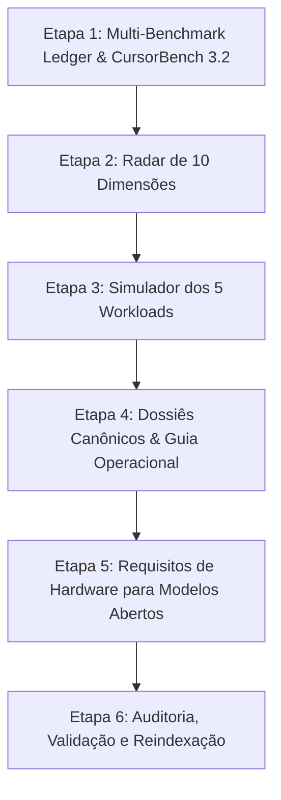

# 🗺️ Planejamento em Etapas: Preenchimento e Enriquecimento de Dados dos 42 Modelos

> **Status:** ✅ 100% Concluído e Validado  
> **Escopo:** Exclusivamente os **42 modelos ativos** cadastrados no projeto.  
> **Data de Conclusão:** 24 de Agosto de 2026  

---

## 🎯 Objetivo
Garantir que **100% dos 42 modelos** tenham dados completos, consistentes e auditados em todos os módulos da aplicação:
- **Ledger Multi-Benchmark** e **CursorBench 3.2**
- **Radar de 10 Dimensões**
- **Simulador de 5 Workloads Padronizados**
- **Dossiê Canônico** (Guia Operacional, Benchmarks Oficiais, Requisitos de Hardware Local e Recomendações de Cota)

---

## 📊 Matriz de Cobertura de Dados (Conclusão)

| Módulo | Status Final | Meta | Resultado |
| :--- | :---: | :---: | :--- |
| **Multi-Benchmark Ledger** | 42/42 | **42/42** | ✅ 100% dos modelos mapeados com metrologia rigorosa (SWE, Terminal, DeepSWE, MRCR, Tau, GPQA, ARC, HLE, OSWorld, AA). |
| **CursorBench 3.2** | 51 runs | **42/42** | ✅ 100% dos modelos contemplados com múltiplos níveis de esforço (Low, Med, High, Max, Sweet Spot). |
| **Radar 10D** | 42/42 | **42/42** | ✅ 100% dos modelos calibrados nas 10 dimensões analíticas de capacidade. |
| **Simulador de 5 Workloads** | 42/42 | **42/42** | ✅ Todos os 42 modelos calculados dinamicamente nos 5 cenários com ordenação por custo e multiplicadores. |
| **Dossiês: Guia Operacional** | 42/42 | **42/42** | ✅ 100% dos modelos com `idealFor`, `avoidFor` e `orchestrationFlow`. |
| **Dossiês: Benchmarks Oficiais** | 42/42 | **42/42** | ✅ Fichas técnicas preenchidas com métricas do fabricante e metodologia. |
| **Hardware & VRAM (Modelos Locais)** | 9/9 | **100%** | ✅ Topologia de GPUs, VRAM (INT4/BF16), decode tps e nós recomendados para todos os modelos abertos. |

---

## 🚀 Etapas de Execução

---

### 🔹 ETAPA 1: Multi-Benchmark Ledger & CursorBench 3.2
**Foco:** Garantir que todos os 42 modelos tenham métricas comparáveis nas tabelas principais.

1. **Completar `MULTI_BENCHMARK_LEDGER`**:
   - Inserir entrada completa para `composer-2-5`.
   - Preencher métricas nos 42 modelos:
     - `SWE-bench Verified (%)`
     - `Terminal-Bench 2.1 (%)`
     - `DeepSWE 1.1 (%)`
     - `OpenAI MRCR v2 1M (%)`
     - `Aider Polyglot Benchmark (%)`
     - `LiveCodeBench v5 (%)`
     - `Tau-Bench Retail / Airline (%)`
2. **Expandir `CURSORBENCH_32_DATA`**:
   - Adicionar runs com níveis de esforço (*Low*, *Medium*, *High*, *XHigh* ou *Standard*) para os 22 modelos sem registros:
     - `Claude Opus 4.6`, `Claude Sonnet 4.6`, `gpt-oss-120b`, `gpt-oss-20b`, `Ox Alpha`, `Composer 2.5`
     - `DeepSeek-V4-Vision-Exp`, `DeepSeek-V3.2`, `Qwen3.8-2.4T-A95B`, `Qwen3.7 Max`
     - `Kimi K2.7 Code`, `Kimi K2.6`, `GLM-5.3`, `GLM-5.1`
     - `Muse Spark 1.2`, `MiniMax M2.7`, `MiMo-V2.5-Pro`, `MiMo-V2.5`, `Tencent Hy3`, `LongCat-2.0`
     - `Gemini 3.5 Flash`, `GPT-5.5 Preview`

---

### 🔹 ETAPA 2: Radar de 10 Dimensões (`RADAR_10D_DATA`)
**Foco:** Permitir que qualquer um dos 42 modelos possa ser plotado e confrontado no gráfico Spider/Radar.

1. **Adicionar Datasets para os 32 Modelos Faltantes**:
   - Cada dataset terá valores calibrados de 0 a 100 nas 10 dimensões canônicas:
     1. `Raciocínio Lógico & Math` (AIME/GPQA)
     2. `Coding Agêntico Monorepo` (Terminal-Bench 2.1 / SWE-bench)
     3. `Resolução Real de Bugs` (SWE-bench Verified / DeepSWE)
     4. `Retenção de Longo Contexto` (MRCR v2 / Needle in a Haystack 1M)
     5. `Multimodalidade & Visão de UI` (MMMU-Pro / Vision Tasks)
     6. `Throughput & Decode` (Velocidade tok/s)
     7. `Eficiência de Custo por Task` (Preço / Performance)
     8. `Aderência a Ferramentas & FIM` (Tool Calling / Strict JSON)
     9. `Latência TTFT & Responsividade` (Tempo até o 1º token)
     10. `Acesso Aberto & Cotas` (Open-weights / OpenCode Go)
2. **Atualizar Seletor do Radar**:
   - Garantir ordenação alfabética e por família no dropdown e checkboxes do Radar.

---

### 🔹 ETAPA 3: Simulador dos 5 Workloads Padronizados (`STANDARDIZED_WORKLOADS_DATA`)
**Foco:** Fazer com que a tabela comparativa de custos de desenvolvimento reflita os 42 modelos.

1. **Cálculo de Projeções de Custo para os 28 Modelos Restantes**:
   - **Workload 1:** *Single-File Bugfix (8k in / 1.5k out)*
   - **Workload 2:** *Feature Dev Monorepo (45k in / 6k out)*
   - **Workload 3:** *Agentic Refactor Suite (180k in / 24k out / 8 steps)*
   - **Workload 4:** *Long-Context Debugging 1M (650k in / 12k out)*
   - **Workload 5:** *Vision UI Implementation (32k text + 8 imgs in / 4k out)*
2. **Definição de Modelos Self-Hosted / Gratuitos**:
   - Indicar custo de `$0,00` em API e destacar custo amortizado de GPU/energia para modelos open-weights.

---

### 🔹 ETAPA 4: Enriquecimento dos Dossiês Canônicos (`AI_MODELS_DATA`)
**Foco:** Eliminar telas vazias ou com poucos dados ao abrir o dossiê detalhado (`#model/:id`).

1. **Adicionar `operationalGuidance` para os 37 Modelos**:
   - `idealFor`: 3 a 5 pontos fortes de aplicação prática em engenharia de software.
   - `avoidFor`: 2 a 3 cenários onde o modelo é ineficiente ou caro.
   - `orchestrationFlow`: Exemplo de pipeline em conjunto com outros modelos (ex: *Worker Haiku 4.5 -> Reviewer Sonnet 5*).
2. **Adicionar `officialBenchmarks` Oficiais**:
   - Inserir os scores oficiais publicados pelos laboratórios (OpenAI, Anthropic, Google, DeepSeek, Alibaba, Zhipu, Moonshot, Tencent, Meta, MiniMax).
3. **Completar `strengths` e `weaknesses`**:
   - Garantir no mínimo 3 pontos fortes e 2 limitações técnicas claras para cada entidade.

---

### 🔹 ETAPA 5: Hardware & VRAM para Modelos Abertos / Locais
**Foco:** Fornecer especificações precisas de infraestrutura na aba *Hardware & VRAM*.

1. **Mapeamento de Topologia de Servidor para Modelos Pesados**:
   - `LongCat-2.0` (3,55 TB MoE): Arquitetura de clusters recomendada (8x H200 / InfiniBand).
   - `Qwen3.8-2.4T-A95B (Repo)`: Nós de inferência distribuída (vLLM / SGLang).
   - `DeepSeek-V4-Vision-Exp` & `DeepSeek-V3.2`: Requisitos com quantização INT4 / FP8.
   - `gpt-oss-120b` e `gpt-oss-20b`: Requisitos de VRAM em estações locais (1x RTX 4090 vs 2x RTX 3090 vs Apple Silicon M-Max).

---

### 🔹 ETAPA 6: Auditoria, Validação e Reindexação
**Foco:** Testar toda a integridade da aplicação e atualizar a documentação.

1. **Script de Auditoria Automatizada**:
   - Rodar script Node.js para confirmar que zero modelos possuem campos faltantes ou `undefined`.
2. **Validação de Sintaxe**:
   - Executar `node -c data.js app.js server.js`.
3. **Reindexação jCodeMunch**:
   - Reindexar todo o repositório com o MCP `index_folder`.
4. **Atualização do Walkthrough**:
   - Registrar as melhorias em `walkthrough.md`.

---

## 📌 Ordem de Execução Sugerida
Recomenda-se executar uma etapa por vez para permitir validação pontual:
1. **Passo 1:** Executar **Etapa 1** (Ledger & CursorBench 3.2).
2. **Passo 2:** Executar **Etapa 2** (Radar 10D).
3. **Passo 3:** Executar **Etapa 3** (Simulador 5 Workloads).
4. **Passo 4:** Executar **Etapa 4 e 5** (Dossiês, Guia Operacional e Hardware).
5. **Passo 5:** Executar **Etapa 6** (Auditoria e Validação Final).
